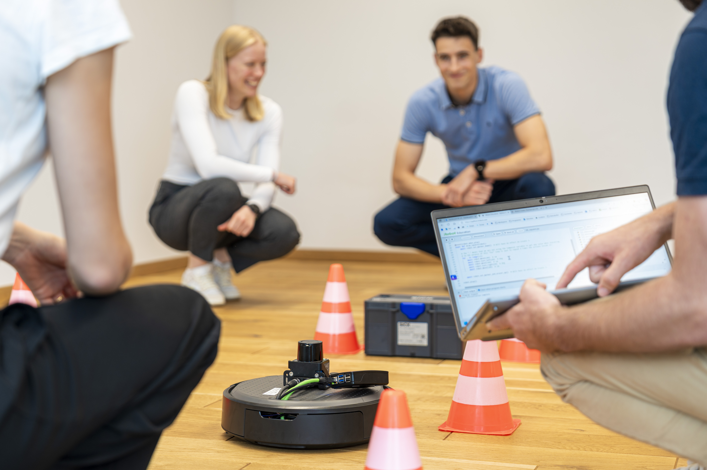
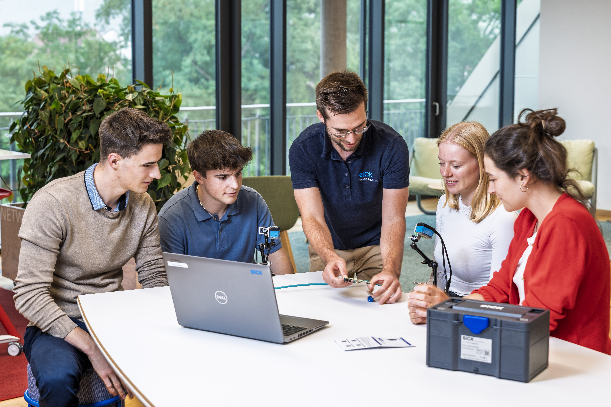
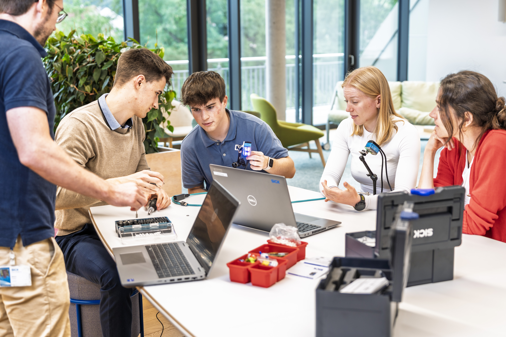

# SICK-Sensor-Starter-Kits

Willkommen auf der GitHub-Seite für die SICK-Sensor-Starter-Kits!

Die Kits enthalten eine umfassende Auswahl an Sensoren, Zubehör und Anwendungsbeispielen, die Ihnen den schnellen Einstieg in die Arbeit mit SICK-Sensoren erleichtern. Diese Kits umfassen alles, was Sie benötigen, um Sensorlösungen zu erkunden, Prototypen zu entwickeln und in Ihre Projekte zu integrieren.

  

    
    
    
    
    
  

  <button class="arrow arrow-left" onclick="prevImage()">&lt;</button>
  <button class="arrow arrow-right" onclick="nextImage()">&gt;</button>

## Wählen Sie Ihr Starter-Kit aus

Wählen Sie das Starter-Kit aus, mit dem Sie arbeiten, um die Einrichtungsanleitung, die erste Demo und die Beispielprojekte zu öffnen.

-    

    **Vision-Starter-Kit**

    Machen Sie sich mit bildbasierten Sensoranwendungen und Beispielen für KI-gestützte Bildverarbeitung vertraut.

     [Vision](vision/vision_overview.md){.md-button}

-   

    **LiDAR-Starter-Kit**

    Entdecken Sie Entfernungsmessung, Geländebewertung und interaktive LiDAR-Demonstrationen

     [LiDAR](lidar/lidar_overview.md){.md-button}

-   

    **IO-Link-Konnektivitäts-Starter-Kit**

    IO-Link-Geräte anschließen und Prozessdaten auslesen.

    [IO-Link](iolink/iolink_overview.md){.md-button}

## Brauchst du ein Starter-Kit?

Sie haben noch kein Starter-Kit? Hier erfahren Sie mehr und können Ihr Exemplar kaufen!

[Starter-Sets](https://www.sick.com/s/sensor-starter-kits){:target="_blank".md-button}

!!! note "Nutzung zu Bildungszwecken"
    Bitte beachten Sie, dass die Starter-Kits ausschließlich für Schulungszwecke bestimmt sind und nicht in Produktionsumgebungen verwendet werden dürfen.