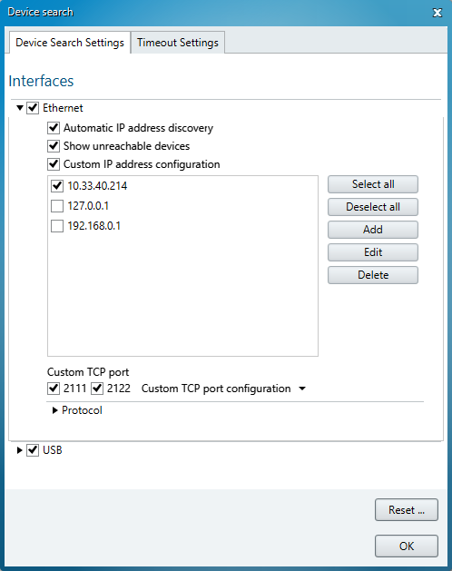
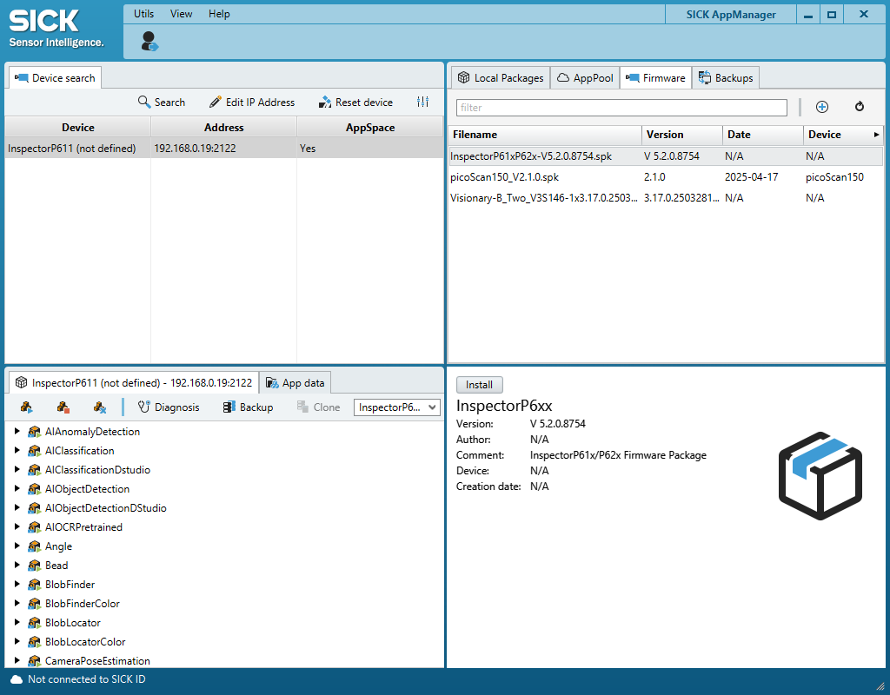

# Fortgeschrittene Anwendungen des IO-Link-Konnektivitäts-Starter-Kits

## Kurzbeschreibung

In diesem Abschnitt werden erweiterte Funktionen und Konfigurationen für das IO-Link-Konnektivitäts-Starter-Kit behandelt.

Hier finden Sie Informationen zu zusätzlichem Zubehör, zum SICK AppManager und zu Firmware-Updates für den SIG300.

## Überblick über fortgeschrittene Themen

<table style="border-collapse: collapse; width: 100%;">
  <thead>
    <tr style="background-color: #005aff; color: white;">
      <th style="padding: 8px; text-align: left;">Thema</th>
      <th style="padding: 8px; text-align: left;">Zweck</th>
    </tr>
  </thead>
  <tbody>
    <tr>
      <td>Weiteres Zubehör</td>
      <td>Erweitern Sie das IO-Link-Konnektivitäts-Starter-Kit um weitere Sensoren und Signalgeber.</td>
    </tr>
    <tr>
      <td>SICK AppManager</td>
      <td>Suchen Sie den SIG300, verwalten Sie dessen IP-Adresse und greifen Sie auf die Firmware-Funktionen zu.</td>
    </tr>
    <tr>
      <td>Firmware-Update</td>
      <td>Installieren Sie eine neuere Firmware-Version auf dem SIG300.</td>
    </tr>
  </tbody>
</table>

 

## Weitere Informationen

Weitere Informationen zum SIG300 und seiner REST-API finden Sie in der entsprechenden Bedienungsanleitung:

[Sensor-Integrations-Gateway – SIG300 – REST-API](https://www.sick.com/ag/en/search?text=8029127){ .md-button .button-small target="_blank" }

---

## Weiteres Zubehör

Das IO-Link-Konnektivitäts-Starter-Kit lässt sich mit zusätzlichem Zubehör kombinieren, um weitere Aufgaben und Anwendungen zu unterstützen.

<table style="border-collapse: collapse; width: 100%;">
  <thead>
    <tr style="background-color: #005aff; color: white;">
      <th style="padding: 8px; text-align: left;">#</th>
      <th style="padding: 8px; text-align: left;">Artikelbeschreibung</th>
      <th style="padding: 8px; text-align: left;">Artikelnummer</th>
    </tr>
  </thead>
  <tbody>
    <tr>
      <td>1</td>
      <td>
        Signalturm
        <a href="https://www.sick.com/ag/en/catalog/products/accessories/signal-transmitters/optical-signal-transmitters/slt060-0b010j700/p/p663661?tab=detail" target="_blank">SLT</a>
        – optischer Signalsender zur Anzeige von Werten wie Füllstand oder Entfernung
      </td>
      <td>6075938</td>
    </tr>
    <tr>
      <td>2</td>
      <td>
        Farbsensor
        <a href="https://www.sick.com/ag/en/catalog/products/detection-sensors/color-sensors/csm/csm-wp1b7a2p/p/p672179?tab=detail" target="_blank">CSM</a>
        mit IO-Link für weitere Anwendungsmöglichkeiten
      </td>
      <td>1122739</td>
    </tr>
    <tr>
      <td>3</td>
      <td>
        Zustandsüberwachungssensor – Multi-Physics-Box
        <a href="https://www.sick.com/ag/en/catalog/products/detection-sensors/condition-monitoring-sensors/multi-physics-box/mpb10-vs00vsiq00/p/p670770?tab=detail" target="_blank">MPB10</a>
        zur Erfassung zusätzlicher Daten
      </td>
      <td>-</td>
    </tr>
  </tbody>
</table>

---

## Entwicklungswerkzeug: SICK AppManager

Mit dem Engineering-Tool **SICK AppManager** lassen sich zusätzliche Gerätefunktionen nutzen, beispielsweise das Aktualisieren der Firmware.

### SICK AppManager installieren und öffnen

1. [SICK AppManager](https://www.sick.com/de/en/products/digital-services-and-software/engineering-tools/sick-appmanager/sick-appmanager/p/p532784).) herunterladen
2. Installieren und öffnen Sie den SICK AppManager.
3. Das Gerät sollte automatisch in der oberen linken Ecke angezeigt werden.

4. Wenn das Gerät nicht angezeigt wird, wählen Sie **Suchen**.
5. Wenn das Gerät immer noch nicht angezeigt wird, öffnen Sie die Einstellungen.
6. Wählen Sie **USB** und alle verfügbaren Kontrollkästchen unter **Ethernet** aus.

7. Wenn das Gerät über Ethernet verbunden ist, kann seine IP-Adresse bei Bedarf geändert werden.

!!! note "Konfiguration der IP-Adresse"
    Die IP-Adresse des Geräts kann im SICK AppManager nur bearbeitet werden, wenn das Gerät über Ethernet verbunden ist.

---

## Firmware-Update

Befolgen Sie diese Schritte, um eine neuere Firmware-Version auf dem SIG300 zu installieren.

1. Öffne die Datei „https://www.sick.com/ag/en/catalog/products/network-and-connection-technology/network-devices/sig300/sig300-0a0gaa100/p/p678107?category=g569793&tab=downloads.“
2. Öffnen Sie **Downloads** > **Software**.
3. Laden Sie die neueste Firmware herunter.
4. Entpacken Sie die heruntergeladene Datei „`.zip`“.
5. Suchen Sie die mitgelieferte Firmware-Datei „`.spk`“.
6. Öffnen Sie den SICK AppManager.
7. Wählen Sie oben rechts **Firmware** aus.
8. Wählen Sie die Schaltfläche **+** aus.
9. Wählen Sie die Datei `.spk` aus.
10. Stellen Sie sicher, dass das richtige Gerät ausgewählt ist.
11. Wählen Sie unten rechts **Installieren** aus.

!!! warning "Firmware-Update"
    Stellen Sie sicher, dass das richtige SIG300-Gerät und die richtige Firmware-Datei ausgewählt sind, bevor Sie mit der Installation beginnen.

---

## Zusammenfassung

Auf dieser Seite wurden zusätzliches Zubehör für das IO-Link-Connectivity-Starter-Kit sowie die grundlegende Verwendung des SICK AppManagers vorgestellt.

Sie haben gelernt, wie man:

- Erweitern Sie das Starter-Kit um weitere IO-Link-Geräte
- Suchen Sie den SIG300 im SICK AppManager
- auf seine IP-Adresse zugreifen, wenn eine Verbindung über Ethernet besteht
- Ein SIG300-Firmware-Update herunterladen und installieren

## Nächste Schritte

Kehren Sie zu den IO-Link-Beispielprojekten zurück, öffnen Sie die Code-Beispiele oder fahren Sie mit den verfügbaren Schulungsunterlagen fort.

[Beispielprojekte](./iolink_example_projects.md){ .md-button }

[Beispiele für IO-Link-Codes](./iolink_code_snippets.md){ .md-button }

[Schulungsunterlagen](./iolink_training_material.md){ .md-button }

[Häufig gestellte Fragen](./iolink_faq.md){ .md-button }

