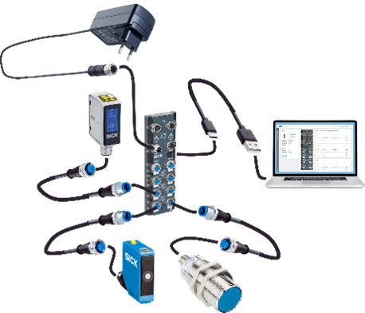

<!-- # Erste Schritte

Sie können nun mit dem IO-Link-Konnektivitäts-Starter-Kit loslegen. Befolgen Sie die nachstehende Anleitung oder scrollen Sie nach unten zum Tutorial-Video.

## Sensoren einrichten

1.	Schließen Sie den SIG300 mit dem USB-C-Kabel und dem Netzteil an.
2.	Wählen Sie den passenden Steckeradapter aus und schließen Sie das Netzteil an eine Steckdose an.
3.	Schließen Sie das USB-C-Kabel an den PC an.
4.	Öffnen Sie einen Browser und geben Sie die Standard-IP-Adresse 169.254.0.1 ein.
5.	Schließen Sie die Sensoren W10, UC12 und IM30 über die IO-Link-Kabel an das SIG300 an (z. B. an die Anschlüsse S1–S3).
6.	Die Geräte sind nun einsatzbereit
7.	Die Sensoren können mit den Befestigungswinkeln am zusammengebauten Rahmen (siehe unten) montiert werden (gilt nur bei Verwendung des Montagesatzes – 1154060). 



## Montagerahmen montieren (gilt nur bei Verwendung des Montagesets)


Scrollen Sie nach unten, um zum Tutorial-Video zu gelangen.

**Erforderliche Hardware**

* 5 × Aluminiumprofile
* 8 × Endkappen
* 8 × Senkkopfschrauben
* 8 × M5-T-Nut-Muttern
* 1 × M4-T-Nut-Mutter
* 4 × Winkelhalterungen
* 1 × Inbusschlüssel (3 mm)**

**Obere Leiste**

* Nehmen Sie ein Aluminiumprofil aus der Schachtel.
* Setzen Sie eine M4-T-Nut-Mutter in die obere Nut ein.
* Setzen Sie zwei M5-T-Nut-Muttern in die untere Nut ein (auf der der M4-Mutter gegenüberliegenden Seite).
* Befestigen Sie zwei Winkelhalterungen mit Senkkopfschrauben und ziehen Sie diese mit einem Inbusschlüssel in den M5-T-Nut-Muttern fest.
* Setzen Sie an beiden Enden des Profils Endkappen auf.
* Schieben Sie die Winkelhalterungen an beide Enden des Profils und ziehen Sie die Schrauben so fest, dass die Winkelhalterungen und die Endkappen fluchten.

**Untere Leisten (2 Stück)**

* Setzen Sie jeweils eine M5-T-Nut-Mutter in die mittlere Nut jeder Schiene ein.
* Befestigen Sie einen Winkelhalter mit Senkkopfschrauben und ziehen Sie diese mit dem Inbusschlüssel fest.
* Setzen Sie an beiden Enden Endkappen auf.
* Legen Sie beide Profile parallel vor sich hin, in Längsrichtung ausgerichtet, sodass die Enden zu Ihnen hin und von Ihnen weg zeigen – nicht seitlich über den Tisch hinweg.

**Vertikale Balken (2x)**

* Setzen Sie am unteren Ende jeder Stange eine M5-T-Nut-Mutter ein.
* Befestigen Sie jede vertikale Stange im 90°-Winkel an einer unteren Stange mit einer Senkkopfschraube und einem 3-mm-Inbusschlüssel.
* Setzen Sie am oberen Ende jeder Stange eine M5-T-Nut-Mutter in die Nut ein, die zur anderen unteren Stange zeigt.
* Setzen Sie auf jede vertikale Stange oben eine Endkappe auf.
Befestigen Sie die obere Leiste mit den beiden verbleibenden Senkkopfschrauben mithilfe der Winkelhalterungen und des Sechskantschlüssels zwischen den beiden vertikalen Leisten.
* Tipp: Es ist möglicherweise einfacher, den Rahmen flach hinzulegen, um die obere Leiste anzubringen.
* Stellen Sie die Höhe und den Winkel der oberen Stange ein, indem Sie die beiden inneren Schrauben oben an den vertikalen Stangen lösen und festziehen.

**Letzter Schritt**

* Befestigen Sie die Inspector61x-Halterung mit der mitgelieferten M4-Schraube und Unterlegscheibe an der T-Nut-Mutter oben auf der oberen Leiste.

<iframe id="kaltura_player" src="https://api.eu.kaltura.com/p/205/sp/20500/embedIframeJs/uiconf_id/23452804/partner_id/205?iframeembed=true&playerId=kaltura_player&entry_id=0_ee4dppoa&flashvars[streamerType]=auto&amp;flashvars[localizationCode]=en&amp;flashvars[sideBarContainer.plugin]=true&amp;flashvars[sideBarContainer.position]=left&amp;flashvars[sideBarContainer.clickToClose]=true&amp;flashvars[chapters.plugin]=true&amp;flashvars[chapters.layout]=vertical&amp;flashvars[chapters.thumbnailRotator]=false&amp;flashvars[streamSelector.plugin]=true&amp;flashvars[EmbedPlayer.SpinnerTarget]=videoHolder&amp;flashvars[dualScreen.plugin]=true&amp;flashvars[hotspots.plugin]=1&amp;flashvars[Kaltura.addCrossoriginToIframe]=true&amp;&wid=0_lj0aweoi" width="560" height="315" allowfullscreen webkitallowfullscreen mozAllowFullScreen allow="autoplay *; fullscreen *; encrypted-media *" sandbox="allow-downloads allow-forms allow-same-origin allow-scripts allow-top-navigation allow-pointer-lock allow-popups allow-modals allow-orientation-lock allow-popups-to-escape-sandbox allow-presentation allow-top-navigation-by-user-activation" frameborder="0" title="Tutorial Mounting Kit"></iframe>

**Jetzt kannst du loslegen – probier es einfach aus oder wähle ein [Beispielprojekt](./iolink_example_projects.md) oder [Code-Schnipsel](./iolink_code_snippets.md) oder sehen Sie sich die [Schulungsunterlagen](./iolink_training_material.md) weiter unten an**

## Fehlerbehebung

Weitere Informationen finden Sie in den Bedienungsanleitungen der Geräte.

* [SIG300](https://www.sick.com/ag/en/catalog/products/network-and-connection-technology/network-devices/sig300/sig300-0a0gaa100/p/p678107?tab=downloads)
* [W10](https://www.sick.com/ag/en/catalog/products/detection-sensors/photoelectric-sensors/w10/wtm10l-241611d0a00zvzzzzzzzzz1/p/p678567?tab=downloads)
* [UC12](https://www.sick.com/ag/en/catalog/products/distance-sensors/ultrasonic-distance-sensors/uc12/uc12-1123e/p/p665119?tab=downloads)
* [IMC30](https://www.sick.com/ag/en/catalog/products/detection-sensors/inductive-proximity-sensors/imc/imc30-20nppvc0sa00/p/p483964?tab=downloads)

Befolgen Sie unbedingt die folgenden Schritte:

1. Stellen Sie sicher, dass Sie nicht mit einem VPN verbunden sind, da dies die Verbindung zum Netzwerkgerät blockieren könnte.
2. Wenn Sie keine Verbindung zum Netzwerkgerät herstellen können, prüfen Sie, ob die LED **„Ready“** grün leuchtet.  
      Ist dies nicht der Fall, ist die Stromversorgung nicht ordnungsgemäß hergestellt. Warten Sie bis zu 2 Minuten und überprüfen Sie, ob die Stromversorgung korrekt angeschlossen ist.

3. Wenn Sie immer noch keine Verbindung herstellen können, suchen Sie die IP-Adresse des Geräts über den **SICK AppManager** heraus:  
      [SICK AppManager | SICK](https://www.sick.com/ag/en/catalog/products/digital-services-and-software/engineering-tools/sick-appmanager/sick-appmanager/p/p532784)
      Weitere Informationen finden Sie im **Abschnitt „Erweitert“**.
4. Schauen Sie im **FAQ-Bereich** nach: [FAQ](./iolink_faq.md)

5. Falls das Gerät weiterhin Probleme aufweist:  
      - Rufen Sie das **Support-Portal** auf, registrieren Sie sich und erstellen Sie einen Supportfall, um Hilfe zu erhalten.


**Wenn Sie mehr über das Netzwerkgerät, die Anschlüsse oder den Logic-Editor erfahren möchten, sehen Sie sich diese Tutorial-Reihe an**


## Anleitung
<iframe width="560" height="315" src="https://www.youtube-nocookie.com/embed/YG7Tm6EzI0A?si=JODw6tMatWkURfNq" title="YouTube video player" frameborder="0" allow="accelerometer; autoplay; clipboard-write; encrypted-media; gyroscope; picture-in-picture; web-share" referrerpolicy="strict-origin-when-cross-origin" allowfullscreen></iframe>

-->

# Erste Schritte mit dem IO-Link-Konnektivitäts-Starter-Kit

Sie können nun mit dem IO-Link-Konnektivitäts-Starter-Kit loslegen.

Befolgen Sie die nachstehenden Anweisungen, um das SIG300 und die im Lieferumfang enthaltenen IO-Link-Sensoren anzuschließen. Weitere Informationen zum Netzwerkgerät, seinen Anschlüssen und dem Logic Editor finden Sie auch im Tutorial-Video.

## Sensoren einrichten

1. Schließen Sie den SIG300 mit dem USB-C-Kabel und dem Netzteil an.
2. Wählen Sie den passenden Steckeradapter aus und schließen Sie das Netzteil an eine Steckdose an.
3. Schließen Sie das USB-C-Kabel an den Computer an.
4. Öffnen Sie einen Browser und geben Sie die Standard-IP-Adresse ein:

```text
http://169.254.0.1
```

5. Schließen Sie die Sensoren W10, UC12 und IMC30 über die IO-Link-Kabel an das SIG300 an, beispielsweise an die Anschlüsse S1 bis S3.
6. Die Geräte sind nun einsatzbereit.
7. Falls das optionale Montageset verfügbar ist, befestigen Sie die Sensoren mithilfe der entsprechenden Halterungen am zusammengebauten Rahmen.


## Optionaler Montagerahmen

Der Montagerahmen ist nur im Lieferumfang enthalten, wenn das separate Montageset verwendet wird.

Die vollständige Montageanleitung finden Sie auf der Seite „Einrichtung des gemeinsamen Montagerahmens“:

[Montagerahmen](../mounting_frame.md){ .md-button .button-small }


## Anleitung

Das folgende Tutorial enthält weitere Informationen zum Netzwerkgerät, seinen Anschlüssen und dem Logik-Editor.

<iframe
  width="560"
  height="315"
  src="https://www.youtube-nocookie.com/embed/YG7Tm6EzI0A?si=JODw6tMatWkURfNq"
  title="Anleitung zum IO-Link-Konnektivitäts-Starter-Kit"
  frameborder="0"
  allow="accelerometer; autoplay; clipboard-write; encrypted-media; gyroscope; picture-in-picture; web-share"
  referrerpolicy="strict-origin-when-cross-origin"
  allowfullscreen>
</iframe>

## Fehlerbehebung

??? info "Probleme bei der Verbindung und Einrichtung"

    !!! failure "Die Benutzeroberfläche von SIG300 lässt sich nicht öffnen"
        Stellen Sie sicher, dass der Computer nicht mit einer aktiven VPN-Verbindung verbunden ist, da dies den Zugriff auf das Netzwerkgerät blockieren könnte.

        Öffnen Sie die Standard-IP-Adresse erneut:

        ```text
        http://169.254.0.1
        ```

    !!! failure "Die „Ready“-LED leuchtet nicht grün"
        Überprüfen Sie, ob das Netzteil und das USB-C-Kabel korrekt angeschlossen sind.

        Warten Sie bis zu zwei Minuten, bis der SIG300 den Startvorgang abgeschlossen hat.

    !!! failure "Der SIG300 ist nach wie vor nicht erreichbar"
        Ermitteln Sie die aktuelle IP-Adresse des Geräts mit dem SICK AppManager.

        [Produktseite von SICK AppManager öffnen](https://www.sick.com/ag/en/catalog/products/digital-ols/sick-appmanager/sick-appmanager/p/p532784){ .md-button .button-small }

        Weitere Informationen zum SICK AppManager finden Sie auf der Seite [Erweiterte Themen](./iolink_advanced.md):

        
    !!! failure "Es ist zusätzliche Unterstützung erforderlich."
        Weitere Informationen zur Fehlerbehebung finden Sie in den häufig gestellten Fragen (FAQ) zum IO-Link-Starter-Kit:

        [IO-Link-FAQ](./iolink_faq.md){ .md-button .button-small }

        Sollten weiterhin Probleme mit dem Gerät auftreten, rufen Sie das SICK-Support-Portal auf, registrieren Sie sich und erstellen Sie einen Supportfall.

??? info "Bedienungsanleitung"

    Weitere Produktinformationen, Bedienungsanleitungen und Downloads finden Sie auf den entsprechenden Produktseiten:

    - [SIG300](https://www.sick.com/ag/en/catalog/products/network-and-connection-technology/network-devices/sig300/sig300-0a0gaa100/p/p678107?tab=downloads)
    - [W10](https://www.sick.com/ag/en/catalog/products/detection-sensors/photoelectric-sensors/w10/wtm10l-241611d0a00zvzzzzzzzzz1/p/p678567?tab=downloads)
    - [UC12](https://www.sick.com/ag/en/catalog/products/distance-sensors/ultrasonic-distance-sensors/uc12/uc12-1123e/p/p665119?tab=downloads)
    - [IMC30](https://www.sick.com/ag/en/catalog/products/detection-sensors/inductive-proximity-sensors/imc/imc30-20nppvc0sa00/p/p483964?tab=downloads)

## Zusammenfassung

Der SIG300 ist nun an den Computer angeschlossen, und die Sensoren W10, UC12 und IMC30 sind über IO-Link verbunden.

Sofern das optionale Montageset verfügbar ist, können die Sensoren auch am zusammengebauten Rahmen montiert werden.

## Nächste Schritte

Sie können nun mit einem Beispielprojekt fortfahren, die Code-Beispiele durchsehen oder das verfügbare Schulungsmaterial öffnen.

<div class="next-step-buttons" markdown>

[Beispielprojekte](./iolink_example_projects.md){ .md-button }

[Beispiele für IO-Link-Codes](./iolink_code_snippets.md){ .md-button }

[Schulungsunterlagen](training_material.md){ .md-button }

[Fortgeschritten](./iolink_advanced.md){ .md-button }

</div>