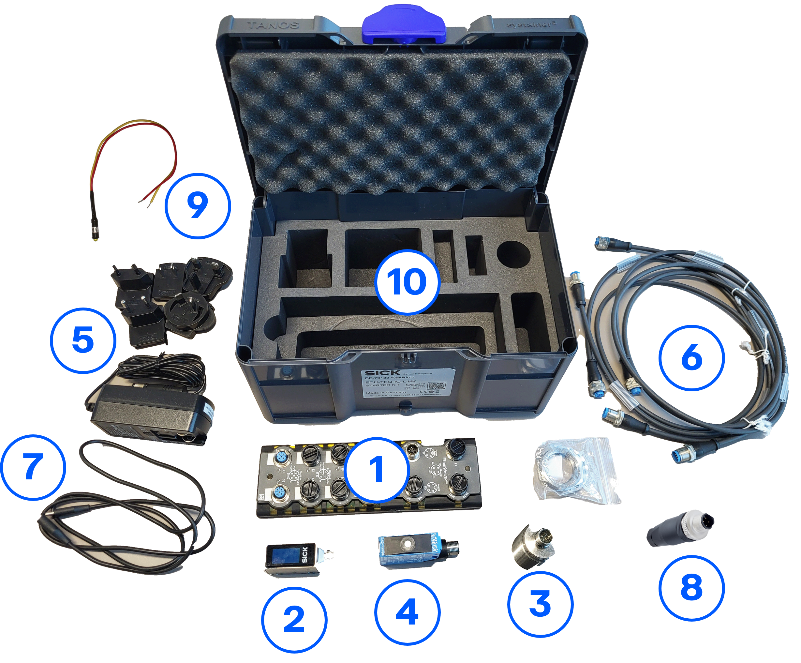

# Übersicht über das IO-Link-Konnektivitäts-Starter-Kit

**Willkommen beim IO-Link-Konnektivitäts-Starter-Kit!**

Bitte beachten Sie, dass die Starter-Kits ausschließlich für Schulungszwecke bestimmt sind und nicht in Produktionsumgebungen verwendet werden dürfen.

Das IO-Link-Starter-Kit bietet einen Einstieg in die Arbeit mit IO-Link-Sensoren und deren Integration in Maschinen oder Anlagen. Verschiedene Sensortechnologien können getestet und verglichen werden.

IO-Link gewinnt zunehmend an Bedeutung, da es einfache Sensoren und Aktoren in intelligente, bidirektionale Kommunikationsgeräte verwandelt und so Echtzeit-Diagnose, einfache Integration sowie zukunftssichere Konnektivität für Industrie 4.0 ermöglicht. Erfahren Sie, wie Sie es für Ihr Projekt nutzen können!

Sie haben noch kein IO-Link-Starter-Kit? Hier können Sie es kaufen!

[IO-Link-Konnektivitäts-Starter-Kit](https://www.sick.com/ag/en/catalog/products/training/training-and-education/technology-trainings/io-link-connectivity-starter-kit-basic/p/p688838){:target="_blank".md-button}

Sie können das IO-Link-Konnektivitäts-Starter-Kit mit einem speziellen Montagesatz mit passendem Montagerahmen und Halterungen kombinieren.

[Montagesatz](https://www.sick.com/ag/en/edu-teq-mounting-kit/p/pn1154060?tab=detail){:target="_blank".md-button}

## Wichtigste Merkmale
- Nahtlose IO-Link-Kommunikation
- Einfache Konfiguration mit SOPAS Air oder kompatiblen Tools
- Einfache Integration in verschiedene Automatisierungssysteme
- Unterstützt Parametrierung und Diagnose
- Plug-and-Play-Einrichtung

## Hardware
Das IO-Link-Konnektivitäts-Starter-Kit enthält folgende Teile:

<table style="border-collapse: collapse; width: 100%;">
  <thead>
    <tr style="background-color: #005aff; color: white;">
      <th style="padding: 8px; text-align: left;">#</th>
      <th style="padding: 8px; text-align: left;">Artikelbeschreibung</th>
      <th style="padding: 8px; text-align: left;">Anzahl</th>
      <th style="padding: 8px; text-align: left;">Artikelnummer</th>
    </tr>
  </thead>
  <tbody>
    <tr>
      <td>1</td>
      <td>SIG300-Netzwerkgerät</td>
      <td>1</td>
      <td>1131014</td>
    </tr>
    <tr>
      <td>2</td>
      <td>Lichtschranke W10</td>
      <td>1</td>
      <td>1133547</td>
    </tr>
    <tr>
      <td>3</td>
      <td>Induktiver Näherungssensor IMC30</td>
      <td>1</td>
      <td>
        1079301
      </td>
    </tr>
    <tr>
      <td>4</td>
      <td>Ultraschall-Abstandssensor UC12</td>
      <td>1</td>
      <td>
        6077702
      </td>
    </tr>
    <tr>
      <td>5</td>
      <td>Stromversorgung</td>
      <td>1</td>
      <td>6089529</td>
    </tr>
    <tr>
      <td>6</td>
      <td>IO-Link-Kabel</td>
      <td>3</td>
      <td>2096007</td>
    </tr>
    <tr>
      <td>7</td>
      <td>USB-C-Kabel</td>
      <td>1</td>
      <td>2119989</td>
    </tr>
    <tr>
      <td>8</td>
      <td>Stecker</td>
      <td>2</td>
      <td>
        6022083
      </td>
    </tr>
    <tr>
      <td>9</td>
      <td>Grüne und rote LEDs  (in den Stecker eingesetzt)</td>
      <td>2</td>
      <td>
        6092050 
        6092051
      </td>
    </tr>
    <tr>
      <td>10</td>
      <td>Transportkiste</td>
      <td>1</td>
      <td>5352759</td>
    </tr>
    <tr>
      <td>11</td>
      <td>Schnellstartanleitung</td>
      <td>1</td>
      <td>8031013</td>
    </tr>
  </tbody>
</table>

Weitere Informationen finden Sie im [Leitfaden für den Einstieg](./iolink_getting_started.md) und in den Abschnitten für Fortgeschrittene.