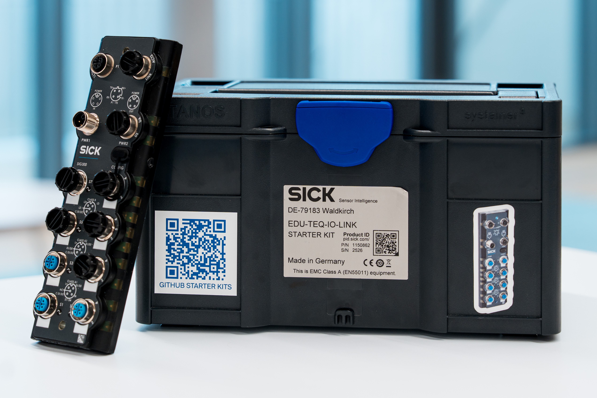

<!-- # Übersicht über das IO-Link-Konnektivitäts-Starter-Kit

**Willkommen beim IO-Link-Konnektivitäts-Starter-Kit!**

Bitte beachten Sie, dass die Starter-Kits ausschließlich für Schulungszwecke bestimmt sind und nicht in Produktionsumgebungen verwendet werden dürfen.

Das IO-Link-Starter-Kit bietet einen Einstieg in die Arbeit mit IO-Link-Sensoren und deren Integration in Maschinen oder Anlagen. Verschiedene Sensortechnologien lassen sich damit testen und vergleichen.

IO-Link gewinnt zunehmend an Bedeutung, da es einfache Sensoren und Aktoren in intelligente, bidirektionale Kommunikationsgeräte verwandelt und so Echtzeit-Diagnose, einfache Integration und zukunftssichere Konnektivität für Industrie 4.0 ermöglicht. Erfahren Sie, wie Sie IO-Link in Ihrem Projekt einsetzen können!

Sie haben noch kein IO-Link-Starter-Kit? Dann kaufen Sie es hier!

[IO-Link-Konnektivitäts-Starter-Kit](https://www.sick.com/ag/en/catalog/products/training/training-and-education/technology-trainings/io-link-connectivity-starter-kit-basic/p/p688838){:target="_blank".md-button}

Sie können das IO-Link-Konnektivitäts-Starter-Kit mit einem speziellen Montageset mit passendem Montagerahmen und Halterungen kombinieren.

[Montagesatz](https://www.sick.com/ag/en/edu-teq-mounting-kit/p/pn1154060?tab=detail){:target="_blank".md-button}

## Wichtigste Merkmale
- Nahtlose IO-Link-Kommunikation
- Einfache Konfiguration mit SOPAS Air oder kompatiblen Tools
- Einfache Integration in verschiedene Automatisierungssysteme
- Unterstützt Parametrierung und Diagnose
- Plug-and-Play-Einrichtung

## Hardware
Das IO-Link-Konnektivitäts-Starter-Kit enthält folgende Teile:

<table style="border-collapse: collapse; width: 100%;">
  <thead>
    <tr style="background-color: #005aff; color: white;">
      <th style="padding: 8px; text-align: left;">#</th>
      <th style="padding: 8px; text-align: left;">Artikelbeschreibung</th>
      <th style="padding: 8px; text-align: left;">Anzahl</th>
      <th style="padding: 8px; text-align: left;">Artikelnummer</th>
    </tr>
  </thead>
  <tbody>
    <tr>
      <td>1</td>
      <td>SIG300-Netzwerkgerät</td>
      <td>1</td>
      <td>1131014</td>
    </tr>
    <tr>
      <td>2</td>
      <td>W10-Lichtschranke</td>
      <td>1</td>
      <td>1133547</td>
    </tr>
    <tr>
      <td>3</td>
      <td>Induktiver Näherungssensor IMC30</td>
      <td>1</td>
      <td>
        1079301
      </td>
    </tr>
    <tr>
      <td>4</td>
      <td>Ultraschall-Abstandssensor UC12</td>
      <td>1</td>
      <td>
        6077702
      </td>
    </tr>
    <tr>
      <td>5</td>
      <td>Stromversorgung</td>
      <td>1</td>
      <td>6089529</td>
    </tr>
    <tr>
      <td>6</td>
      <td>IO-Link-Kabel</td>
      <td>3</td>
      <td>2096007</td>
    </tr>
    <tr>
      <td>7</td>
      <td>USB-C-Kabel</td>
      <td>1</td>
      <td>2119989</td>
    </tr>
    <tr>
      <td>8</td>
      <td>Stecker</td>
      <td>2</td>
      <td>
        6022083
      </td>
    </tr>
    <tr>
      <td>9</td>
      <td>Grüne und rote LEDs  (in den Stecker eingesetzt)</td>
      <td>2</td>
      <td>
        6092050 
        6092051
      </td>
    </tr>
    <tr>
      <td>10</td>
      <td>Transportkiste</td>
      <td>1</td>
      <td>5352759</td>
    </tr>
    <tr>
      <td>11</td>
      <td>Schnellstartanleitung</td>
      <td>1</td>
      <td>8031013</td>
    </tr>
  </tbody>
</table>

Weitere Informationen finden Sie im [Leitfaden für den Einstieg](./iolink_getting_started.md) und in den Abschnitten für Fortgeschrittene.

-->

# Übersicht über das IO-Link-Konnektivitäts-Starter-Kit

Willkommen bei der Dokumentation zum **IO-Link-Konnektivitäts-Starter-Kit**.

Das IO-Link-Konnektivitäts-Starter-Kit unterstützt Sie beim Einstieg in die IO-Link-Kommunikation, den Einsatz intelligenter Sensoren und die Geräteintegration. Es enthält einen SIG300 IO-Link-Master, verschiedene Sensortechnologien, Zubehör sowie Dokumentationen für Schulungs- und Demonstrationszwecke.

IO-Link verwandelt Sensoren und Aktoren in intelligente, bidirektionale Kommunikationsgeräte. Dies ermöglicht den Zugriff auf Prozessdaten, Geräteparameter und Diagnoseinformationen und bietet einen praktischen Einstieg in die moderne industrielle Vernetzung.

## Wichtigste Merkmale

- Kommunikation mit mehreren IO-Link-Sensoren
- Zugriff auf Prozessdaten, Parameter und Diagnoseinformationen
- Verschiedene Sensortechnologien im praktischen Vergleich
- Einfache Konfiguration über die SIG300-Benutzeroberfläche
- Einfache Integration in Anwendungen und Automatisierungsbeispiele
- Plug-and-Play-Einrichtung für erste IO-Link-Experimente

## Was kann man damit machen?

Mit dem IO-Link-Konnektivitäts-Starter-Kit können Sie typische IO-Link-Anwendungen erkunden, wie zum Beispiel:

- Anschluss und Identifizierung von IO-Link-Geräten
- Vergleich verschiedener Sensortechnologien
- Prozessdaten auslesen
- Geräteparameter ändern
- Anzeige von Diagnoseinformationen
- Daten aus mehreren Sensoren zusammenführen
- Erstellung einfacher Feedback- und Automatisierungsanwendungen
- Einbindung von Sensordaten in externe Software

## Optionales Befestigungsset

Das IO-Link-Konnektivitäts-Starter-Kit kann mit einem separaten Montagesatz kombiniert werden.

Der Montagesatz enthält einen geeigneten Montagerahmen und Halterungen für den Aufbau einer stabilen Vorführ- und Schulungsanlage.

[Montagesatz](https://www.sick.com/ag/en/edu-teq-mounting-kit/p/pn1154060?tab=detail){:target="_blank".md-button .button-small}

Eine Montageanleitung finden Sie auf der Seite [Montagerahmen](../mounting_frame.md).

## Was ist im Lieferumfang enthalten?

Das IO-Link-Konnektivitäts-Starter-Kit enthält folgende Komponenten:

<table style="border-collapse: collapse; width: 100%;">
  <thead>
    <tr style="background-color: #005aff; color: white;">
      <th style="padding: 8px; text-align: left;">#</th>
      <th style="padding: 8px; text-align: left;">Artikelbeschreibung</th>
      <th style="padding: 8px; text-align: left;">Anzahl</th>
      <th style="padding: 8px; text-align: left;">Artikelnummer</th>
    </tr>
  </thead>
  <tbody>
    <tr>
      <td>1</td>
      <td>SIG300-Netzwerkgerät</td>
      <td>1</td>
      <td>1131014</td>
    </tr>
    <tr>
      <td>2</td>
      <td>W10-Lichtschranke</td>
      <td>1</td>
      <td>1133547</td>
    </tr>
    <tr>
      <td>3</td>
      <td>Induktiver Näherungssensor IMC30</td>
      <td>1</td>
      <td>1079301</td>
    </tr>
    <tr>
      <td>4</td>
      <td>Ultraschall-Abstandssensor UC12</td>
      <td>1</td>
      <td>6077702</td>
    </tr>
    <tr>
      <td>5</td>
      <td>Stromversorgung</td>
      <td>1</td>
      <td>6089529</td>
    </tr>
    <tr>
      <td>6</td>
      <td>IO-Link-Kabel</td>
      <td>3</td>
      <td>2096007</td>
    </tr>
    <tr>
      <td>7</td>
      <td>USB-C-Kabel</td>
      <td>1</td>
      <td>2119989</td>
    </tr>
    <tr>
      <td>8</td>
      <td>Stecker</td>
      <td>2</td>
      <td>6022083</td>
    </tr>
    <tr>
      <td>9</td>
      <td>
        Grüne und rote LEDs 
        In den Stecker eingesetzt
      </td>
      <td>2</td>
      <td>
        6092050 
        6092051
      </td>
    </tr>
    <tr>
      <td>10</td>
      <td>Transportkiste</td>
      <td>1</td>
      <td>5352759</td>
    </tr>
    <tr>
      <td>11</td>
      <td>Schnellstartanleitung</td>
      <td>1</td>
      <td>8031013</td>
    </tr>
  </tbody>
</table>

 

??? info "Bild der Komponentenübersicht anzeigen"
    

Beginnen Sie mit der Einführungsanleitung, um den SIG300 anzuschließen, die IO-Link-Geräte anzuschließen und die Benutzeroberfläche des Geräts zu öffnen.

[Erste Schritte](../iolink/iolink_getting_started.md){.md-button .button-small}

!!! note "Nutzung zu Bildungszwecken"
    Die Starter-Kits sind ausschließlich für Schulungs- und Demonstrationszwecke bestimmt und dürfen nicht in Produktionsumgebungen verwendet werden.