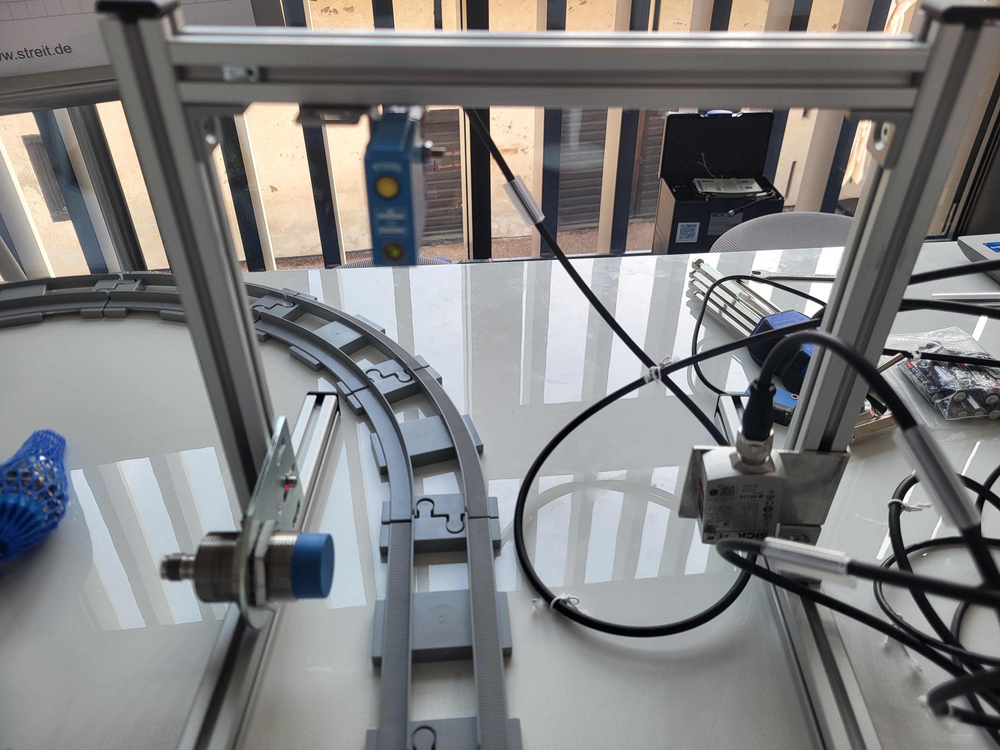
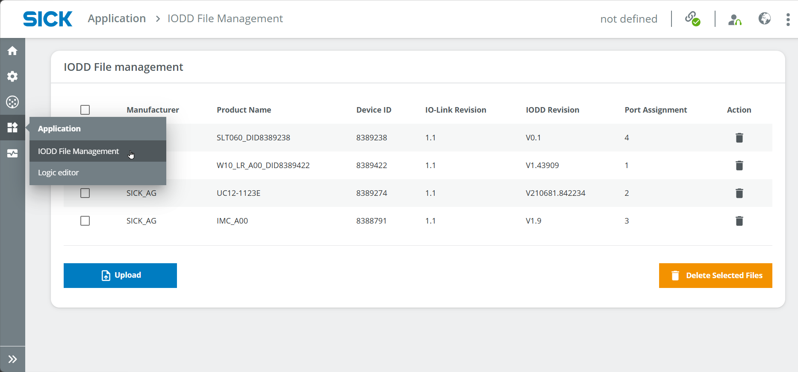
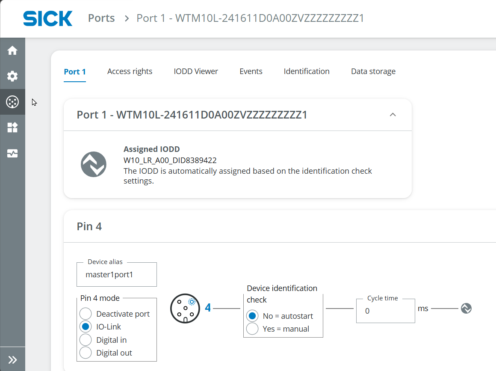
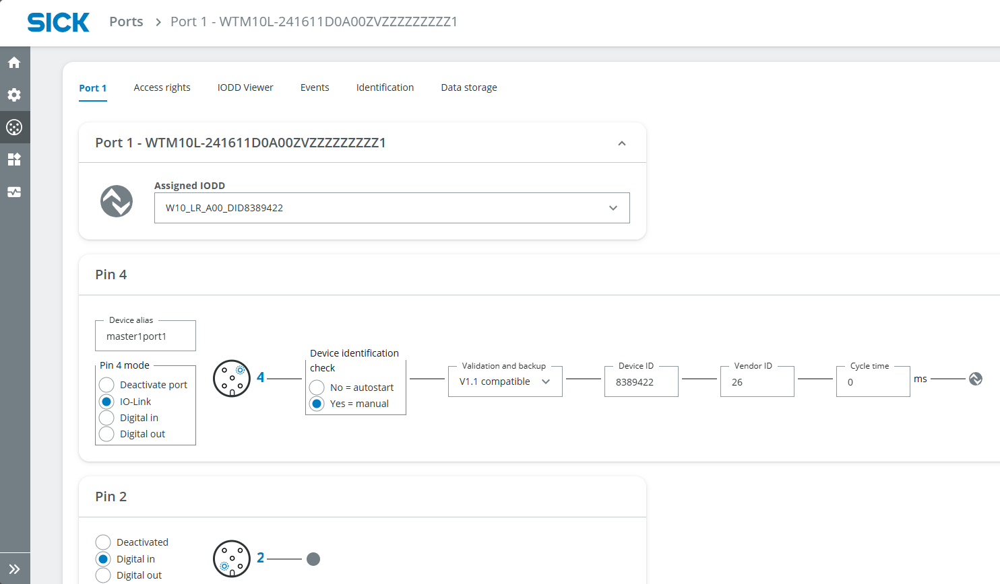
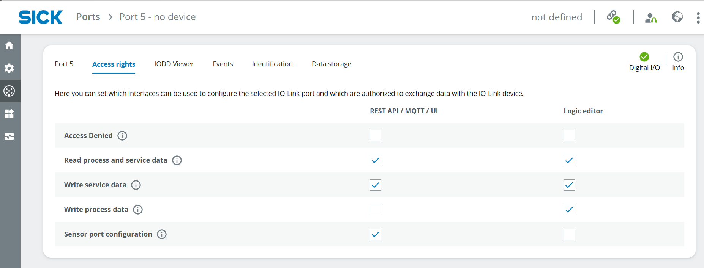
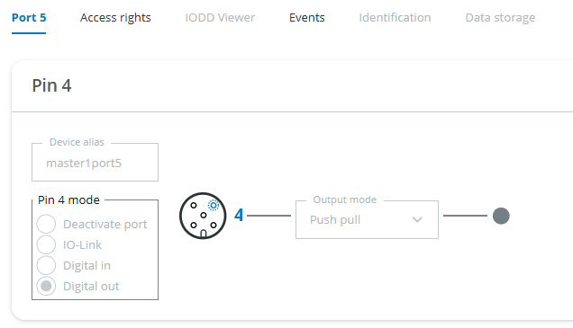
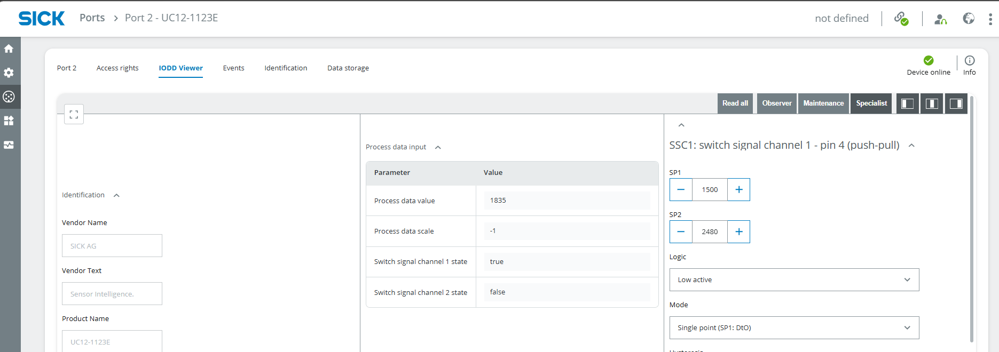
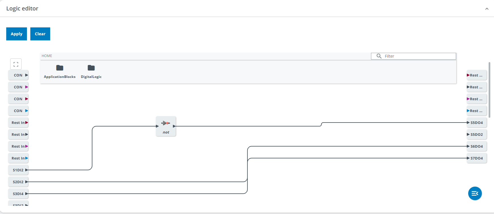
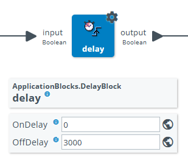

# Intelligente Zugschleife

## Kurzbeschreibung

Dieses anspruchsvolle Projekt zeigt, wie verschiedene Sensortechnologien kombiniert werden können, um einen Zug zu analysieren, der sich auf einer Gleisschleife bewegt.

Die Modelle W10, UC12 und IMC30 werden zur Anwesenheitserkennung, zur Abstandsmessung und zur Erkennung metallischer Objekte eingesetzt. Die Sensordaten können über LEDs oder eine optionale Signalsäule angezeigt werden. Die erforderliche Logik wird im Logik-Editor des SIG300 erstellt.

## Projektinformationen

<table style="border-collapse: collapse; width: 100%;">
  <thead>
    <tr style="background-color: #005aff; color: white;">
      <th style="padding: 8px; text-align: left;">Projektart</th>
      <th style="padding: 8px; text-align: left;">Erforderliches Wissensniveau</th>
      <th style="padding: 8px; text-align: left;">Voraussichtliche Dauer</th>
      <th style="padding: 8px; text-align: left;">Zusätzliche Hardware- und Softwareanforderungen</th>
    </tr>
  </thead>
  <tbody>
    <tr>
      <td><span class="project-badge advanced">Fortgeschrittenes Projekt</span></td>
      <td>Fortgeschritten</td>
      <td>1 bis 2 Stunden</td>
      <td>
        Montagesatz<br>
        Batteriebetriebener Zug mit Schienen<br>
        Metallgegenstände für Eisenbahnwaggons<br>
        Optional: SLT
      </td>
    </tr>
  </tbody>
</table>


## Ziel

Das Ziel dieses Projekts ist es, ein intelligentes Tor zu bauen, das einen Zug analysiert, der den Erfassungsbereich durchfährt.

Das Projekt kombiniert verschiedene Sensoren, um:

- den Zug erkennen
- feststellen, ob ein Eisenbahnwaggon beladen ist
- metallische Gegenstände in einem Eisenbahnwaggon erkennen
- Die Sensordaten mit LEDs oder einem optionalen SLT anzeigen
- Kombinieren Sie die Sensorsignale im Logik-Editor des SIG300

---

## Projektkonzept

Das Projekt nutzt die drei Sensoren, die im IO-Link Connectivity Starter Kit enthalten sind:

- der fotoelektrische Sensor W10
- der Ultraschall-Abstandssensor UC12
- der induktive Näherungssensor IMC30

Jeder Sensor erfüllt eine andere Aufgabe. Die Ergebnisse werden im Logik-Editor des SIG300 zusammengefasst und können über die angeschlossenen LEDs oder eine optionale Signalsäule angezeigt werden.

---

## Bevor Sie beginnen

Stellen Sie eine Verbindung zur Benutzeroberfläche des SIG300 her, wie in der Anleitung „Erste Schritte“ beschrieben.

[Erste Schritte](./iolink_getting_started.md){ .md-button .button-small }

Wenn das optionale Montageset verwendet wird, bauen Sie den [Montagerahmen](../mounting_frame.md) zusammen, bevor Sie die Sensoren positionieren.


---

# Projekteinrichtung

## 1. Schließen Sie die Geräte an

Schließen Sie die drei Sensoren und die LEDs oder das optionale SLT an das SIG300 an.

??? info "Beispiel für die Einrichtung einer Verbindung"

    Ein Beispiel für eine Verbindungskonfiguration lautet:

    - SIG300 über USB-C an den Computer angeschlossen
    - S1: W10
    - S2: UC12
    - S3: IMC30
    - S4: SLT oder gelbe LED
    - S5: grüne LED
    - S6: rote LED

    Die grünen und roten LEDs können zunächst blinken, da die entsprechenden Anschlüsse für IO-Link konfiguriert sind.

---

## 2. Die Sensoraufgaben definieren

Überlegen Sie sich für jeden Sensor eine geeignete Aufgabe.

Befestigen Sie die Sensoren mithilfe der mitgelieferten Halterungen und Werkzeuge am Montagerahmen.

??? info "Sensorinformationen"

    **W10**

    Fotoelektrischer Sensor, der den Abstand nach einem optischen Funktionsprinzip misst.

    Messbereich:

    ```text
    25 to 700 mm, depending on the selected mode
    ```

    https://www.sick.com/ag/en/catalog/products/detection-sensors/photoelectric-sensors/w10/wtm10l-241611d0a00zvzzzzzzzzz1/p/p678567

    **UC12**

    Ultraschall-Abstandssensor.

    Messbereich:

    ```text
    55 to 250 mm
    ```

    https://www.sick.com/ag/en/catalog/products/distance-sensors/ultrasonic-distance-sensors/uc12/uc12-1223e/p/p665120

    **IMC30**

    Induktiver Näherungssensor zur Erkennung metallischer Objekte.

    Erfassungsbereich:

    ```text
    0 to 20 mm
    ```

    https://www.sick.com/ag/en/catalog/products/detection-sensors/inductive-proximity-sensors/imc/imc30-20nppvc0sa00/p/p483964?tab=detail

??? info "Beispiel für Einrichtung und Aufgaben"

    **UC12**

    Befestigen Sie den UC12 oben am Rahmen, um den Zug zu erfassen. Beachten Sie dabei die maximale Messreichweite.

    **W10**

    Befestigen Sie den W10 am unteren Ende der anderen vertikalen Stange, um zu überprüfen, ob ein Eisenbahnwaggon beladen ist. Beachten Sie dabei die Mindesthöhe der Gegenstände auf dem Waggon.

    **IMC30**

    Befestigen Sie den IMC30 am unteren Ende einer vertikalen Stange, um metallische Gegenstände auf dem Eisenbahnwaggon zu erkennen. Beachten Sie dabei die maximale Erfassungsreichweite.

    

    

    

---

## 3. Öffnen Sie die Benutzeroberfläche des SIG300

1. Stellen Sie eine Verbindung zur Benutzeroberfläche des SIG300 her, wie in der Anleitung „Erste Schritte“ beschrieben.
2. Melden Sie sich als **Service** an.
3. Verwenden Sie das folgende Passwort:

```text
servicelevel
```

4. Wählen Sie **„Standardpasswort beibehalten“**.

---

# IODD-Konfiguration

## 1. Überprüfen Sie die IODD-Dateien

1. Wählen Sie **Anwendung** > **IODD-Dateiverwaltung**.
2. Überprüfen Sie, ob die IODDs aller angeschlossenen Sensoren verfügbar sind.



Falls ein IODD fehlt, laden Sie es bitte hier herunter:

- der Bereich **Downloads** > **Software** auf der entsprechenden SICK-Produktseite
- https://ioddfinder.io-link.com/

Verwenden Sie bei der Suche die folgenden Geräteinformationen:

- W10: `WTM10x-xx1611xxA00xVxxxxxxxxxx`
- UC12: `6077702`
- IMC30: `1079301`
- SLT060: `6075938`

3. Weisen Sie die IODDs den entsprechenden Anschlüssen zu, falls dies nicht automatisch geschehen ist.



---

# Port-Konfiguration

## 1. Konfigurieren Sie die Sensoren

Das folgende Beispiel beschreibt die Konfiguration des W10 am Port S1.

Die Sensoren können als digitale Eingänge verwendet werden, beispielsweise um einen digitalen Ausgang wie eine LED anzusteuern. Sie können auch als IO-Link-Geräte eingesetzt werden, um mit anderen IO-Link-Geräten wie dem SLT zu kommunizieren.

1. Öffnen Sie **Ports** > **Port 1**.
2. Öffnen Sie die Registerkarte **Zugriffsrechte**.
3. Aktivieren Sie die erforderlichen Zugriffsrechte.

Folgende Zugriffsrechte sind relevant:

- **Prozess- und Servicedaten lesen**
- **Konfiguration des Sensoranschlusses**


4. Öffnen Sie die Registerkarte „**Port 1**“ in den Einstellungen.
5. Überprüfen Sie die folgenden Einstellungen:

- IODD korrekt zugewiesen
- IO-Link ausgewählt
- Option „Geräteidentifikation prüfen“ auf **Ja** gesetzt
- Version auf **V1.1** gesetzt

!!! note "Relevante Pins"

    Pin 4 ist für das SLT relevant, wenn es als IO-Link-Gerät verwendet wird.

    Pin 2 kann für digitale Signale verwendet werden, beispielsweise beim Anschluss des Sensorsignals an eine LED.



6. Öffnen Sie die Registerkarte **IODD Viewer**.
7. Wählen Sie oben in der Mitte die Messart aus.
8. Lesen Sie den aktuellen Messwert unten in der Mitte ab.

Um einen Trigger bei einem bestimmten Messwert zu definieren, passen Sie die entsprechenden Sensorparameter an.

Um beispielsweise den W10 auszulösen, wenn der Messwert größer als 180 mm ist:

1. Öffnen Sie die **Erkennungseinstellungen**.
2. Stellen Sie den **Erfassungsbereich von Qint.1 SP1** auf `180 mm` ein.
3. Wählen Sie **Hochaktiv** aus.


Wiederholen Sie die Konfiguration für alle Sensoren.

!!! note "Verschiedene Layouts des IODD-Viewers"

    Der IODD-Viewer kann je nach Sensor unterschiedlich aussehen, da die Sensoren unterschiedliche Funktionsprinzipien, Parameter und integrierte Funktionen verwenden.

---

## 2. Konfigurieren Sie die LEDs

Das SLT ist ähnlich wie ein Sensor konfiguriert, da es als IO-Link-Gerät eingesetzt wird.

Für einfache digitale Ausgänge wie die mitgelieferten LEDs gehen Sie wie folgt vor:

1. Öffnen Sie **Ports** und wählen Sie den von der LED verwendeten Port aus.
2. Öffnen Sie die Registerkarte **Zugriffsrechte**.
3. Aktivieren Sie **„Prozessdaten schreiben“**.



4. Öffnen Sie die Registerkarte „Konfiguration“ für den entsprechenden Port.
5. Konfigurieren Sie den von der LED verwendeten Pin.
6. Je nach Portkonfiguration und Zugriffsrechten schalten Sie zwischen **HI/LO** um, um zu prüfen, ob die LED funktioniert.



Wiederholen Sie die Konfiguration für alle LEDs.

!!! warning "Port-Modus überprüfen"

    In der vorherigen Version dieser Anleitung war für Pin 4 „**Digital In**“ angegeben, obwohl die LED als digitaler Ausgang angesteuert wird.

    Überprüfen Sie den erforderlichen Portmodus in der Benutzeroberfläche des SIG300 und in der jeweiligen Geräteanleitung, bevor Sie die Konfiguration abschließen.

---

# Logik-Editor

## 1. Erstellen Sie die Anwendungslogik

Der Logik-Editor kombiniert die digitalen Sensorsignale mit den angeschlossenen LEDs.

!!! warning "Änderungen übernehmen"

    Wählen Sie nach jeder Änderung der Logik immer **Übernehmen** aus. Andernfalls werden die Änderungen nicht wirksam.

1. Öffnen Sie **Anwendung** > **Logik-Editor**.
2. Erstellen Sie die Logik für die angeschlossenen Sensoren und LEDs.
3. Verwenden Sie die bei der Projekteinrichtung definierten Aufgaben.

Die folgenden Beispiele zeigen mögliche Umsetzungen.

---

## 2. Geben Sie an, ob ein Waggon beladen ist

??? info "Die grüne LED soll aufleuchten, wenn ein Waggon beladen ist"

    Stellen Sie eine direkte Verbindung zwischen dem digitalen Eingang des W10 und dem digitalen Ausgang der grünen LED her.

    Beispiel:

    ```text
    S1DI2 → S5DO4
    ```

    Ziehe den Pfeil vom Eingabeblock auf der linken Seite zum Ausgabeblock auf der rechten Seite.

    Je nach Messergebnis des W10 sollte die grüne LED aufleuchten.

    Um das Ergebnis umzukehren, fügen Sie den folgenden Logikblock zwischen Eingang und Ausgang ein:

    ```text
    Digital Logic > Gate > NOT
    ```

    

---

## 3. Geben Sie an, ob der Zug erkannt wurde

??? info "Die rote LED soll aufleuchten, wenn der Zug erkannt wird"

    Der UC12 kann Objekte innerhalb eines definierten Bereichs erkennen.

    1. Montieren Sie den UC12 entsprechend seinem Messbereich und der Höhe des Zuges.
    2. Öffnen Sie den **IODD Viewer**.
    3. Überprüfen Sie das Messergebnis und passen Sie die Position des UC12 an.
    4. Öffnen Sie **SSC1: Schaltkanal 1**.
    5. Passen Sie den Wert **SP1** an.
    6. Wählen Sie **Geringe Aktivität** aus.

    !!! note "UC12 SP1-Wert"

        Der hier beschriebene SP1-Wert ist kein Wert in Millimetern.

    

    Öffnen Sie den Logik-Editor und stellen Sie folgende Verbindungen her:

    ```text
    S2I2 → S6DO4
    ```

    Ein NOT-Gatter ist nicht erforderlich, da die Logik als **Low-aktiv** konfiguriert ist.

    

    Wählen Sie **Übernehmen** und überprüfen Sie das Ergebnis.

---

## 4. Geben Sie an, ob ein metallischer Gegenstand erkannt wurde

??? info "Die gelbe LED soll aufleuchten, wenn ein metallischer Gegenstand erkannt wird"

    Der IMC30 erkennt metallische Objekte innerhalb seines Erfassungsbereichs.

    1. Montieren Sie den IMC30 entsprechend seinem Erfassungsbereich und dem Abstand zu den metallischen Objekten auf dem Waggon.
    2. Öffnen Sie den **IODD Viewer**.
    3. Überprüfen Sie das Messergebnis.
    4. Passen Sie die Position des IMC30 bei Bedarf an.

    Für dieses Beispiel müssen keine weiteren Parameter konfiguriert werden.

    Öffnen Sie den Logik-Editor und stellen Sie folgende Verbindungen her:

    ```text
    S3I2 → S4DO4
    ```

    

    Wählen Sie **Übernehmen** und prüfen Sie das Ergebnis.

---

## 5. Eine LED drei Sekunden lang leuchten lassen

??? info "Eine LED nach einem Auslöseereignis drei Sekunden lang leuchten lassen"

    Fügen Sie im Logik-Editor einen **Verzögerungs**-Block ein.

    Stellen Sie **OffDelay** auf folgenden Wert ein:

    ```text
    3000 ms
    ```

    Dadurch wird das Ausschalten der LED um drei Sekunden verzögert, nachdem das Triggersignal beendet ist.

    

---

## Erwartetes Ergebnis

Nach Abschluss des Projekts sollte der SIG300 die konfigurierten Sensorsignale zusammenführen und die angeschlossenen LEDs oder das optionale SLT steuern.

Je nach der implementierten Logik:

- Die grüne LED zeigt an, ob ein Eisenbahnwaggon beladen ist
- Die rote LED zeigt an, ob der Zug erkannt wird.
- Die gelbe LED zeigt an, ob ein metallischer Gegenstand erkannt wurde
- Durch eine Verzögerung kann eine LED nach einem Trigger noch drei Sekunden lang aktiv bleiben

---

## Zurücksetzen

Wenn das Projekt fertig ist, wählen Sie im Logik-Editor die Option **Löschen** aus, um alle Blöcke und Verbindungen zu entfernen.

!!! warning "Auf Werkseinstellungen zurücksetzen"

    Durch das Zurücksetzen auf die Werkseinstellungen werden auch die hochgeladenen IODD-Dateien gelöscht.

---

## Zusammenfassung

In diesem Projekt für Fortgeschrittene haben Sie die drei Sensoren des IO-Link-Connectivity-Starter-Kits in einer intelligenten Zuganwendung kombiniert.

Du hast mit folgenden Personen zusammengearbeitet:

- der Lichtschranken-Sensor W10
- der Ultraschall-Abstandssensor UC12
- der induktive Näherungssensor IMC30
- LEDs oder ein optionales SLT
- IODD-Dateiverwaltung
- Portkonfiguration
- der IODD-Viewer
- der Logik-Editor des SIG300

Die einzelnen Sensordaten wurden mit visuellen Anzeigen verknüpft, die verschiedene Zustände des Zuges und seiner Ladung darstellten.

## Nächste Schritte

Kehren Sie zur IO-Link-Projektübersicht zurück oder sehen Sie sich das SensorFusion-Projekt an.

<div class="next-step-buttons" markdown>

[Beispielprojekte](./iolink_example_projects.md){ .md-button }

[SensorFusion](./sensor_fusion.md){ .md-button }

</div>