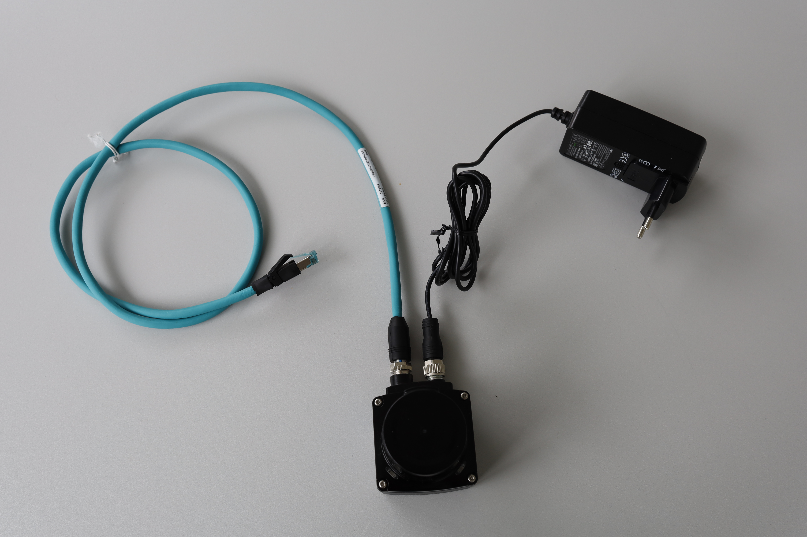

# Erste Schritte mit dem LiDAR-Starter-Kit

Befolgen Sie diese Schritte, um Ihr LiDAR-Starter-Kit einzurichten und in Betrieb zu nehmen:

## Schritt 1: Hardware-Einrichtung
1. Schließen Sie den LiDAR-Sensor mithilfe des mitgelieferten Kabels und des Netzwerkadapters an Ihren Computer an.
2. Stellen Sie sicher, dass das Netzteil angeschlossen und eingeschaltet ist.
3. Konfigurieren Sie die IP-Adresse des Adapters.

??? sickinfo "Ausführliche Anleitung"

      - Tastenkombination unter Windows: „Win + R“: „ncpa.cpl“

      

      - Alternative: Öffnen Sie die Netzwerkeinstellungen Ihres Betriebssystems (z. B. **Systemsteuerung > Netzwerk und Internet** unter Windows 10/11 oder die entsprechende Option in Ihrem Betriebssystem).  
      Wählen Sie **Erweiterte Netzwerkeinstellungen**  

      - Suchen Sie den USB-Ethernet-Adapter (möglicherweise als **ASIX USB to Gigabit Ethernet Family Adapter** aufgeführt).

       

      - Klicken Sie auf den Adapter und wählen Sie **Eigenschaften / Bearbeiten**.  

      - Geben Sie gegebenenfalls die Administrator-Anmeldedaten ein.  

      - Suchen Sie **Internetprotokoll Version 4 (TCP/IPv4)** und wählen Sie **Eigenschaften** oder klicken Sie mit der rechten Maustaste darauf.

        

      - Von DHCP auf manuelle IP-Einstellungen umstellen:  
      Verwenden Sie die folgende IP-Adresse: `192.168.0.xxx`  
      Subnetzmaske: `255.255.0.0`

        

      - Speichern Sie die Änderungen, indem Sie in beiden Fenstern auf **OK** klicken.

4. Öffnen Sie einen Browser und geben Sie die Standard-IP-Adresse 192.168.0.1 ein. Nun sollte die Benutzeroberfläche des Sensors angezeigt werden.

  
*Abbildung 1: Anschlusskonfiguration für das LiDAR-Starter-Kit.*

## Schritt 2: Softwareinstallation
1. Installieren Sie die erforderlichen Treiber und die Software von der SICK-Website.
2. Laden Sie die im Kit enthaltenen Beispiel-Python-Skripte herunter.

## Schritt 3: Erste Messung
1. Führen Sie das Skript `01_read_devicetype.py` aus, um die Verbindung zu überprüfen.
2. Verwenden Sie das Skript `02_read_measurement.py`, um eine einzelne Messung durchzuführen.

Weitere Informationen zu komplexeren Anwendungsfällen finden Sie im Abschnitt „Fortgeschrittene“.