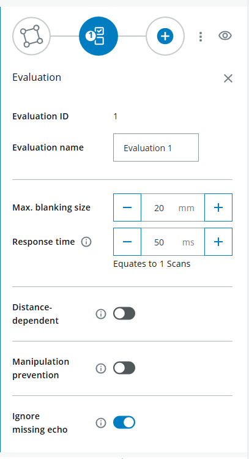

<!-- # Menschliches Klavier / Luftklavier
<table style="border-collapse: collapse; width: 100%;">
  <thead>
    <tr style="background-color: #005aff; color: white;">
      <th style="padding: 8px; text-align: left;">Kurzbeschreibung</th>
      <th style="padding: 8px; text-align: left;">Erforderliches Wissensniveau</th>
      <th style="padding: 8px; text-align: left;">Voraussichtliche Dauer</th>
      <th style="padding: 8px; text-align: left;">Zusätzliche Hardware- und Softwareanforderungen</th>
    </tr>
  </thead>
  <tbody>
    <tr>
      <td>Erstellen Sie mehrere Spielfelder und eine einfache Python-Anwendung, die bei Regelverstößen auf den Spielfeldern Töne abspielt.</td>
      <td>Fortgeschritten</td>
      <td>30–60 Minuten</td>
      <td>Mehrere Personen oder Gegenstände</td>
    </tr>
  </tbody>
</table>


Ziel dieses Projekts ist es, die Tasten eines Klaviers zu simulieren, indem Felder gezeichnet werden, die unterschiedliche Töne erzeugen, wenn sie von Objekten berührt werden. Ein einfaches Python-Skript steuert die Logik der verschiedenen Töne.

## Anleitung

**Hinweis:** Die genannten Codeausschnitte dienen lediglich als Beispiele. Sie können gerne Ihren eigenen Code verwenden, um das Projekt auszuführen.

### Feldbewertung

- Schließen Sie Ihr Gerät wie unter [Erste Schritte](./lidar_getting_started.md) beschrieben an. Die Benutzeroberfläche sollte nun in etwa so aussehen:


- Melden Sie sich als **Service** an, Passwort: **servicelevel**, und klicken Sie auf **Standardpasswort beibehalten**
- Wählen Sie **Anwendung** > **Feldauswertung** und zeichnen Sie ein Feld in geeigneter Größe ein.


- Falls erforderlich, führen Sie ein **Teach-in** durch, um alle statischen Objekte zu ignorieren. Beenden Sie das Teach-in nach etwa 10 Sekunden.


- Legen Sie die Feldparameter fest, z. B. die maximale Ausblendgröße, die der minimalen Objektgröße entspricht, die das Feld überschreitet.



- Zeichnen Sie mehrere Felder direkt nebeneinander.


- Sie können **Ausgabe** ignorieren

### Programmierung

- Öffnen Sie eine Programmierumgebung für Python, beispielsweise Visual Studio Code.
- Geben Sie den folgenden Code ein:

```python
import socket

HOST = "192.168.0.1"
PORT = 2111

def sopas(cmd):
    with socket.socket(socket.AF_INET, socket.SOCK_STREAM) as s:
        s.settimeout(2)
        s.connect((HOST, PORT))
        telegram = b"\x02" + cmd.encode("ascii") + b"\x03"
        s.sendall(telegram)
        return s.recv(1024).decode("ascii").strip("\x02\x03")

# Enable measurement
print(sopas("sMN SetAccessMode 03 F4724744"))
print(sopas("sMN LMCstartmeas"))

# Read field evaluation
response = sopas("sRN FieldEvaluationResult")
print("Field evaluation:", response)
```

- Das Ergebnis sollte in etwa so aussehen: 


- **2** = Feld nicht verletzt, **4** = Feld verletzt
- Lesen Sie nun einen bestimmten Wert aus (Feld „verletzt“ oder „nicht verletzt“, z. B. um einen Ton abzuspielen oder ein Licht einzuschalten).

??? sickinfo "Code"
    ```python
    field1 = response[38:39]
    print(output)
    ```

- **38:39** bezieht sich auf die Position im Ergebnis (erste Ziffer 2 oder 4)
- Überprüfen Sie, ob das Ergebnis die richtige Position angibt (entweder 2 für „nicht verletzt“ oder 4 für „verletzt“).
- Bei einem Verstoß gegen die Feldgrenzen wird ein Ton abgespielt; andernfalls wird der Text „Fehler“ angezeigt. Wichtig: Gib in der zweiten Zeile des Codes (unterhalb des vorherigen „import socket“) den Befehl „import winsound“ ein.

??? sickinfo "Code"
    ```python
    import winsound


    if output == '4':
        winsound.Beep(200, 1000)
    else:  print('error')
    ```

- Um die Sensordaten kontinuierlich auszulesen, fügen Sie den Code in eine „while True“-Schleife ein.

??? sickinfo "Code"
    ```python
    import socket
    import winsound
    HOST = "192.168.0.1"
    PORT = 2111
    def sopas(cmd):
    with socket.socket(socket.AF_INET, socket.SOCK_STREAM) as s:
        s.settimeout(2)
        s.connect((HOST, PORT))
        telegram = b"\x02" + cmd.encode("ascii") + b"\x03"
        s.sendall(telegram)
        return s.recv(1024).decode("ascii").strip("\x02\x03")
    # Enable measurement
    print(sopas("sMN SetAccessMode 03 F4724744"))
    print(sopas("sMN LMCstartmeas"))

    while True:
    # Read field evaluation
    response = sopas("sRN FieldEvaluationResult")
    print("Field evaluation:", response)

    output= response[38:39]
    #print(output)

    if output == '4':
        winsound.Beep(200, 1000)
    else:  print('error')
    ```

- Füge alle Felder in deinen Code ein
- Wählen Sie die passenden Frequenzen für Ihre Noten aus.

??? sickinfo "Frequenzen"
    

- **Vollständiger Code:**

??? sickinfo "Code"
    ```python
    import winsound

    if output == '4':
        x
        import socket
    import winsound

    HOST = "192.168.0.1"
    PORT = 2111

    def sopas(cmd):
    with socket.socket(socket.AF_INET, socket.SOCK_STREAM) as s:
        s.settimeout(2)
        s.connect((HOST, PORT))
        telegram = b"\x02" + cmd.encode("ascii") + b"\x03"
        s.sendall(telegram)
        return s.recv(1024).decode("ascii").strip("\x02\x03")

    # Enable measurement
    print(sopas("sMN SetAccessMode 03 F4724744"))
    print(sopas("sMN LMCstartmeas"))

    #music notes
    noteC=262
    noteD=298
    noteE=330
    noteF=350
    noteG=392
    noteA=440

    fieldposition=37
    duration=300

    while True:
    # Read field evaluation
    response = sopas("sRN FieldEvaluationResult")
    print("Field evaluation:", response)

    field1= response[fieldposition:fieldposition+1]
    field2= response[fieldposition+4:fieldposition+5]
    field3= response[fieldposition+8:fieldposition+9]
    field4= response[fieldposition+12:fieldposition+13]
    field5= response[fieldposition+16:fieldposition+17]
    field6= response[fieldposition+20:fieldposition+21]
    #print(field1 +' '+ field2)


    if field1 == '4':
        winsound.Beep(noteC, duration)
    if field2 == '4':
        winsound.Beep(noteD, duration)
    if field3 == '4':
        winsound.Beep(noteE, duration)
    if field4 == '4':
        winsound.Beep(noteF, duration)
    if field5 == '4':
        winsound.Beep(noteG, duration)
    if field6 == '4':
        winsound.Beep(noteA, duration)
    else:  print('error')
    ```
- Versuche, einen Song abzuspielen, indem du die entsprechenden Felder falsch ausfüllst.

Möchtest du weitere Schwierigkeitsstufen?

- Note nur beim Wechseln der Noten abspielen
- Halbtöne einbeziehen, d. h. benachbarte Tasten

-->

# Menschliches Klavier / Luftklavier

## Kurzbeschreibung

Dieses Vorzeigeprojekt zeigt, wie sich mit dem LiDAR-Starter-Kit ein interaktives **Air Piano** erstellen lässt.

Sie werden mit dem LiDAR-Sensor mehrere Erfassungsfelder erstellen und mithilfe einer Python-Anwendung verschiedene Töne abspielen, sobald ein Feld von einer Person oder einem Objekt betreten wird.

Das Projekt lässt sich um verschiedene Spielmodi, Halbtöne, realistischere Klavierklänge oder mehrere gleichzeitig erklingende Töne erweitern.

## Projektinformationen

<table style="border-collapse: collapse; width: 100%;">
  <thead>
    <tr style="background-color: #005aff; color: white;">
      <th style="padding: 8px; text-align: left;">Projektart</th>
      <th style="padding: 8px; text-align: left;">Erforderliches Wissensniveau</th>
      <th style="padding: 8px; text-align: left;">Voraussichtliche Dauer</th>
      <th style="padding: 8px; text-align: left;">Zusätzliche Hardware- und Softwareanforderungen</th>
    </tr>
  </thead>
  <tbody>
    <tr>
      <td><span class="project-badge showcase">Vorzeigeprojekt</span></td>
      <td>Fortgeschritten</td>
      <td>30 bis 60 Minuten</td>
      <td>Mehrere Personen oder Objekte, Audioausgabe, Python mit pygame</td>
    </tr>
  </tbody>
</table>

<br>


## Ziel

Das Ziel dieses Projekts ist es, Klaviertasten mithilfe von LiDAR-Erfassungsfeldern zu simulieren.

Nach Abschluss dieses Projekts sollten Sie wissen, wie man:

- Mehrere LiDAR-Erfassungsfelder erstellen
- Auswertungsergebnisse von Feldern mit Python auslesen
- Verstöße gegen die Feldregeln musikalischen Noten zuordnen
- Geräusche basierend auf Sensordaten auslösen
- verschiedene Spielmodi wie „Trigger“ oder „Hold“ verwenden
- Verbesserung der Socket-Verarbeitung für einen stabileren Betrieb

---

## Projektkonzept

Der LiDAR-Sensor überwacht mehrere nebeneinander liegende Bereiche.

Jedes Feld steht für eine Klaviertaste.  
Wenn eine Person oder ein Objekt ein Feld berührt, liest das Python-Skript den Feldstatus aus und spielt die entsprechende Note ab.

Mögliche Erweiterungen:

- Töne kontinuierlich abspielen, solange ein Feld verletzt wird
- Signaltöne nur einmal beim Aufrufen eines Feldes abspielen
- Halbtöne hinzufügen
- realistische Klavierklänge verwenden
- mehrere Noten gleichzeitig anspielen
- Kombinieren Sie die Konfiguration mit einem Dashboard oder visuellem Feedback

---

## Bevor Sie beginnen

Schließen Sie Ihr LiDAR-Starter-Kit wie in der Anleitung [Erste Schritte](./lidar_getting_started.md) beschrieben an.

!!! note "Code-Beispiele"
    Die Codeausschnitte auf dieser Seite dienen als Beispiele.  
    Sie können den Code anpassen oder Ihre eigene Implementierung für das Projekt verwenden.

!!! warning "Erforderliches Python-Paket"
    Das verbesserte Klavierbeispiel verwendet `pygame.midi`.  
    Installieren Sie pygame, bevor Sie das Skript ausführen:

    ```bash
    pip install pygame
    ```

---

# Einrichtung der Feldbewertung

## 1. Öffnen Sie die Benutzeroberfläche des Sensors

1. Öffnen Sie die Benutzeroberfläche des LiDAR-Sensors in Ihrem Browser.
2. Stellen Sie sicher, dass der Sensor angeschlossen und erreichbar ist.
3. Die Benutzeroberfläche sollte ähnlich wie im folgenden Beispiel aussehen.


---

## 2. Als Service-Benutzer anmelden

1. Melden Sie sich als **Service** an.
2. Geben Sie das Passwort ein:

```text
servicelevel
```

3. Klicken Sie auf **„Standardpasswort beibehalten“**.

---

## 3. Feldauswertungsbereiche anlegen

1. Wählen Sie **Anwendung** > **Feldauswertung**.
2. Zeichne ein Feld in geeigneter Größe.
3. Wiederholen Sie diesen Schritt, bis mehrere Felder nebeneinander stehen.


Führen Sie gegebenenfalls ein **Teach-in** durch, um statische Objekte zu ignorieren.

1. Starten Sie den Einlernvorgang.
2. Warten Sie etwa 10 Sekunden.
3. Den Teach-In-Prozess beenden.


---

## 4. Feldparameter konfigurieren

Legen Sie die Feldparameter für Feldverletzungen fest.

Konfigurieren Sie beispielsweise die maximale Ausblendgröße.  
Dieser Wert entspricht der kleinsten Objektgröße, die das Feld verletzt.


Zeichnen Sie mehrere Felder direkt nebeneinander.


Die Konfiguration unter **Ausgabe** können Sie in diesem einfachen Beispiel ignorieren.

!!! tip "Feldkonfiguration"
    Beginnen Sie zunächst mit einer kleinen Anzahl von Feldern, zum Beispiel drei oder vier.  
    Sobald die Python-Logik zuverlässig funktioniert, fügen Sie weitere Felder und Notizen hinzu.

---

# Python-Integration

## 1. Ergebnis der Feldbewertung lesen

Öffnen Sie eine Python-Entwicklungsumgebung, zum Beispiel Visual Studio Code.

Der folgende Code stellt eine Verbindung zum LiDAR-Sensor her und liest das Ergebnis der Feldauswertung einmal aus.

```python
import socket

HOST = "192.168.0.1"
PORT = 2111

def sopas(cmd):
    with socket.socket(socket.AF_INET, socket.SOCK_STREAM) as s:
        s.settimeout(2)
        s.connect((HOST, PORT))
        telegram = b"\x02" + cmd.encode("ascii") + b"\x03"
        s.sendall(telegram)
        return s.recv(1024).decode("ascii").strip("\x02\x03")

# Enable measurement
print(sopas("sMN SetAccessMode 03 F4724744"))
print(sopas("sMN LMCstartmeas"))

# Read field evaluation
response = sopas("sRN FieldEvaluationResult")
print("Field evaluation:", response)
```

Das Ergebnis sollte in etwa so aussehen:


Ergebnis der Feldbewertung:

- **2** bedeutet, dass das Feld nicht verletzt ist
- **4** bedeutet, dass das Feld verletzt wurde

---

## 2. Feldzustände extrahieren

Bei mehreren Feldern enthält die Antwort mehrere Feldzustände.

Die genauen Positionen hängen von der Sensorkonfiguration und der Anzahl der Felder ab.  
Im folgenden, verbesserten Beispiel wird die Antwort in eine Liste aufgeteilt, und die Feldwerte werden anhand des Indexes ausgelesen.

!!! warning "Konfiguration des Feldindexes"
    Die Werte `FIELD_START_INDEX` und `FIELD_STEP` müssen möglicherweise an Ihre Konfiguration angepasst werden.  
    Drucken Sie zunächst die vollständige Antwort aus und prüfen Sie, wo sich die Feldangaben befinden.

---

## 3. Air-Piano-Code

Der folgende Code nutzt eine dauerhafte Socket-Verbindung und die MIDI-Ausgabe:

- eine dauerhafte Socket-Verbindung, anstatt in jeder Schleife eine neue Verbindung herzustellen
- Automatische Wiederherstellung der Verbindung, wenn diese einmal unterbrochen wird
- MIDI-Noten statt einfacher Pieptonfrequenzen
- Trigger-Modus und Hold-Modus
- Halbtöne
- Es können mehrere Notizen gleichzeitig aktiv sein.
- ein realistischeres, klavierähnliches Spielverhalten

```python
import socket  
import time  
import pygame.midi

# ============ KONFIGURATION ============  
HOST = "192.168.0.1"  
PORT = 2111

# Spielmodus:  
#   "hold"    = Ton klingt dauerhaft (Orgel)  
#   "trigger" = Ton wird einmal angeschlagen (Klavier)  
PLAY_MODE = "hold"

NOTE_DURATION_MS = 400   # Tondauer im Trigger-Modus (ms)  
VELOCITY = 110           # Anschlagstärke (0-127)

# --- Instrument passt automatisch zum Modus ---  
if PLAY_MODE == "hold":  
    INSTRUMENT = 19      # Church Organ (hält den Ton)  
else:  
    INSTRUMENT = 0       # Acoustic Grand Piano (klingt aus)

# Chromatische Tonleiter (12 Töne): C, C#, D, D#, E, F, F#, G, G#, A, A#, H  
NOTES = [60, 61, 62, 63, 64, 65, 66, 67, 68, 69, 70, 71]

# Physische Reihenfolge (links -> rechts) -> Feld-Nummer in der Antwort  
FIELD_ORDER = [3, 7, 5, 8, 4, 9, 6, 2, 10, 1, 11, 0]

FIELD_START_INDEX = 4    # Position des ersten Feldwerts in der Antwort  
FIELD_STEP = 2           # Abstand zwischen den Feldwerten  
NUM_FIELDS = len(NOTES)


# ============ LIDAR-VERBINDUNG (persistent) ============  
class LidarConnection:  
    def __init__(self, host, port):  
        self.host = host  
        self.port = port  
        self.sock = None  
        self.connect()

    def connect(self):  
        if self.sock:  
            try:  
                self.sock.close()  
            except OSError:  
                pass  
        self.sock = socket.socket(socket.AF_INET, socket.SOCK_STREAM)  
        self.sock.settimeout(2)  
        self.sock.connect((self.host, self.port))

    def sopas(self, cmd):  
        telegram = b"\x02" + cmd.encode("ascii") + b"\x03"  
        try:  
            self.sock.sendall(telegram)  
            return self.sock.recv(1024).decode("ascii").strip("\x02\x03")  
        except (OSError, socket.timeout):  
            self.connect()  
            self.sock.sendall(telegram)  
            return self.sock.recv(1024).decode("ascii").strip("\x02\x03")

    def close(self):  
        if self.sock:  
            self.sock.close()


# ============ HAUPTPROGRAMM ============  
def main():  
    pygame.midi.init()  
    player = pygame.midi.Output(pygame.midi.get_default_output_id())  
    player.set_instrument(INSTRUMENT)

    lidar = LidarConnection(HOST, PORT)  
    print(lidar.sopas("sMN SetAccessMode 03 F4724744"))  
    print(lidar.sopas("sMN LMCstartmeas"))

    note_on = [False] * NUM_FIELDS  
    note_off_time = [0.0] * NUM_FIELDS  
    prev_infringed = [False] * NUM_FIELDS

    try:  
        while True:  
            now = time.time()  
            response = lidar.sopas("sRN FieldEvaluationResult").split(' ')

            for pos in range(NUM_FIELDS):  
                field_number = FIELD_ORDER[pos]  
                idx = FIELD_START_INDEX + field_number * FIELD_STEP  
                infringed = (idx < len(response)) and (response[idx] == '4')  
                note = NOTES[pos]

                if PLAY_MODE == "hold":  
                    if infringed and not note_on[pos]:  
                        player.note_on(note, VELOCITY)  
                        note_on[pos] = True  
                    elif not infringed and note_on[pos]:  
                        player.note_off(note, VELOCITY)  
                        note_on[pos] = False

                elif PLAY_MODE == "trigger":  
                    if infringed and not prev_infringed[pos]:  
                        player.note_on(note, VELOCITY)  
                        note_on[pos] = True  
                        note_off_time[pos] = now + NOTE_DURATION_MS / 1000  
                    if note_on[pos] and now >= note_off_time[pos]:  
                        player.note_off(note, VELOCITY)  
                        note_on[pos] = False

                prev_infringed[pos] = infringed

            time.sleep(0.01)

    except KeyboardInterrupt:  
        print("Durch Nutzer gestoppt.")  
    finally:  
        for pos in range(NUM_FIELDS):  
            if note_on[pos]:  
                player.note_off(NOTES[pos], VELOCITY)  
        del player  
        pygame.midi.quit()  
        lidar.close()


if __name__ == "__main__":  
    main()  
```

---

## 4. Erläuterung des Codes

Die wichtigsten Konfigurationsoptionen sind:

- `PLAY_MODE`: Legt fest, ob Noten kontinuierlich oder nur einmal bei der Eingabe in ein Feld abgespielt werden
- `NOTE_DURATION_MS`: Legt fest, wie lange eine Note im Trigger-Modus gespielt wird
- `INSTRUMENT`: definiert das MIDI-Instrument
- `VELOCITY`: definiert die Anschlagstärke
- `NOTES`: Ordnet LiDAR-Felder MIDI-Noten zu
- `FIELD_START_INDEX`: Gibt an, wo sich der Status des ersten Feldes in der Antwort befindet
- `FIELD_STEP`: Definiert den Abstand zwischen den Feldwerten in der Antwort
- `NUM_FIELDS`: Legt fest, wie viele LiDAR-Felder ausgewertet werden

Das Skript hält eine Socket-Verbindung offen und nutzt diese für wiederholte SOPAS-Befehle wieder.  
Dies kann die Stabilität verbessern, verglichen mit dem Öffnen einer neuen Socket-Verbindung in jedem Schleifenzyklus.

---

## 5. Spielmodi und Erweiterungen

<div class="strategy-grid">

  <div class="strategy-card">
    <h3>Trigger Mode</h3>
    <p>A note is played once when a field changes from not infringed to infringed.</p>
    <p>This mode behaves more like a real piano key press.</p>
  </div>

  <div class="strategy-card">
    <h3>Hold Mode</h3>
    <p>A note plays as long as the field remains infringed.</p>
    <p>This mode behaves more like an organ or continuous sound trigger.</p>
  </div>

  <div class="strategy-card">
    <h3>Semitones</h3>
    <p>The example uses MIDI notes from 60 to 70 and includes semitones.</p>
    <p>This makes the setup closer to a chromatic piano scale.</p>
  </div>

  <div class="strategy-card">
    <h3>Multiple Notes</h3>
    <p>Several fields can be active at the same time.</p>
    <p>Using MIDI output makes it easier to handle overlapping notes compared to simple beep sounds.</p>
  </div>

</div>

---

## 6. Realistischere Klavierklänge

Das verbesserte Beispiel verwendet MIDI-Noten und das General-MIDI-Instrument **Acoustic Grand Piano**.

Für einen noch realistischeren Klavierklang sind folgende Erweiterungen möglich:

- Verwende ein anderes MIDI-Instrument
- externe MIDI-Software verwenden
- Verwende die aufgenommenen `.wav`-Klavier-Samples
- Verwenden Sie eine Audiobibliothek, die die überlappende Wiedergabe von Sounds unterstützt.
- Jedes LiDAR-Feld einem anderen Klavier-Sample zuordnen

!!! info "Klangqualität"
    Einfache Pieptonfrequenzen eignen sich gut für erste Tests.  
    Der MIDI-Ausgang ist die bessere Wahl, wenn das Projekt eher wie ein echtes Klavier klingen soll.

---

## Fehlerbehebung

??? question "Das Skript bricht nach wenigen Minuten mit einem Socket-Fehler ab. Was kann ich tun?"

    Dies kann passieren, wenn zu oft eine neue Socket-Verbindung geöffnet wird.

    Eine typische Fehlermeldung lautet:

    ```text
    Only one usage of each socket address, protocol, network address or port is normally permitted.
    ```

    Um dieses Problem zu verringern, sollten Sie eine dauerhafte Socket-Verbindung verwenden, anstatt in jeder Schleifeniteration eine neue Verbindung zu öffnen.

    Das erweiterte MIDI-Beispiel auf dieser Seite verwendet zu diesem Zweck die Klasse `LidarConnection`.

??? question "Es wurde kein MIDI-Ausgabegerät gefunden. Was kann ich tun?"

    Stellen Sie sicher, dass auf Ihrem System ein MIDI-Ausgabegerät verfügbar ist.

    Auf einigen Systemen sind möglicherweise zusätzliche MIDI-Software oder virtuelle MIDI-Geräte erforderlich.

??? question "Das falsche Feld löst eine Meldung aus. Was sollte ich überprüfen?"

    Überprüfen Sie die Werte von:

    ```python
    FIELD_START_INDEX
    FIELD_STEP
    NUM_FIELDS
    ```

    Diese Werte hängen von der Struktur der Feldauswertungsantwort und der Anzahl der konfigurierten Felder ab.

??? question "Die Notizen stimmen nicht mit den Feldern überein. Was kann ich ändern?"

    Passen Sie die Liste `NOTES` an.

    Beispiel:

    ```python
    NOTES = [60, 62, 64, 65, 67, 69]
    ```

    Dadurch würden die Felder einer einfachen C-Dur-Tonleiter zugeordnet.

??? question "Die Noten werden immer wieder zu schnell abgespielt. Was kann ich tun?"

    Verwenden Sie `PLAY_MODE = "trigger"`, um eine Note nur einmal abzuspielen, wenn ein Feld ausgefüllt wird.

    Sie können auch den Wert von `NOTE_DURATION_MS` erhöhen oder eine längere Verzögerung in die Schleife einfügen.

---

## Erwartetes Ergebnis

Nach Abschluss dieses Projekts sollte das LiDAR-Starter-Kit je nachdem, welches Feld verletzt wird, unterschiedliche Signale auslösen.

Ein erfolgreiches Ergebnis bedeutet, dass:

- Es sind mehrere Erfassungsfelder konfiguriert
- Feldzustände können mit Python ausgelesen werden
- Jedes Feld wird einer MIDI-Note zugeordnet.
- Bei einem Feldverstoß ertönt ein Signalton
- Das „Trigger-and-Hold“-Verhalten kann getestet werden
- Das Setup lässt sich um Halbtöne und realistischere Klavierklänge erweitern.

---

## Zusammenfassung

In diesem Vorzeigeprojekt haben Sie ein LiDAR-basiertes Luftklavier entwickelt.

Sie haben gelernt, wie man:

- Mehrere LiDAR-Erfassungsfelder erstellen
- Ergebnisse der Feldauswertung lesen
- Felder MIDI-Noten zuordnen
- Audioausgabe mit Python auslösen
- verschiedene Spielmodi nutzen
- Verbesserung der Socket-Verarbeitung für einen stabilen Langzeitbetrieb
- das Projekt um Halbtöne oder realistischere Klavierklänge erweitern

Dieses Projekt zeigt, wie die LiDAR-Feldauswertung für interaktive Audioanwendungen genutzt werden kann.

---

## Nächste Schritte

Fahren Sie mit einem weiteren LiDAR-Projekt fort oder öffnen Sie die vollständigen Projektdateien auf GitHub.com.

<div class="next-step-buttons" markdown>

[Beispielprojekte](./lidar_example_projects.md){ .md-button }

[GitHub](https://github.com/SICKAG/SICK-Sensor-Starter-Kits){:target="_blank" .md-button}

</div>