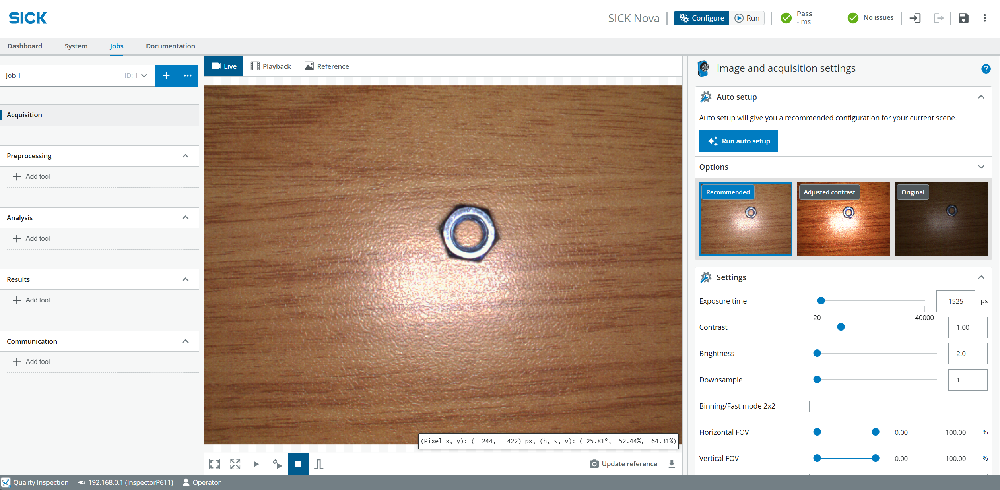
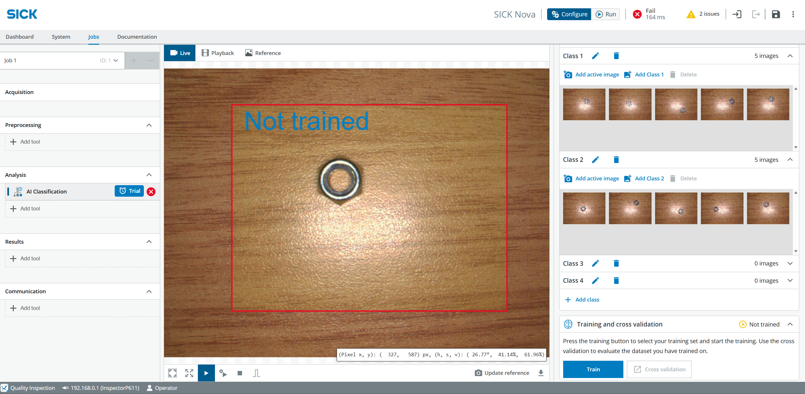

# Sechskantmuttern und -schrauben klassifizieren

## Kurzbeschreibung

Dieses angeleitete Projekt bietet eine Einführung in das Tool **KI-Klassifizierung** in SICK Nova.  
Sie werden ein einfaches KI-Modell trainieren, um anhand von Bildern, die mit dem Vision Starter Kit aufgenommen wurden, zwischen verschiedenen Sechskantmuttern und Schrauben zu unterscheiden.

## Projektinformationen

<table style="border-collapse: collapse; width: 100%;">
  <thead>
    <tr style="background-color: #005aff; color: white;">
      <th style="padding: 8px; text-align: left;">Projektart</th>
      <th style="padding: 8px; text-align: left;">Erforderliches Wissensniveau</th>
      <th style="padding: 8px; text-align: left;">Voraussichtliche Dauer</th>
      <th style="padding: 8px; text-align: left;">Zusätzliche Hardware- und Softwareanforderungen</th>
    </tr>
  </thead>
  <tbody>
    <tr>
      <td>Betreutes Projekt </td>
      <td>Grundlagen</td>
      <td>30 Minuten</td>
      <td>Keine – alles ist im Starter-Kit enthalten</td>
    </tr>
  </tbody>
</table>

{ width="850" }

## Ziel

Das Ziel dieses Projekts ist es, eine einfache KI-Klassifizierungsaufgabe zu entwickeln, die zwischen verschiedenen Sechskantmuttern und Schrauben unterscheiden kann.

Nach Abschluss dieses Projekts sollten Sie in der Lage sein:

- Einen leeren Auftrag in SICK Nova anlegen
- Einstellungen für die Bildaufnahme konfigurieren
- Ein KI-Klassifizierungstool hinzufügen
- Bildklassen erstellen
- Trainingsbilder aufnehmen
- ein KI-Klassifikationsmodell trainieren
- das Klassifizierungsergebnis testen und verbessern

---

## Bevor Sie beginnen

Richten Sie das Vision Starter Kit wie im Abschnitt [Erste Schritte](./vision_getting_started.md) beschrieben ein.

!!! tip "Tipp zur Einrichtung"
    Passen Sie die Höhe der Halterung bei Bedarf an.  
    Bei diesem Projekt kann ein Abstand von etwa 10 cm zwischen dem Objekt und dem Sensor dazu beitragen, ein schärferes Bild zu erhalten.

---

## Anleitung

Befolgen Sie die folgenden Schritte, um Ihre erste KI-Klassifizierungsaufgabe zu erstellen.

---

## 1. Einen leeren Auftrag erstellen und die Bildaufnahme konfigurieren

1. Erstellen Sie einen **leeren Auftrag**.
2. Stellen Sie sicher, dass **Jobs** und **Akquise** ausgewählt sind.
3. Bringen Sie die **Sechskantmutter** in das Sichtfeld des Sensors.
4. Wählen Sie **Konfigurieren**.
5. Klicken Sie auf **Automatische Einrichtung ausführen**.
6. Passen Sie den Fokus bei Bedarf mit dem Fokus-Einstellwerkzeug an.
7. Klicken Sie auf **Empfohlen**.
8. Klicken Sie auf **Ausführen**, um die Live-Bilder anzuzeigen.
9. Passen Sie gegebenenfalls die Einstellungen für das **Sichtfeld (FOV)** und die **Downsampling-Einstellung** an.

{ width="850" }

---

## 2. Fügen Sie das KI-Klassifizierungstool hinzu

1. Klicken Sie im Abschnitt **Analyse** auf **Tool hinzufügen**.
2. Wählen Sie **Klassifizieren** > **KI-Klassifizierung**.

{ width="850" }

---

## 3. Bilder für die erste Klasse aufnehmen

1. Stellen Sie sicher, dass sich **Sechskantmutter 1** im Sichtfeld des Sensors befindet.
2. Passen Sie die Größe des roten Rechtecks so an, dass es das Objekt umschließt.
3. Öffne **Klasse 1**.
4. Klicken Sie auf **Aktives Bild hinzufügen**.
5. Wiederholen Sie diesen Schritt mehrmals.
6. Verwenden Sie jedes Mal ein neues, identisches Objekt oder verschieben Sie das Objekt jedes Mal ein wenig.

!!! tip "Trainingstipp"
    Versuchen Sie, kleine Abweichungen in der Position und Drehung von Objekten zu erfassen.  
    Dadurch kann das KI-Modell das Objekt zuverlässiger klassifizieren.

---

## 4. Bilder für die zweite Klasse aufnehmen

1. Setzen Sie die **Sechskantmutter 2** in das Sichtfeld des Sensors.
2. Öffne **Klasse 2**.
3. Klicken Sie auf **Aktives Bild hinzufügen**.
4. Wiederholen Sie diesen Schritt mehrmals.
5. Verwenden Sie auch hier verschiedene Positionen oder Drehungen, um die Trainingsdaten zu verbessern.

---

## 5. Training und Test der Klassifizierung

1. Klicken Sie auf **Zug**.
2. Warten Sie, bis der Job **erfolgreich trainiert** wurde.
3. Prüfen Sie, ob die Objekte zuverlässig erkannt werden.
4. Fügen Sie weitere Trainingsbilder hinzu, wenn das Ergebnis nicht stabil genug ist.

!!! note "Das Ergebnis verbessern"
    Sollte die Klassifizierung unzuverlässig sein, fügen Sie weitere Bilder mit unterschiedlichen Positionen, Drehungen und Lichtverhältnissen hinzu.  
    Eine größere Vielfalt an Trainingsbildern kann das Klassifizierungsergebnis verbessern.

---

## Erwartetes Ergebnis

Nach Abschluss dieses Projekts sollte das Vision Starter Kit in der Lage sein, zwischen den trainierten Objektklassen zu unterscheiden.

Das KI-Klassifizierungstool soll die ausgewählten Sechskantmuttern oder Schrauben anhand der während des Trainings aufgenommenen Bilder klassifizieren.

---

## Zusammenfassung

In diesem angeleiteten Projekt haben Sie mit dem Vision Starter Kit eine einfache KI-Klassifizierungsaufgabe erstellt.

Sie haben gelernt, wie man:

- Bildaufnahme konfigurieren
- Objektklassen erstellen
- Trainingsbilder aufnehmen
- ein KI-Klassifikationsmodell trainieren
- das Klassifizierungsergebnis testen und verbessern

Dieses Projekt ist ein guter nächster Schritt nach dem „Vision Starter“-Projekt und bietet einen einfachen Einstieg in die KI-basierte Bildklassifizierung.

---

## Nächste Schritte

Fahren Sie mit einem weiteren Vision-Projekt fort oder öffnen Sie die vollständigen Projektdateien auf GitHub.com.

[Beispielprojekte](./vision_example_projects.md){ .md-button .button-small }

[GitHub](https://github.com/SICKAG/SICK-Sensor-Starter-Kits){:target="_blank" .md-button .button-small}

