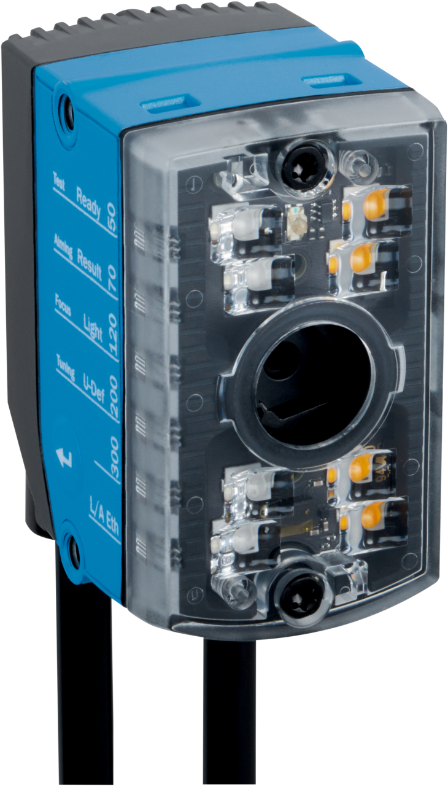
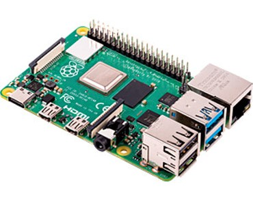
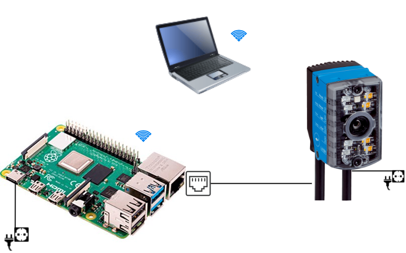
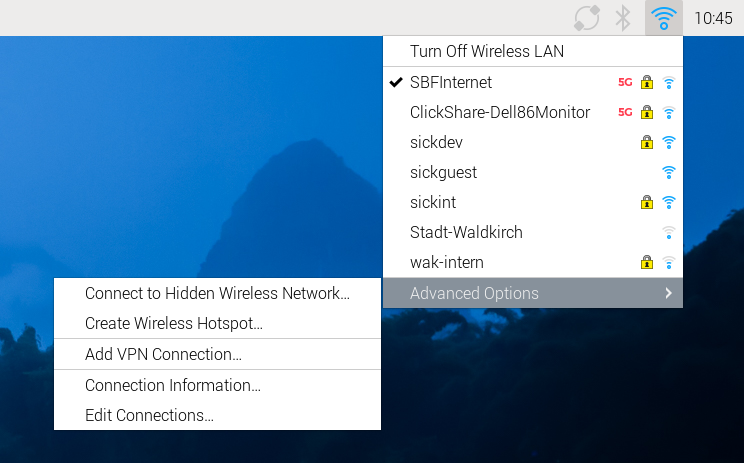
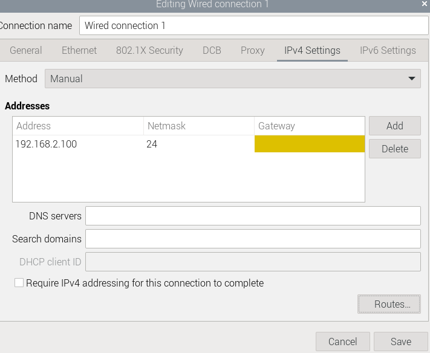
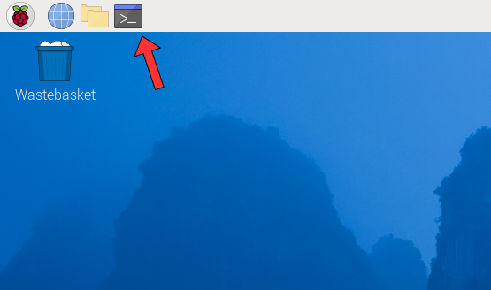
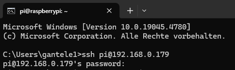
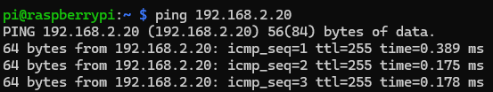
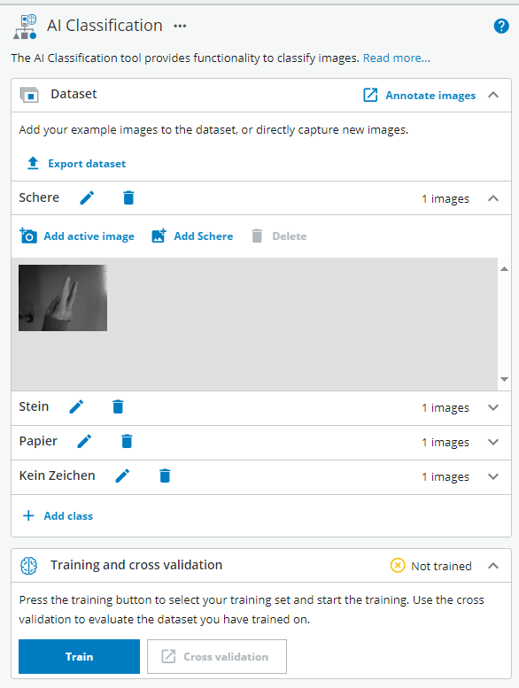

# Stein, Papier, Schere

## Kurzbeschreibung

Dieses fortgeschrittene Projekt kombiniert das **Vision Starter Kit**, **KI-Klassifizierung**, einen **Raspberry Pi** und eine **Python-Flask-Webanwendung**, um gegen den Computer „Stein, Papier, Schere“ zu spielen.

Der InspectorP61x erkennt das Handzeichen mithilfe einer KI-Klassifizierung. Der Raspberry Pi empfängt das Ergebnis über Ethernet, führt die Spielelogik aus und zeigt die webbasierte Spieloberfläche an.

## Projektinformationen

<table style="border-collapse: collapse; width: 100%;">
  <thead>
    <tr style="background-color: #005aff; color: white;">
      <th style="padding: 8px; text-align: left;">Projektart</th>
      <th style="padding: 8px; text-align: left;">Erforderliches Wissensniveau</th>
      <th style="padding: 8px; text-align: left;">Voraussichtliche Dauer</th>
      <th style="padding: 8px; text-align: left;">Zusätzliche Hardware- und Softwareanforderungen</th>
    </tr>
  </thead>
  <tbody>
    <tr>
      <td>Fortgeschrittenes Projekt</td>
      <td>Experte</td>
      <td>4 Stunden</td>
      <td>
        <strong>Hardware</strong>
        <ul>
          <li>Raspberry Pi 5</li>
          <li>Micro HDMI cable or adapter</li>
          <li>Display, keyboard and mouse</li>
        </ul>
        <strong>Software</strong>
        <ul>
          <li>Visual Studio Code</li>
          <li>Raspberry Pi Imager</li>
          <li>Python</li>
          <li>Flask</li>
        </ul>
      </td>
    </tr>
  </tbody>
</table>

 

{.image-medium}

## Ziel

Das Ziel dieses Projekts ist es, ein webbasiertes „Stein, Papier, Schere“-Spiel zu entwickeln, das mithilfe des Vision Starter Kits Handzeichen erkennt.

Nach Abschluss dieses Projekts sollten Sie wissen, wie man:

- ein KI-Klassifikationsmodell für Handzeichen trainieren
- Schließen Sie den InspectorP61x an einen Raspberry Pi an
- Die Netzwerkeinstellungen des Raspberry Pi konfigurieren
- Sensordaten über Ethernet empfangen
- Eine Python-Flask-Webanwendung ausführen
- Sensorwerte mit einfacher Spielelogik kombinieren

---

## Projektkonzept

Das Projekt besteht aus zwei Hauptkomponenten:

| Komponente | Funktion |
|---|---|
| Vision Starter Kit | Erkennt Handzeichen mithilfe von KI-Klassifizierung |
| Raspberry Pi 5 | Empfängt Sensordaten, führt die Python-Spielelogik aus und hostet die Webanwendung |

Der Sensor erkennt eine der folgenden Klassen:

- Fels
- Papier
- Schere
- kein Zeichen

Der Raspberry Pi wählt zufällig ein Zeichen für den Computer aus und vergleicht es mit dem vom Sensor erfassten Ergebnis.

{.image-small}

---

## Bevor Sie beginnen

Richten Sie das Vision Starter Kit wie in der Anleitung [Erste Schritte](./vision_getting_started.md) beschrieben ein.

!!! info "Fortgeschrittenenprojekt"
    Für dieses Projekt sind zusätzliche Hardware- und Software-Einrichtungen erforderlich.  
    Grundkenntnisse in Python, im Bereich Netzwerke und in der Konfiguration des Raspberry Pi sind von Vorteil.

---

## Projektvorbereitung

### Hardware-Einrichtung

Für den Raspberry Pi Imager benötigen wir einen Computer mit Internetverbindung. Außerdem benötigen wir einen Computer für die SSH-Verbindung zum Raspberry Pi. Wenn Sie direkt über Maus, Tastatur und Monitor auf den Raspberry Pi zugreifen, benötigen Sie den Computer eigentlich nur für die Installation des Raspberry Pi OS. 

Der Raspberry Pi wird über einen USB-C-Anschluss mit Strom versorgt und benötigt WLAN, da der Ethernet-Anschluss für den InspectorP61x benötigt wird. 

Der InspectorP61x wird an die Stromversorgung angeschlossen und über ein Ethernet-Kabel mit dem Raspberry Pi verbunden. 

**Einrichtung des Sensors**

Der Sensor lässt sich mithilfe der Halterung auf verschiedene Arten befestigen. So kann er beispielsweise auf einem Tisch montiert und die Hand unter den Sensor gehalten werden. Alternativ wäre es auch möglich, den Sensor vor einer Wand zu platzieren und die Hand vor die Wand zu halten.

Die folgenden Faktoren sind wichtig:

Ein einheitlicher Hintergrund
Genug Platz, damit die gesamte Hand ins Bild passt. 

### Software-Einrichtung

**Raspberry Pi Imager**

Als Betriebssystem für den Raspberry Pi verwenden wir Raspberry Pi OS. Dieses müssen wir auf eine SD-Karte übertragen, damit wir es anschließend auf dem Raspberry Pi installieren können.

1. Zunächst müssen wir den Imager für das Betriebssystem installieren: [Raspberry Pi Imager herunterladen](https://www.raspberrypi.com/software/).). Öffnen Sie das Programm anschließend und wählen Sie Folgendes aus: das entsprechende Raspberry-Pi-Modell, das richtige Betriebssystem (in diesem Fall 64-Bit) und die SD-Karte, auf die der Imager geschrieben werden soll. 

2. Nun passen wir die Einstellungen an, indem wir auf „Einstellungen bearbeiten“ klicken. 

3. Wir legen nun „pi“ als Benutzernamen und „raspberry“ als Passwort fest. Geben Sie in den WLAN-Einstellungen das WLAN-Netzwerk und das entsprechende Passwort ein. Legen Sie außerdem das WLAN-Land fest und nehmen Sie die Spracheinstellungen vor. Als Nächstes müssen wir SSH in den Diensten aktivieren und anklicken, um anzugeben, dass wir das Raspberry-Passwort für die Authentifizierung über SSH verwenden möchten. 

Wir speichern die Einstellungen, kehren zum vorherigen Menü zurück und übernehmen die Einstellungen. Sollte eine Meldung erscheinen, dass alle Daten auf der SD-Karte gelöscht werden, bestätigen wir dies. Der Installationsvorgang auf der SD-Karte sollte nun automatisch fortgesetzt werden. 

> **Hinweis:**
> Sollten Sie aus irgendeinem Grund die vorherigen Schritte wiederholen müssen, bleiben die Einstellungen weiterhin gespeichert. Das WLAN-Passwort ist dann jedoch der Hash und nicht mehr das Passwort selbst. Sie sollten dies daher noch einmal überprüfen!

4. Im letzten Schritt nehmen wir die SD-Karte heraus und schließen sie an den Raspberry an. 

**Zusätzliche Einstellungen in Raspbian**

Um gleichzeitig eine Verbindung zum Raspberry Pi über SSH und zum Sensor über LAN herzustellen, müssen wir noch einige weitere Einstellungen vornehmen. Für diesen Schritt müssen wir zunächst den Raspberry Pi an einen Monitor, eine Maus und eine Tastatur anschließen. Hilfe dazu finden Sie hier: [Erste Schritte mit dem Raspberry Pi](https://www.raspberrypi.com/documentation/computers/getting-started.html#keyboard)

Außerdem müssen wir den Sensor an den LAN-Anschluss des Raspberry Pi anschließen.

5. Klicken Sie zunächst auf das WLAN-Symbol in der oberen Taskleiste. Klicken Sie im sich öffnenden Menü unter „Erweiterte Optionen“ auf „Verbindungen bearbeiten“. 

6. Klicken Sie anschließend im soeben geöffneten Menü auf „Kabelverbindung 1“.  Es sollte nun so aussehen.

7. Auf der Registerkarte „Gerät“ wählen wir nun „eth0“ mit der angegebenen MAC-Adresse aus. Als Nächstes wechseln wir zur Registerkarte „IPv6-Einstellungen“. Dort wählen wir unter „Methode“ die Option „Deaktivieren“ aus. Nun sollte alles so aussehen.

8. Als Nächstes wechseln wir zur Registerkarte „IPv4-Einstellungen“, da wir dort ebenfalls einige Anpassungen vornehmen müssen. Zunächst wählen wir unter „Methode“ die Option „Manuell“ aus, damit wir unsere eigene IP-Adresse und „Netzmaske“ festlegen können. Dort geben wir nun 192.168.2.100 als „Adresse“ und 24 als „Netzmaske“ ein. Das Feld für das Gateway können wir leer lassen.

Bevor wir jedoch alles speichern können, müssen wir unter „Routen…“ das Kontrollkästchen „Diese Verbindung nur für Ressourcen in diesem Netzwerk verwenden“ aktivieren. Siehe unten:

Jetzt können wir alles unter „Speichern“ speichern. 

**Verbindung prüfen**

Bevor wir fortfahren, sollten wir testen, ob wir nun von unserem Computer aus über SSH eine Verbindung zum Raspberry Pi und zum Sensor herstellen können. 

9. Dazu benötigen wir die IP-Adresse unseres Raspberry Pi. Diese können wir ganz einfach über die Befehlszeile ermitteln. Wir öffnen diese, indem wir auf dieses Symbol klicken.

10. In der sich nun öffnenden Befehlszeile geben wir den Befehl „ifconfig“ ein. Dadurch erhalten wir alle Informationen zu den derzeit verwendeten Netzwerkadaptern, deren IP-Adressen usw.

Uns interessiert jedoch nur die unter „wlan0“ angegebene IP-Adresse. Im Beispiel wäre dies „192.168.0.179“, sie kann aber auch anders lauten. Es ist wichtig, dass wir uns diese IP-Adresse notieren.

11. Nun öffnen wir die Eingabeaufforderung auf unserem Computer. Unter Windows müssen Sie die Windows-Taste drücken und anschließend „cmd“ eingeben. Wenn Sie die Eingabetaste drücken, sollte sich die Eingabeaufforderung öffnen. Nun geben wir Folgendes ein.

„ssh pi@[IP]“ Die IP-Adresse ist diejenige, die wir im vorherigen Schritt notiert haben. 

Drücken Sie die Eingabetaste, um den Befehl zu senden. Wenn wir alles korrekt eingegeben haben, werden wir nun aufgefordert, das Raspberry-Pi-Passwort einzugeben. In diesem Fall ist das Passwort dasjenige, das wir bei der Konfiguration des Betriebssystems gewählt haben. In unserem Beispiel wäre dies „raspberry“. 

Wir können sehen, dass die Verbindung hergestellt ist, da in der Befehlszeile nun „pi@raspberrypi“ anstelle von „C:\Users\xxxx“ angezeigt wird.

Wenn dies der Fall ist, haben wir nun erfolgreich eine SSH-Verbindung zu unserem Raspberry Pi hergestellt. Das bedeutet, dass wir nun auf das Micro-HDMI-Kabel und den Monitor verzichten und die nächsten Schritte ebenfalls über SSH auf unserem Computer ausführen können. 

12. Um zu prüfen, ob der Sensor angeschlossen ist, schalten wir ihn zunächst ein und geben den folgenden Befehl ein.

> „ping 192.168.2.20“

Wenn wir bis zu diesem Punkt alles richtig gemacht haben, sollte die folgende Ausgabe angezeigt werden.

Der Raspberry Pi sendet nun ständig Pings an den Sensor. Um dies zu unterbrechen, können wir STRG + C drücken.

>**Hinweis:**
>Falls Ihre Anzeige von der hier gezeigten abweicht, sollten Sie die IP-Adresse und die physische Verbindung Ihres Sensors noch einmal überprüfen. 

**Python**

Da wir zur Umsetzung des Projekts nicht standardmäßige Python-Module benötigen, müssen wir diese zunächst installieren. Dazu können wir den in Raspbian integrierten Paketmanager nutzen. 

1. Zunächst sollten wir sicherstellen, dass unsere Systempakete auf dem neuesten Stand sind. Öffnen Sie dazu die Befehlszeile und geben Sie den folgenden Befehl ein:

>„sudo apt update“ 

Dadurch werden alle verfügbaren Pakete und deren Versionen aufgelistet. Wenn wir Pakete aktualisieren können, können wir dies mit dem folgenden Befehl tun:

>„sudo apt upgrade“

2. Als Nächstes müssen wir prüfen, ob Python und pip bereits installiert sind. Dazu verwenden wir

>„python3 --version“ 

oder

>„pip3 --version“

Wenn keine Versionen angezeigt werden, müssen wir sie installieren:

>„sudo apt install python3“  
>„sudo apt install python3-pip“

 

**Hinweis für Entwickler:**

Wenn du dich weiterentwickeln möchtest, kannst du Visual Studio Code auf deinem Computer oder dem Raspberry Pi installieren. Der Befehl dafür lautet „sudo apt install code“. Für die SSH-Verbindung benötigst du eine Erweiterung für VS Code: [Visual Studio Code-Tutorial für SSH](https://code.visualstudio.com/docs/remote/ssh).

## Start

### SICK-Web-Benutzeroberfläche

Nachdem wir Nova2D nun im Starter Kit eingerichtet haben, können wir weitere Einstellungen für unser Spiel vornehmen. 

**Dateneingabe**

Um sicherzustellen, dass unsere Handzeichen erkannt werden, müssen wir nun ein KI-gestütztes Analyse-Tool finden. Gehen Sie dazu auf: Analyse → KI-Klassifizierung

2. Auf dem Bild erscheint nun ein rotes Rechteck mit der Aufschrift „nicht trainiert“. Passen Sie dieses Rechteck an (in diesem Fall kann die gesamte Bildaufnahme verwendet werden). 

3. Nun können wir vier Klassen erstellen (Schere, Stein, Papier, kein Zeichen) und Bilder der Zeichen aufnehmen („Aktives Bild hinzufügen“). Nehmen Sie für jede Klasse mindestens 20 bis 30 Bilder auf, gehen Sie dann zu „Trainieren“ und warten Sie. Sobald das Training abgeschlossen ist, können Sie testen, wie genau die Erkennung ist. Siehe auch: Hardware-Einrichtung, um zu erfahren, wie der Sensor angebracht und die Hand positioniert werden sollte. 

4. Sollte die Erkennung nach dem Training immer noch ungenau sein, können weitere Bilder aufgenommen werden, um den Datensatz zu erweitern.

Die Einstellungen und der Datensatz können nun gespeichert und bei Bedarf exportiert werden. 

### Web-Benutzeroberfläche

Unter „Demo“ findest du einen ZIP-Ordner mit allen Dateien, die du benötigst, um das Spiel „Stein, Papier, Schere“ zu starten. Bevor Sie dies tun können, müssen Sie alle erforderlichen Pakete installieren. Diese sind in einer Textdatei gespeichert. Kopieren Sie den Ordner auf Ihren Raspberry Pi und navigieren Sie im Terminal zum richtigen Verzeichnis (path/to steht für das Verzeichnis, in dem Sie den Ordner gespeichert haben):

>cd Pfad/zu/SchereStein/Python

Mit dem folgenden Befehl können Sie alle Pakete aus dieser Datei installieren:

> pip install -r requirements.txt

6. Falls Sie für den Sensor eine andere IP-Adresse als die in der Dokumentation angegebene festgelegt haben, müssen Sie diese in der Datei „client.py“ ändern. Das Gleiche gilt für den Port. 

Nun sollte alles bereit sein, damit Sie das Spiel starten können.

## Demo

Hier findest du alle wichtigen Dateien, die du zum Starten des Spiels benötigst:

Im Python-Ordner findest du die Datei „start.sh“, mit der du das Spiel starten kannst. 
Nachdem Sie alle erforderlichen Pakete installiert haben. 
Verwenden Sie für die Installation die Datei „requirements.txt“.
Viel Spaß!

[ZIP-Datei](../files/Python.zip)

Um das Spiel über die Website zu starten, können Sie die Datei „start-sh“ im Terminal mit dem folgenden Befehl ausführen:

>bash start.sh ./start.ps1

Geben Sie die IP-Adresse Ihres Raspberry Pi gefolgt von Port 5001, auf dem die Webanwendung läuft, wie folgt in Ihren Browser ein:

Beispiel: 192.168.0.179:5001/

Die Website sollte nun angezeigt werden, sodass Sie mit dem Sensor „Stein, Papier, Schere“ spielen können. 

---

## Erwartetes Ergebnis

Nach Abschluss dieses Projekts sollte das System folgende Funktionen erfüllen:

- Mit dem Vision Starter Kit erkennen, ob „Stein, Papier, Schere“ oder kein Zeichen vorliegt
- die erkannte Klasse an den Raspberry Pi senden
- die Spiellogik in einer Python-Flask-Webanwendung ausführen
- Die Spieloberfläche in einem Browser anzeigen
- das vom Sensor erkannte Zeichen mit dem vom Computer ausgewählten Zeichen vergleichen

---

## Zusammenfassung

In diesem Projekt für Fortgeschrittene hast du Bildverarbeitung, KI-Klassifizierung, Raspberry-Pi-Netzwerkfunktionen und eine Python-Flask-Webanwendung miteinander kombiniert.

Sie haben gelernt, wie man:

- Handzeichen-Erkennung in SICK Nova konfigurieren
- Einen Raspberry Pi für die Kommunikation mit Sensoren einrichten
- Netzwerkeinstellungen für WLAN und Ethernet konfigurieren
- Erforderliche Python-Pakete installieren
- Ein Flask-basiertes Webspiel starten
- Sensorsignale mit der Anwendungslogik kombinieren

Dieses Projekt veranschaulicht, wie das Vision Starter Kit als Teil einer größeren interaktiven Anwendung eingesetzt werden kann.

---

## Weitere Ressourcen

[Stein, Papier, Schere mit Flugzeitsensor und Arduino](https://projecthub.arduino.cc/mad_mcu/how-to-play-rock-paper-scissor-with-a-time-of-flight-sensor-3d27ec)

**Für Entwickler:** 

[Flasche](https://flask.palletsprojects.com/en/stable/quickstart/#http-methods)

[Visual Studio Code](https://code.visualstudio.com/) 

---

## Nächste Schritte

Fahren Sie mit einem weiteren Vision-Projekt fort oder öffnen Sie die vollständigen Projektdateien auf GitHub.com.

[Beispielprojekte](./vision_example_projects.md){ .md-button .button-small }

[GitHub](https://github.com/SICKAG/SICK-Sensor-Starter-Kits/tree/main/projects/vision/rock_paper_scissors){:target="_blank" .md-button .button-small}

