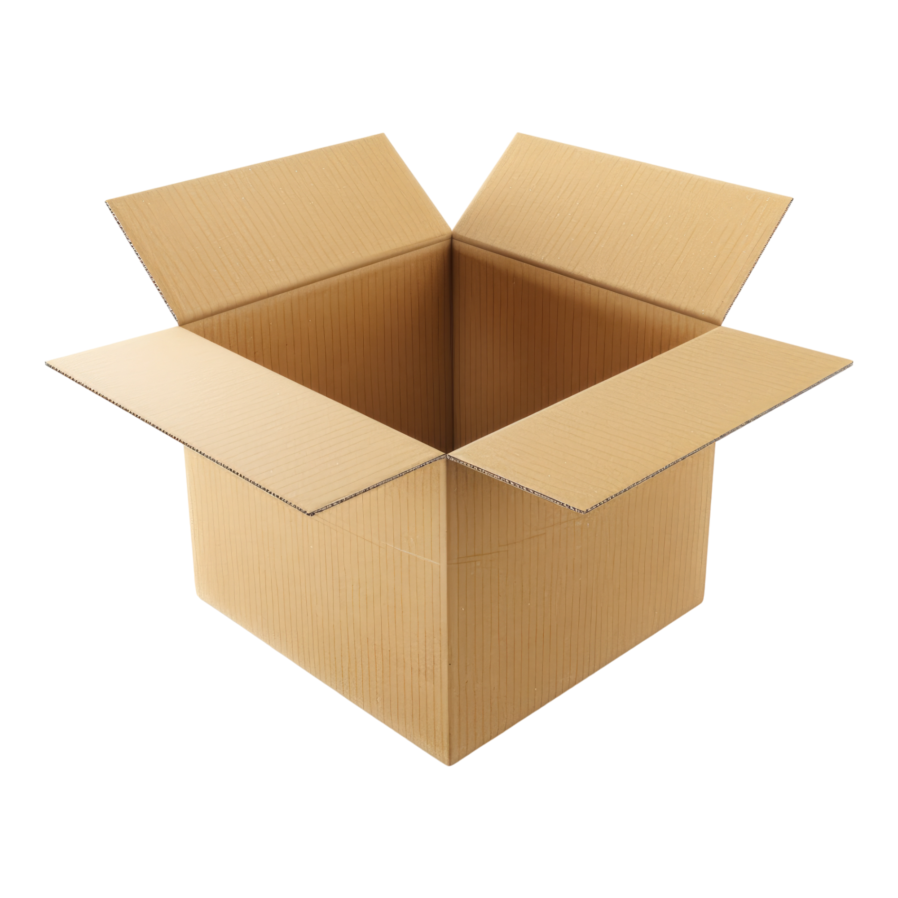

<!-- # Beispielprojekte Vision Starter Kit

Hier findest du einige Beispielprojekte, die du ganz einfach nachmachen und selbst umsetzen kannst.

Zu jedem Projekt finden Sie weitere Informationen zu den Voraussetzungen, der voraussichtlichen Dauer usw.

Zögert nicht, eure eigenen Projekte zu erstellen und sie mit uns zu teilen!

<table style="border-collapse: collapse; width: 100%;">
  <thead>
    <tr style="background-color: #005aff; color: white;">
      <th style="padding: 8px; text-align: left;">#</th>
      <th style="padding: 8px; text-align: left;">Projektname</th>
      <th style="padding: 8px; text-align: left;">Kurzbeschreibung</th>
      <th style="padding: 8px; text-align: left;">Erforderliches Wissensniveau</th>
      <th style="padding: 8px; text-align: left;">Voraussichtliche Dauer</th>
      <th style="padding: 8px; text-align: left;">Zusätzliche Hardware- und Softwareanforderungen</th>
    </tr>
  </thead>
  <tbody>
    <tr>
      <td>1</td>
      <td><a href="vision_starter_project.html">Vision-Starter-Projekt</a></td>
      <td>Machen Sie sich mit den ersten Einstellungen zur Bilderfassung und einer einfachen Aufgabe zur KI-Klassifizierung und Anomalieerkennung vertraut.</td>
      <td>Grundlagen</td>
      <td>90 Minuten</td>
      <td>keine – alles ist im Starter-Kit enthalten</td>
    </tr>
    <tr>
      <td>2</td>
      <td><a href="classify_hex_nuts_screws.html">Sechskantmuttern und -schrauben klassifizieren</a></td>
      <td>Probieren Sie das KI-Klassifizierungstool aus, indem Sie Bilder von verschiedenen Sechskantmuttern und/oder Schrauben aufnehmen, um Ihren ersten KI-Algorithmus zu erstellen.</td>
      <td>Grundlagen</td>
      <td>30 Minuten</td>
      <td>keine – alles ist im Starter-Kit enthalten</td>
    </tr>
    <tr>
      <td>3</td>
      <td><a href="chocolate_inspection.html">Schokoladenprüfung</a></td>
      <td>Folgen Sie den SICK Nova-Tutorials auf YouTube und lernen Sie verschiedene KI- und Nicht-KI-Tools kennen, indem Sie einen Schokoriegel genauer unter die Lupe nehmen.</td>
      <td>Fortgeschritten</td>
      <td>2 Stunden</td>
      <td>Schokoladentafel 3D-Druckdateien <a href="https://sick.com/de/en/downloads/media/swp682086">sick.com/de/en/downloads/media/swp682086</a> ODER eine beliebige andere Schokoladentafel / ein beliebiges anderes verpacktes Lebensmittel</td>
    </tr>
    <tr>
      <td>4</td>
      <td><a href="sketch_demonstrator.html">Sketch-Demonstrator</a></td>
      <td>Klassifizieren Sie verschiedene handgezeichnete Skizzen mit dem KI-Klassifizierungstool.</td>
      <td>Fortgeschritten</td>
      <td>2 Stunden</td>
      <td>Papier, Edding</td>
    </tr>
    <tr>
      <td>5</td>
      <td>Erkennung leerer Kartons</td>
      <td>Untersuchen Sie die Kartons mit dem KI-Tool zur Anomalieerkennung auf Verunreinigungen oder Fremdkörper.</td>
      <td>Fortgeschritten</td>
      <td>1 Stunde</td>
      <td>Leere Kartons Verunreinigungen (z. B. Papierstücke, kleine Steine, Haare usw.)</td>
    </tr>
    <tr>
      <td>56</td>
      <td><a href="rock_paper_scissors.html">Stein, Papier, Schere</a></td>
      <td>Verwende den Sensor und KI-Tools, um die Handzeichen für das Spiel „Stein, Papier, Schere“ zu erkennen. Eine auf einem Raspberry Pi laufende Python-Flask-Webanwendung wählt ein zufälliges Zeichen für den Computer aus und vergleicht es mit dem vom Sensor erfassten Handzeichen.</td>
      <td>Experte</td>
      <td>4 Stunden</td>
      <td><strong>Hardware:</strong> Raspberry Pi 5, Micro-HDMI (Kabel/Adapter), Bildschirm, Tastatur, Maus <strong>Software:</strong> Visual Studio Code, Raspberry Pi Imager, Python</td>
    </tr>
    <tr>
      <td>7</td>
      <td>LEGO-Skelette sortieren</td>
      <td>Untersuche LEGO-Teile (dafür eignen sich Skelette am besten) und sortiere Teile mit fehlenden Teilen aus. Dieses Projekt lässt sich durch den Einsatz eines Förderbands und eines Auslösesensors erweitern, um den Analyseprozess zu automatisieren.</td>
      <td>Experte</td>
      <td>4 Stunden</td>
      <td>LEGO-Skelette Optional: Förderband, Auslösesensor, Kabel, Signalleuchte</td>
    </tr>
    <tr>
      <td>8</td>
      <td><a href="recycling.html">Recycling</td>
      <td>Verwenden Sie das KI-Klassifizierungstool, um verschiedene Abfallarten für das Recycling zu sortieren.</td>
      <td>Grundlagen/Fortgeschrittene</td>
      <td>1–4 Stunden</td>
      <td>Abfälle (z. B. Papier, Kunststoffe, Verpackungen, …) wenn möglich: Förderband wenn möglich: Schieber/Aussortierer zum Sortieren/Aussortieren von Objekten – alternativ: LED- oder akustische Rückmeldung</td>
    </tr>
    <tr>
      <td>9</td>
      <td><a href="blackjack.html">Black Jack</td>
      <td>Spielkarten erkennen und klassifizieren sowie eine Strategie entwickeln, um gegen den Computer Blackjack zu spielen</td>
      <td>Fortgeschritten/Experte</td>
      <td>4–8 Stunden</td>
      <td>Spielkarten
    </tr>
    <tr>
      <td>10</td>
      <td><a href="uno.html">UNO-Kartenspiel</td>
      <td>UNO-Spielkarten erkennen und klassifizieren sowie eine Logik entwickeln, um gegen den Computer zu spielen</td>
      <td>Fortgeschrittene/Experten</td>
      <td>4–8 Stunden</td>
      <td>UNO-Spielkarten
    </tr>
    <tr>
      <td>11</td>
      <td><a href="tic_tac_toe.html">Tic Tac Toe</td>
      <td>Analysiere ein Tic-Tac-Toe-Spielfeld und spiele gegen den Computer.</td>
      <td>Fortgeschritten</td>
      <td>4 Stunden</td>
      <td>Papier, Stift, Schere
    </tr>
    <tr>
      <td>12</td>
      <td><a href="tic_tac_toe.html">Tic Tac Toe</td>
      <td>Analysiere die auf eine Dartscheibe geworfenen Darts und entwickle eine Logik für verschiedene Spiele.</td>
      <td>Fortgeschritten</td>
      <td>4 Stunden</td>
      <td>Klett-Dartscheibe mit Klettbällen
    </tr>
  </tbody>
</table>

-->

# Beispielprojekte – Vision-Starter-Kit

Entdecken Sie Beispielprojekte für das **Vision Starter Kit**.  
Die Projekte sind nach **Art**, **Schwierigkeitsgrad** und **voraussichtlicher Dauer** gruppiert, um Ihnen die Wahl des richtigen Einstiegsprojekts zu erleichtern.

Sie können die angeleiteten Projekte Schritt für Schritt durcharbeiten, sich von den Vorzeigeprojekten inspirieren lassen oder sich an den Herausforderungsprojekten versuchen, um Ihre eigene Lösung zu entwickeln.

---

## Projektarten

| Projektart | Beschreibung |
|---|---|
| Geführtes Projekt | Schritt-für-Schritt-Projekt mit detaillierten Anleitungen |
| Challenge-Projekt | Aufgabenbasiertes Projekt mit weniger Anweisungen |
| Vorzeigeprojekt | Demonstrationsprojekt, das die Möglichkeiten aufzeigt |
| Fortgeschrittenes Projekt | Komplexeres Projekt mit höheren Hardware- oder Softwareanforderungen |
| Community-Projekt | Ein von unserer Community ins Leben gerufenes Projekt |

---

## Projektübersicht

-   

    **Vision-Starter-Projekt**

    **Typ:** Betreutes Projekt  
    **Schwierigkeitsgrad:** Grundstufe  
    **Voraussichtliche Dauer:** 90 Minuten  
    **Voraussetzungen:** Alles, was im Starter-Kit enthalten ist  

    Machen Sie sich mit den ersten Einstellungen zur Bilderfassung sowie einer einfachen Aufgabe zur KI-Klassifizierung und Anomalieerkennung vertraut.

    [Projekt „Vision Starter“](vision_starter_project.md){ .md-button}

-    

    **Hex-Muttern und -Schrauben klassifizieren**

    **Typ:** Betreutes Projekt   
    **Schwierigkeitsgrad:** Grundstufe  
    **Voraussichtliche Dauer:** 30 Minuten  
    **Voraussetzungen:** Alles, was im Starter-Kit enthalten ist  

    Probieren Sie das KI-Klassifizierungstool aus, indem Sie Bilder von verschiedenen Sechskantmuttern und Schrauben aufnehmen, um Ihren ersten KI-Algorithmus zu erstellen.

    [Sechskantmuttern, Muttern und Schrauben sortieren](classify_hex_nuts_screws.md){ .md-button}

-   

    **Schokoladenprüfung**

    **Typ:** Vorzeigeprojekt  
    **Schwierigkeitsgrad:** Fortgeschritten  
    **Voraussichtliche Dauer:** 2 Stunden  
    **Benötigte Materialien:** Schokoladentafel, optional 3D-Druckdateien oder ein anderes verpacktes Lebensmittel  

    Folgen Sie den SICK Nova-Tutorials und entdecken Sie verschiedene KI- und Nicht-KI-Tools, indem Sie eine Tafel Schokolade genauer unter die Lupe nehmen.

    [Schokoladenprüfung](chocolate_inspection.md){ .md-button}

-   

    **Sketch-Demonstrator**

    **Typ:** Challenge-Projekt   
    **Schwierigkeitsgrad:** Fortgeschritten  
    **Voraussichtliche Dauer:** 2 Stunden  
    **Benötigtes Material:** Papier, Edding  

    Klassifizieren Sie verschiedene handgezeichnete Skizzen mit dem KI-Klassifizierungstool.
    
    [Sketch-Demonstrator](sketch_demonstrator.md){ .md-button}

-   

    **Erkennung leerer Kartons**

    **Typ:** Challenge-Projekt   
    **Schwierigkeitsgrad:** Fortgeschritten  
    **Voraussichtliche Dauer:** 1 Stunde  
    **Anforderungen:** Leere Kartons, Verunreinigungen wie Papierstücke, kleine Steine oder ähnliche Gegenstände  

    Analysieren Sie Kartons und prüfen Sie mithilfe der KI-basierten Anomalieerkennung, ob sie Verunreinigungen oder Fremdkörper enthalten.

    [In Kürze verfügbar]

-   

    **Stein, Papier, Schere**

    **Typ:** Fortgeschrittenes Projekt  
    **Schwierigkeitsgrad:** Experte  
    **Voraussichtliche Dauer:** 4 Stunden  
    **Voraussetzungen:** Raspberry Pi 5, Bildschirm, Tastatur, Maus, Python, Visual Studio Code  

    Verwenden Sie den Sensor und die KI-Tools, um die Handzeichen für „Stein, Papier, Schere“ zu erkennen. Eine Python-Flask-Webanwendung vergleicht das vom Sensor erkannte Handzeichen mit einem zufällig ausgewählten Computerzeichen.

    [Stein, Papier, Schere](rock_paper_scissors.md){ .md-button}

-     

     **LEGO-Skelette sortieren**

    **Typ:**  Fortgeschrittenes Projekt   
    **Schwierigkeitsgrad:** Experte  
    **Voraussichtliche Dauer:** 4 Stunden  
    **Benötigte Teile:** LEGO-Skelette, optionales Förderband, Auslösesensor, Kabel und Signalleuchte  

    LEGO-Teile analysieren und fehlende Teile identifizieren. Das Projekt lässt sich mit einem Förderband und einem Auslösesensor zur Automatisierung erweitern.

    [In Kürze verfügbar]

-   

    **Recycling**

    **Typ:** Challenge-Projekt  
    **Schwierigkeitsgrad:** Anfänger bis Fortgeschrittene  
    **Voraussichtliche Dauer:** 1 bis 4 Stunden  
    **Voraussetzungen:** Abfallgegenstände, optionales Förderband, optionaler Schieber oder Rückmeldesignal  

    Nutzen Sie die KI-Klassifizierung, um verschiedene Abfallarten für das Recycling zu sortieren.

    [Recycling](recycling.md){ .md-button }

-   

    **Black Jack**

    **Typ:** Fortgeschrittenes Projekt    
    **Schwierigkeitsgrad:** Fortgeschritten bis Experte  
    **Voraussichtliche Dauer:** 4 bis 8 Stunden  
    **Benötigt:** Spielkarten  

    Erkenne und klassifiziere Spielkarten und entwickle eine Logik, um gegen den Computer Blackjack zu spielen.

    [Blackjack](blackjack.md){ .md-button}

-   

    **UNO-Kartenspiel**

    **Typ:** Fortgeschrittenes Projekt  
    **Schwierigkeitsgrad:** Fortgeschritten bis Experte  
    **Voraussichtliche Dauer:** 4 bis 8 Stunden  
    **Benötigt:** UNO-Spielkarten  

    Erkenne und klassifiziere UNO-Spielkarten und entwickle eine Logik, um gegen den Computer zu spielen.

    [Uno](uno.md){ .md-button }

-   

    **Tic Tac Toe**

    **Typ:** Challenge-Projekt   
    **Schwierigkeitsgrad:** Fortgeschritten  
    **Voraussichtliche Dauer:** 4 Stunden  
    **Benötigte Materialien:** Papier, Stift, Schere  

    Analysiere ein Tic-Tac-Toe-Spielfeld und entwickle eine Strategie, um gegen den Computer zu spielen.

    [Tic Tac Toe](tic_tac_toe.md){ .md-button }

-   

    **Darts**

    **Typ:** Challenge-Projekt     
    **Schwierigkeitsgrad:** Fortgeschritten  
    **Voraussichtliche Dauer:** 4 Stunden  
    **Benötigtes Material:** Dartscheibe mit Klettverschluss und Klettbälle  

    Die auf eine Dartscheibe geworfenen Darts analysieren und Regeln für verschiedene Spiele erstellen.

    [Darts](darts.md){ .md-button }

---

## Tragen Sie Ihr eigenes Projekt bei

Hast du mit dem Vision Starter Kit dein eigenes Projekt erstellt?  
Zukünftige Community- oder Hochschulprojekte können über das [GitHub.com](https://github.com/SICKAG/SICK-Sensor-Starter-Kits){:target="_blank"}-Projekt-Repository eingereicht werden.

