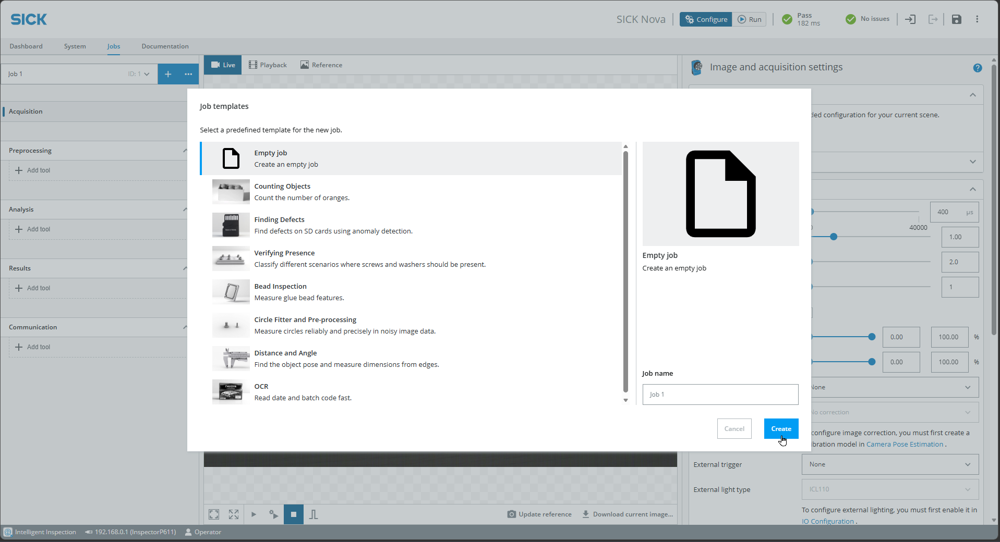

# Erste Schritte mit dem Vision Starter Kit

Sie können nun mit dem Vision Starter Kit loslegen. Befolgen Sie die nachstehende Anleitung, um den Sensor einzurichten.

## Vision-Sensor einrichten

1. Befestigen Sie den Inspector am [Montagerahmen](../mounting_frame.md). Neigen Sie die obere Leiste um etwa 10–15 Grad, um Reflexionen zu vermeiden.
2. Schließen Sie den Inspector über das Netzwerkkabel und das Netzteil an.
3. Schließen Sie das Netzwerkkabel an den USB-Netzwerkadapter an.
4. Wählen Sie den passenden Steckeradapter aus und schließen Sie das Netzteil an eine Steckdose an.
5. Schließen Sie den USB-Netzwerkadapter an den PC an.
6. Konfigurieren Sie die IP-Adresse des Adapters.

??? sickinfo "Ausführliche Anleitung"

      - Tastenkombination unter Windows: „Win + R“: „ncpa.cpl“

      

      - Alternative: Öffnen Sie die Netzwerkeinstellungen Ihres Betriebssystems (z. B. **Systemsteuerung > Netzwerk und Internet** unter Windows 10/11 oder die entsprechende Option in Ihrem Betriebssystem).  
      Wählen Sie **Erweiterte Netzwerkeinstellungen**  

      - Suchen Sie den USB-Ethernet-Adapter (möglicherweise als **ASIX USB to Gigabit Ethernet Family Adapter** aufgeführt).

       

      - Klicken Sie auf den Adapter und wählen Sie **Eigenschaften / Bearbeiten**.  

      - Geben Sie gegebenenfalls die Administrator-Anmeldedaten ein.  

      - Suchen Sie **Internetprotokoll Version 4 (TCP/IPv4)** und wählen Sie **Eigenschaften** oder klicken Sie mit der rechten Maustaste darauf.

        

      - Von DHCP auf manuelle IP-Einstellungen umstellen:  
      Verwenden Sie die folgende IP-Adresse: `192.168.0.210`  
      Subnetzmaske: `255.255.0.0`

        

      - Speichern Sie die Änderungen, indem Sie in beiden Fenstern auf **OK** klicken.

- Öffnen Sie einen Browser und geben Sie die Standard-IP-Adresse 192.168.0.1 ein.
Sie sollten nun die unten abgebildete Benutzeroberfläche sehen. Erstellen Sie einen leeren Job.

---

## Nächste Schritte

**Starten Sie mit Ihrem ersten Projekt**: [Vision-Starterprojekt](./vision_starter_project.md){.md-button .button-small}

**Oder wählen Sie ein [Beispielprojekt](./vision_example_projects.md) oder [Codeausschnitte](./vision_code_snippets.md) aus oder sehen Sie sich die [Schulungsunterlagen](./vision_training_material.md) an.**

??? info "Fehlerbehebung"
    ## Fehlerbehebung

    Weitere Informationen finden Sie in der [Bedienungsanleitung](https://www.sick.com/ag/en/catalog/products/machine-vision-and-identification/machine-vision/inspectorp61x/v2d611p-cmwbi4/p/p685672?tab=downloads) des Geräts.

    1. Stellen Sie sicher, dass Sie nicht mit einem VPN verbunden sind, da dies die Verbindung zum Netzwerkgerät blockieren könnte. 
    2. Wenn Sie keine Verbindung zum Sensor herstellen können, überprüfen Sie, ob die LED **„Ready“** grün leuchtet.  
         Ist dies nicht der Fall, ist die Stromversorgung nicht ordnungsgemäß hergestellt. Warten Sie bis zu 2 Minuten und überprüfen Sie, ob die Stromversorgung korrekt angeschlossen ist.
    3. Wenn Sie immer noch keine Verbindung herstellen können, suchen Sie die IP-Adresse des Geräts über den **SICK AppManager** heraus:  
         [SICK AppManager | SICK](https://www.sick.com/ag/en/catalog/products/digital-services-and-software/engineering-tools/sick-appmanager/sick-appmanager/p/p532784)  
         Weitere Informationen finden Sie im **Abschnitt „Erweitert“**.

    4. Falls Sie bereits angemeldet sind und KI-Tools nutzen:  
       - Das Gerät verfügt über eine Testlizenz. Starten Sie das Gerät nach 2 Stunden neu, um den Timer zurückzusetzen.  
       - Ziehen Sie den Stecker heraus und stecken Sie ihn wieder ein. Speichern Sie zuvor die Konfiguration.

    5. Schauen Sie im **FAQ-Bereich** nach: [FAQ](./vision_faq.md)

    6. Sollten Sie weiterhin Probleme mit dem Gerät haben:  
         - Rufen Sie das **Support-Portal** auf, registrieren Sie sich und erstellen Sie einen Fall, um Unterstützung zu erhalten.

