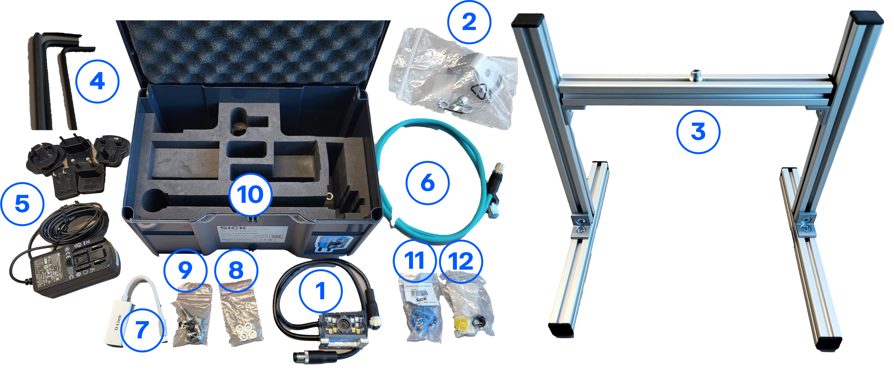
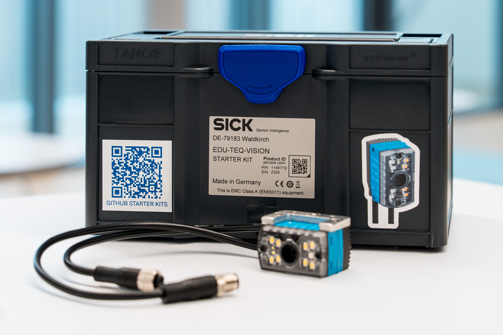

<!--# Übersicht über das Vision Starter Kit
 **Willkommen beim Vision Starter Kit!**

Bitte beachten Sie, dass die Starter-Kits ausschließlich für Schulungszwecke bestimmt sind und nicht in Produktionsumgebungen verwendet werden dürfen.

Das Vision Starter Kit enthält Tools und Beispiele, die Ihnen den Umgang mit Bildverarbeitungssensoren erleichtern. Es umfasst einen industriellen Bildverarbeitungssensor mit einer Testlizenz für KI-Funktionen, Beispielcode, Konfigurationen und Dokumentation, damit Sie schnell loslegen können.

Bildverarbeitung und KI gewinnen in immer mehr Anwendungsbereichen wie der Qualitätskontrolle, Klassifizierungs- oder Sortieraufgaben und vielen weiteren Bereichen zunehmend an Bedeutung. Erfahren Sie, wie Sie diese Technologien für Ihr Projekt nutzen können! 

Sie haben noch kein „Vision Starter Kit“? Dann kaufen Sie es hier!

[Starter-Sets](https://www.sick.com/ag/en/catalog/produkte/trainings/training-und-weiterbildung/technologietrainings/vision-starter-kit-basics/p/p687691?tab=detail){:target="_blank".md-button}

## Wichtigste Merkmale
- Hochauflösende Bildaufnahme.
- Erweiterte Funktionen zur Objekterkennung.
- Einfach zu bedienendes Konfigurationstool (SICK Nova)

## Hardware
Das Vision-Starter-Kit enthält folgende Teile:

<table style="border-collapse: collapse; width: 100%;">
  <thead>
    <tr style="background-color: #005aff; color: white;">
      <th style="padding: 8px; text-align: left;">#</th>
      <th style="padding: 8px; text-align: left;">Artikelbeschreibung</th>
      <th style="padding: 8px; text-align: left;">Anzahl</th>
      <th style="padding: 8px; text-align: left;">Artikelnummer</th>
    </tr>
  </thead>
  <tbody>
    <tr>
      <td>1</td>
      <td>InspectorP61x + Software SICK Nova</td>
      <td>1</td>
      <td>1432322</td>
    </tr>
    <tr>
      <td>2</td>
      <td>Montageplatte</td>
      <td>1</td>
      <td>1131603</td>
    </tr>
    <tr>
      <td>3</td>
      <td>Montagerahmen (unmontiert) mit Schraube und Unterlegscheibe</td>
      <td>1</td>
      <td>
        3533635 
        3173225 
        3014724
      </td>
    </tr>
    <tr>
      <td>4</td>
      <td>Inbusschlüssel</td>
      <td>je 1 Stück</td>
      <td>
        3533955 
        3533965 
        3533975
      </td>
    </tr>
    <tr>
      <td>5</td>
      <td>Stromversorgung</td>
      <td>1</td>
      <td>6075717</td>
    </tr>
    <tr>
      <td>6</td>
      <td>Netzwerkkabel</td>
      <td>1</td>
      <td>21128447</td>
    </tr>
    <tr>
      <td>7</td>
      <td>Netzwerkadapter</td>
      <td>1</td>
      <td>60834268</td>
    </tr>
    <tr>
      <td>8</td>
      <td>Sechskantmuttern – Beispielobjekte für die Erkennung oder Klassifizierung</td>
      <td>je 2 Stück</td>
      <td>
        3014205 
        3043919
      </td>
    </tr>
    <tr>
      <td>9</td>
      <td>Schrauben – Beispielobjekte für die Erkennung oder Klassifizierung</td>
      <td>je 2 Stück</td>
      <td>
        3033885 
        3130491
      </td>
    </tr>
    <tr>
      <td>10</td>
      <td>Transportkiste</td>
      <td>1</td>
      <td>352372</td>
    </tr>
    <tr>
      <td>11</td>
      <td>Werkzeug zur Fokuseinstellung</td>
      <td>1</td>
      <td>2111580</td>
    </tr>
    <tr>
      <td>12</td>
      <td>Werkzeug zur Fokuseinstellung, klein</td>
      <td>1</td>
      <td>2117576</td>
    </tr>
    <tr>
      <td>13</td>
      <td>Schnellstartanleitung</td>
      <td>1</td>
      <td>8030241</td>
    </tr>
  </tbody>
</table>

 

Weitere Informationen finden Sie im [Leitfaden für den Einstieg](./vision_getting_started.md) und in den Abschnitten für Fortgeschrittene.

Entdecken Sie unsere weiteren Schulungsangebote: [Lernpaket „Künstliche Intelligenz“ von SICK](https://www.sick.com/ag/en/artificial-intelligence-educational-kit/w/educational-set-artificial-intelligence)
-->

# Übersicht über das Vision-Starter-Kit

Willkommen bei der Dokumentation zum **Vision Starter Kit**.

Das Vision Starter Kit hilft Ihnen beim Einstieg in bildbasierte Sensoranwendungen und KI-gestützte Bildverarbeitungsbeispiele. Es enthält einen industriellen Bildverarbeitungssensor, Beispielcode, Konfigurationen und Dokumentation für Ausbildungs- und Demonstrationszwecke.

{ width="650" }

## Wichtigste Merkmale

- Hochauflösende Bildaufnahme
- KI-gestützte Objekterkennung und -klassifizierung
- Einfache Konfiguration mit SICK Nova
- Beispielobjekte und Beispielprojekte für einen schnellen Einstieg

## Was kann man damit machen?

Mit dem Vision Starter Kit können Sie typische Bildverarbeitungsanwendungen erkunden, wie zum Beispiel:

- Objekterkennung
- Klassifizierungsaufgaben
- Beispiele für die Sortierung
- Szenarien zur Qualitätskontrolle
- Demos zur KI-basierten Bildverarbeitung

## Was ist im Lieferumfang enthalten?

Das Vision Starter Kit enthält folgende Komponenten:

<table style="border-collapse: collapse; width: 100%;">
  <thead>
    <tr style="background-color: #005aff; color: white;">
      <th style="padding: 8px; text-align: left;">#</th>
      <th style="padding: 8px; text-align: left;">Artikelbeschreibung</th>
      <th style="padding: 8px; text-align: left;">Anzahl</th>
      <th style="padding: 8px; text-align: left;">Artikelnummer</th>
    </tr>
  </thead>
  <tbody>
    <tr>
      <td>1</td>
      <td>InspectorP61x + Software SICK Nova</td>
      <td>1</td>
      <td>1432322</td>
    </tr>
    <tr>
      <td>2</td>
      <td>Montageplatte</td>
      <td>1</td>
      <td>1131603</td>
    </tr>
    <tr>
      <td>3</td>
      <td>Montagerahmen (unmontiert) mit Schraube und Unterlegscheibe</td>
      <td>1</td>
      <td>
        3533635 
        3173225 
        3014724
      </td>
    </tr>
    <tr>
      <td>4</td>
      <td>Inbusschlüssel</td>
      <td>je 1 Stück</td>
      <td>
        3533955 
        3533965 
        3533975
      </td>
    </tr>
    <tr>
      <td>5</td>
      <td>Stromversorgung</td>
      <td>1</td>
      <td>6075717</td>
    </tr>
    <tr>
      <td>6</td>
      <td>Netzwerkkabel</td>
      <td>1</td>
      <td>21128447</td>
    </tr>
    <tr>
      <td>7</td>
      <td>Netzwerkadapter</td>
      <td>1</td>
      <td>60834268</td>
    </tr>
    <tr>
      <td>8</td>
      <td>Sechskantmuttern – Beispielobjekte für die Erkennung oder Klassifizierung</td>
      <td>je 2 Stück</td>
      <td>
        3014205 
        3043919
      </td>
    </tr>
    <tr>
      <td>9</td>
      <td>Schrauben – Beispielobjekte für die Erkennung oder Klassifizierung</td>
      <td>je 2 Stück</td>
      <td>
        3033885 
        3130491
      </td>
    </tr>
    <tr>
      <td>10</td>
      <td>Transportkiste</td>
      <td>1</td>
      <td>352372</td>
    </tr>
    <tr>
      <td>11</td>
      <td>Werkzeug zur Fokuseinstellung</td>
      <td>1</td>
      <td>2111580</td>
    </tr>
    <tr>
      <td>12</td>
      <td>Werkzeug zur Fokuseinstellung, klein</td>
      <td>1</td>
      <td>2117576</td>
    </tr>
    <tr>
      <td>13</td>
      <td>Schnellstartanleitung</td>
      <td>1</td>
      <td>8030241</td>
    </tr>
  </tbody>
</table>

??? info "Bild der Komponentenübersicht anzeigen"
    

## Empfohlener nächster Schritt

Beginnen Sie mit der Einrichtungsanleitung, um die Hardware anzuschließen und Ihre erste Demo auszuführen.

[Erste Schritte](../vision/vision_getting_started.md){.md-button .button-small}

!!! note "Nutzung zu Bildungszwecken"
    Die Starter-Kits sind ausschließlich für Schulungs- und Demonstrationszwecke bestimmt und dürfen nicht in Produktionsumgebungen eingesetzt werden.