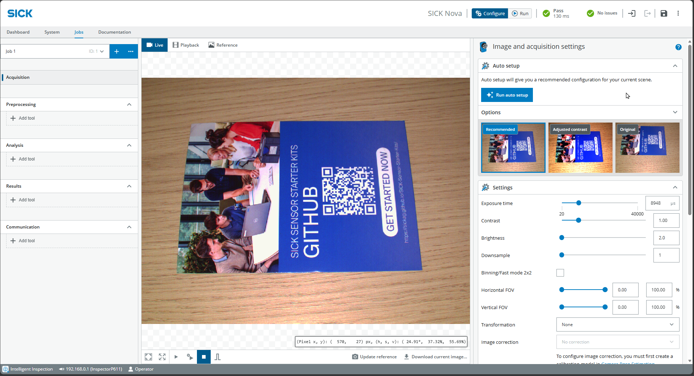
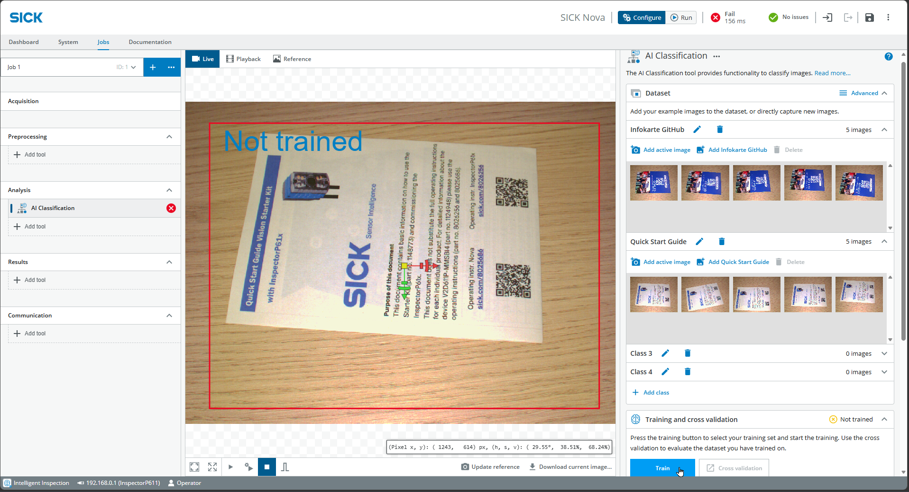
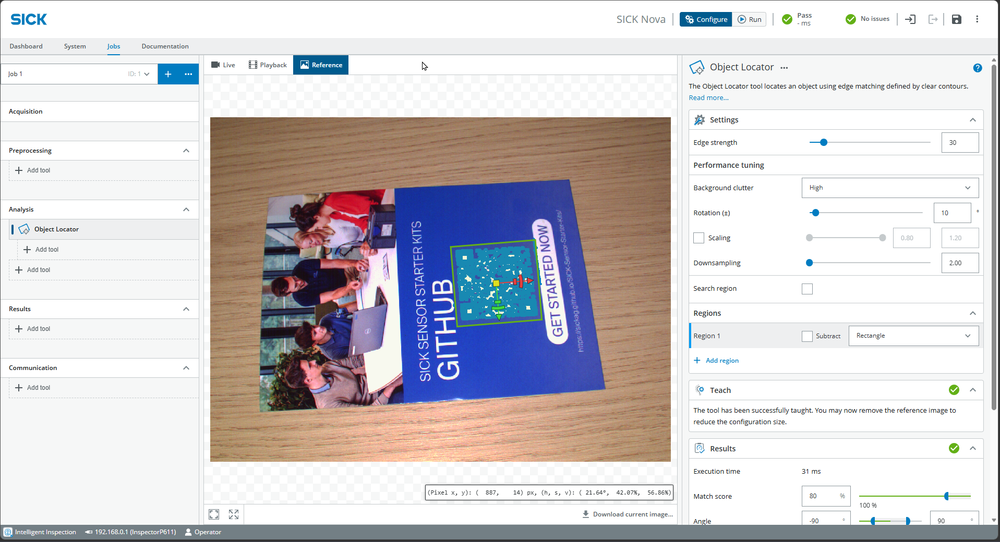

# Projekt „Vision Starter“

## Kurzbeschreibung

Dieses angeleitete Projekt bietet eine Einführung in den grundlegenden Arbeitsablauf des Vision Starter Kits.  
Sie werden die ersten Einstellungen für die Bilderfassung vornehmen, eine einfache KI-Klassifizierungsaufgabe erstellen und ein Beispiel für die Anomalieerkennung einrichten.

<table style="border-collapse: collapse; width: 100%;">
  <thead>
    <tr style="background-color: #005aff; color: white;">
      <th style="padding: 8px; text-align: left;">Projektart</th>
      <th style="padding: 8px; text-align: left;">Erforderliches Wissensniveau</th>
      <th style="padding: 8px; text-align: left;">Voraussichtliche Dauer</th>
      <th style="padding: 8px; text-align: left;">Zusätzliche Hardware- und Softwareanforderungen</th>
    </tr>
  </thead>
  <tbody>
    <tr>
      <td>Betreutes Projekt</td>
      <td>Grundlagen</td>
      <td>90 Minuten</td>
      <td>keine – alles ist im Starter-Kit enthalten</td>
    </tr>
  </tbody>
</table>

## Ziel

Ziel dieses Projekts ist es, sich mit dem grundlegenden Arbeitsablauf des Vision Starter Kits und von SICK Nova vertraut zu machen.

Nach Abschluss dieses Projekts sollten Sie in der Lage sein:

- Bilder mit dem InspectorP61x erfassen
- Grundeinstellungen für die Bildaufnahme anpassen
- Eine einfache KI-Klassifizierungsaufgabe erstellen
- Verwenden Sie den Object Locator
- Eine einfache KI-Anomalieerkennungsaufgabe konfigurieren
- Die Anwendung auf die Standardeinstellungen zurücksetzen

---

## Anleitung

Befolgen Sie die folgenden Schritte, um das „Vision Starter“-Projekt abzuschließen.

---

### 1. Bildaufnahme

- Richten Sie den Inspector wie unter [Erste Schritte](./vision_getting_started.md) beschrieben ein.
- Wählen Sie oben **Live** aus und drücken Sie unten die **Play**-Taste, um Bilder im Serienmodus aufzunehmen.
-  Platzieren Sie die GitHub-Infokarte im Sichtfeld der Kamera.
- Wählen Sie **Aufträge** > **Erfassung** und probieren Sie die verschiedenen **Einstellungen** aus, um ein gut belichtetes Bild zu erhalten. Alternativ können Sie auch direkt auf **Automatische Einrichtung ausführen** klicken.

- Passen Sie den Fokus der Kamera bei Bedarf manuell mit dem Fokus-Einstellwerkzeug (im Lieferumfang enthalten) an.

---

### 2. KI-Klassifizierung

- Wählen Sie **Analyse** > **Werkzeug hinzufügen** > **Klassifizieren** > **KI-Klassifizierung** (ohne dStudio)

- Passen Sie die Größe des Rahmens so an, dass er das gesamte Objekt sowie einen Puffer zur Berücksichtigung von Abweichungen oder unterschiedlichen Positionen umfasst.

- Erstellen Sie Klassen unter **Dataset** auf der rechten Seite
- Klicken Sie auf das Wiedergabesymbol unten in der Mitte, um Serienfotos aufzunehmen.
- Erweitern Sie die erste Klasse und nehmen Sie Bilder mit **Aktives Bild hinzufügen** auf
- Probieren Sie verschiedene Varianten aus (Position / Drehung)

- Wiederholen Sie den Vorgang für die zweite Klasse, nehmen Sie jeweils mindestens 5 Bilder auf und klicken Sie auf **Train**.

- Nach einigen Sekunden ist das Training beendet und Sie können die Ergebnisse überprüfen.

- Fügen Sie gegebenenfalls weitere Bilder hinzu oder nehmen Sie zusätzliche Klassen (z. B. „Leer“) auf, um die Ergebnisse zu optimieren.

---

### 3. Objekt-Locator

Der Object Locator dient dazu, die Position eines Objekts zu ermitteln und Analysen in Bezug auf diese Position durchzuführen (z. B. zur Erkennung von Anomalien).

- Wählen Sie links **Jobs** > **Analyse** > **Tool hinzufügen** > **Suchen** > **Objekt-Locator**
- Füge ein Objekt in das Bild ein
- Klicken Sie unten in der Mitte auf **Referenz aktualisieren** und wechseln Sie zur Registerkarte **Referenz**.
- Ziehen Sie den Rahmen über einen markanten Teil des Objekts.

- Passen Sie gegebenenfalls die Parameter auf der rechten Seite an:
  - Kantenstärke für Kontrastkanten
  - Drehung zur möglichen Drehung des Objekts
  - Skalierung, Übereinstimmungswert und Winkel für die Sensitivität
- Klicken Sie in der Mitte auf **Live** und **Play**, um zu testen, ob der betreffende Teil des Objekts verfolgt wird, wenn das Objekt bewegt wird.

!!! warning "Wichtig"
    Der Object Locator muss zuverlässig funktionieren, bevor weitere Tools zum Einsatz kommen.  
    Fügen Sie weitere Werkzeuge direkt unterhalb des Objekt-Locators hinzu.

---

### 4. Erkennung von Anomalien

- Wählen Sie links **Jobs** > **Analyse** > **Tool hinzufügen** > **Überprüfen** > **KI-Anomalieerkennung** (ggf. unter „Objektlokalisierer“)

- Wählen Sie oben in der Mitte die Registerkarte **„Referenz“** aus und ziehen Sie einen Rahmen über das Objekt (machen Sie ihn nur geringfügig größer, da der Objekt-Locator mitverfolgt wird).

- Gehen Sie zurück zu **Live** und **Play** und suchen Sie unten rechts nach **Dataset**. Fügen Sie „Gute“ Bilder mit verschiedenen Variationen hinzu. Beginnen Sie vorerst mit nur wenigen „Guten“ Bildern.
- Klicken Sie auf **Zug**.

Passen Sie die Trainingsparameter bei Bedarf an:

- **Anzahl der Trainingsbilder** (der Rest dient der Auswertung)
- **Schnell vs. präzise** – je nach Anzahl der Bilder und Zeitaufwand
- Lassen Sie **„Strikte Übereinstimmung“** aktiviert, wenn die Objektvariation sehr gering ist bzw. nur ein Objekt vorhanden ist.

- Stellen Sie die Optionen auf **Live** und **Play** ein und probieren Sie verschiedene Positionen und Fremdkörper aus.
- Passen Sie unten rechts unter **Ergebnisse** bei Bedarf den **Anomalie-Score** und den **Visualisierungsbereich** an. Dies wirkt sich auf die Empfindlichkeit bei der Erkennung von Anomalien und deren Darstellung mittels einer Heatmap aus.
!!! note "Abhängigkeit vom Objekt-Locator"
    Die Anomalieerkennung hängt vom Objekt-Locator ab.  
    Wenn der Object Locator fehlschlägt, schlägt auch die Anomalieerkennung fehl.

Falls erforderlich, nehmen Sie weitere Bilder auf und fügen Sie auch schlechte Bilder hinzu, um die Ergebnisse zu optimieren.

---

### 5. Zurücksetzen

Klicken Sie oben rechts auf die **3 Punkte** > **Anwendungsstandards**

---

## Erwartetes Ergebnis

Nach Abschluss dieses Projekts sollte das Vision Starter Kit wie folgt konfiguriert sein:

- Bildaufnahme
- Einfache KI-Klassifizierung
- Objektlokalisierung
- Grundlegende KI-Anomalieerkennung

Sie sollten nun den grundlegenden Arbeitsablauf von SICK Nova verstehen und wissen, wie sich verschiedene Analysewerkzeuge kombinieren lassen.

---

## Zusammenfassung

In diesem angeleiteten Projekt haben Sie gelernt, wie Sie mit dem Vision Starter Kit Bilder erfassen, Objekte klassifizieren, Objekte lokalisieren und Anomalien erkennen können.

Dieses Projekt ist als erste praktische Übung nach Abschluss des Einführungsleitfadens gedacht.

---

## Nächste Schritte

Fahren Sie mit einem weiteren Vision-Beispielprojekt fort oder öffnen Sie die vollständigen Projektdateien auf GitHub.com.

[Beispielprojekte](./vision_example_projects.md){ .md-button }

[GitHub](https://github.com/SICKAG/SICK-Sensor-Starter-Kits){:target="_blank" .md-button }

