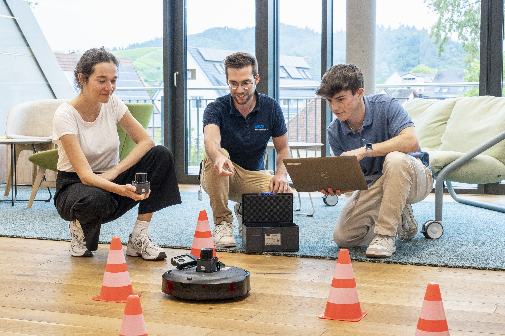
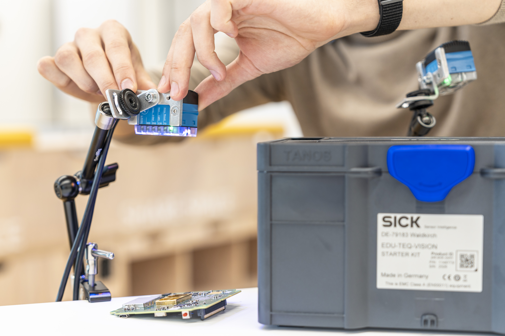

# SICK Sensor Starter Kits

Welcome to the GitHub for the SICK Sensor Starter Kits!

The Kits provide a comprehensive set of sensors, accessories and examples to help you quickly get started with SICK sensors. These kits include everything you need to explore, prototype, and integrate sensor solutions into your projects.

  

    
    
    
    
    
  

  <button class="arrow arrow-left" onclick="prevImage()">&lt;</button>
  <button class="arrow arrow-right" onclick="nextImage()">&gt;</button>

## Choose your Starter Kit

Select the Starter Kit you are working with to open the setup guide, first demo and example projects.

-    

    **Vision Starter Kit**

    Get started with image-based sensor applications and AI-based vision examples.

     [Vision](vision/vision_overview.md){.md-button}

-   

    **LiDAR Starter Kit**

    Explore distance measurement, field evaluation and interactive LiDAR demonstrations

     [LiDAR](lidar/lidar_overview.md){.md-button}

-   

    **IO-Link Connectivity Starter Kit**

    Connect IO-Link devices and read process data.

    [IO-Link](iolink/iolink_overview.md){.md-button}

## Need a Starter Kit?

Don’t have a Starter Kit yet? Find out more and purchase yours here!

[Starter Kits](https://www.sick.com/s/sensor-starter-kits){:target="_blank".md-button}

!!! note "Educational use"
    Please note that the Starter Kits are intended for educational purposes only and must not be used in production environments.
