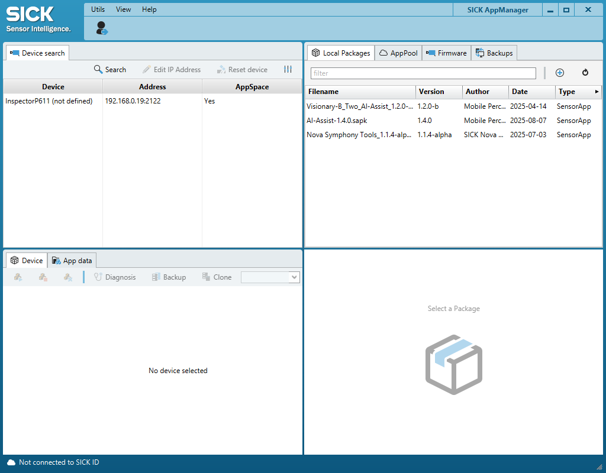

# Advanced Usage of the IO-Link Connectivity Starter Kit

## Short Description

This section covers advanced features and configurations for the IO-Link Connectivity Starter Kit.

It provides information about additional accessories, the SICK AppManager and firmware updates for the SIG300.

## Advanced Topic Overview

<table style="border-collapse: collapse; width: 100%;">
  <thead>
    <tr style="background-color: #005aff; color: white;">
      <th style="padding: 8px; text-align: left;">Topic</th>
      <th style="padding: 8px; text-align: left;">Purpose</th>
    </tr>
  </thead>
  <tbody>
    <tr>
      <td>Additional Accessories</td>
      <td>Extend the IO-Link Connectivity Starter Kit with additional sensors and signal transmitters.</td>
    </tr>
    <tr>
      <td>SICK AppManager</td>
      <td>Find the SIG300, manage its IP address and access firmware functions.</td>
    </tr>
    <tr>
      <td>Firmware Update</td>
      <td>Install a newer firmware version on the SIG300.</td>
    </tr>
  </tbody>
</table>

 

## Further Information

For more information about the SIG300 and its REST API, refer to the corresponding operating instructions:

[Sensor Integration Gateway - SIG300 - REST-API](https://www.sick.com/ag/en/search?text=8029127){ .md-button .button-small target="_blank" }

---

## Additional Accessories

The IO-Link Connectivity Starter Kit can be combined with additional accessories to support further tasks and applications.

<table style="border-collapse: collapse; width: 100%;">
  <thead>
    <tr style="background-color: #005aff; color: white;">
      <th style="padding: 8px; text-align: left;">#</th>
      <th style="padding: 8px; text-align: left;">Article Description</th>
      <th style="padding: 8px; text-align: left;">Part No.</th>
    </tr>
  </thead>
  <tbody>
    <tr>
      <td>1</td>
      <td>
        Signal light tower
        <a href="https://www.sick.com/ag/en/catalog/products/accessories/signal-transmitters/optical-signal-transmitters/slt060-0b010j700/p/p663661?tab=detail" target="_blank">SLT</a>
        – optical signal transmitter for visualizing values such as fill level or distance
      </td>
      <td>6075938</td>
    </tr>
    <tr>
      <td>2</td>
      <td>
        Color sensor
        <a href="https://www.sick.com/ag/en/catalog/products/detection-sensors/color-sensors/csm/csm-wp1b7a2p/p/p672179?tab=detail" target="_blank">CSM</a>
        with IO-Link for additional applications
      </td>
      <td>1122739</td>
    </tr>
    <tr>
      <td>3</td>
      <td>
        Condition monitoring sensor – Multi Physics Box
        <a href="https://www.sick.com/ag/en/catalog/products/detection-sensors/condition-monitoring-sensors/multi-physics-box/mpb10-vs00vsiq00/p/p670770?tab=detail" target="_blank">MPB10</a>
        for measuring additional data
      </td>
      <td>-</td>
    </tr>
  </tbody>
</table>

---

## Engineering Tool: SICK AppManager

The engineering tool **SICK AppManager** can be used to access additional device functions, such as updating the firmware.

### Install and Open SICK AppManager

1. Download [SICK AppManager](https://www.sick.com/de/en/products/digital-services-and-software/engineering-tools/sick-appmanager/sick-appmanager/p/p532784).
2. Install and open SICK AppManager.
3. The device should automatically appear in the upper-left corner.

4. If the device does not appear, select **Search**.
5. If the device still does not appear, open the settings.
6. Select **USB** and all available checkboxes under **Ethernet**.

7. If the device is connected via Ethernet, its IP address can be edited if required.

!!! note "IP address configuration"
    The device IP address can only be edited in SICK AppManager when the device is connected via Ethernet.

---

## Firmware Update

Follow these steps to install a newer firmware version on the SIG300.

1. Open the https://www.sick.com/ag/en/catalog/products/network-and-connection-technology/network-devices/sig300/sig300-0a0gaa100/p/p678107?category=g569793&tab=downloads.
2. Open **Downloads** > **Software**.
3. Download the latest firmware.
4. Extract the downloaded `.zip` file.
5. Locate the included `.spk` firmware file.
6. Open SICK AppManager.
7. Select **Firmware** in the upper-right corner.
8. Select the **+** button.
9. Choose the `.spk` file.
10. Make sure that the correct device is selected.
11. Select **Install** in the lower-right corner.

!!! warning "Firmware update"
    Make sure that the correct SIG300 and firmware file are selected before starting the installation.

---

## Summary

This page introduced additional accessories for the IO-Link Connectivity Starter Kit and the basic use of SICK AppManager.

You learned how to:

- extend the Starter Kit with additional IO-Link devices
- find the SIG300 in SICK AppManager
- access its IP address when connected via Ethernet
- download and install a SIG300 firmware update

## Next Steps

Return to the IO-Link example projects, open the code examples or continue with the available training material.

[Example Projects](./iolink_example_projects.md){ .md-button }

[IO-Link Code Examples](./iolink_code_snippets.md){ .md-button }

[Training Material](./iolink_training_material.md){ .md-button }

[FAQ](./iolink_faq.md){ .md-button }

