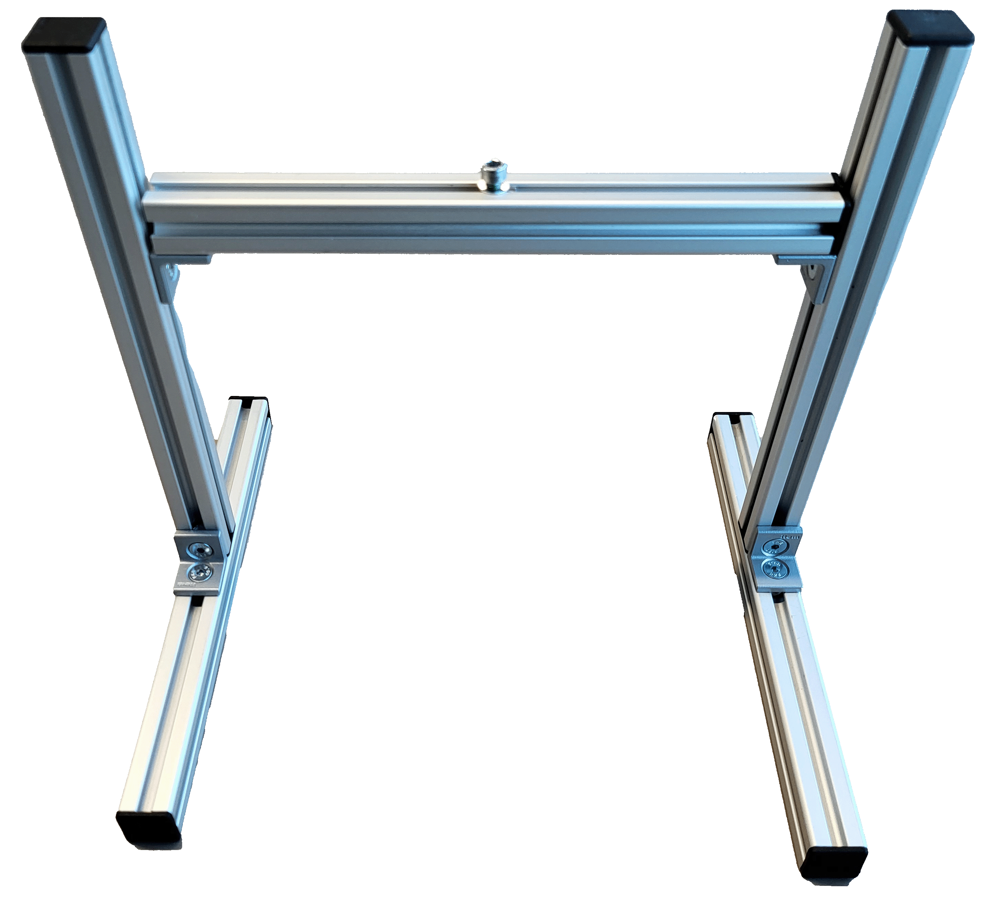

<!-- # Getting started

You are now ready to get started with the IO-Link Connectivity Starter Kit. Follow along the instruction below or scroll down to the tutorial video.

## Setup Sensors

1.	Connect the SIG300 with the USB-C cable and power supply.
2.	Choose the correct plug adapter and plug the power supply into an outlet.
3.	Connect the USB-C cable to the PC.
4.	Open a browser and enter the default IP address 169.254.0.1
5.	Connect the sensors W10, UC12 and IM30 with the IO-Link cables to the SIG300 (e.g. to port S1-S3)
6.	The devices are now ready to use
7.	The sensors can be mounted onto the assembled frame (see below) with the mounting brackets (only applies with a Mounting Kit - 1154060) 


## Setup Mounting Frame (only applies with Mounting Kit)



Scroll down to get to the tutorial video.

**Required Hardware**

* 5 × Aluminum profiles
* 8 × End caps
* 8 × Countersunk screws
* 8 × M5 T-slot nuts
* 1 × M4 T-slot nut
* 4 × Angle brackets
* 1 × Hex key (3 mm)**

**Top Bar**

* Take one aluminum profile from the box.
* Insert one M4 T-slot nut into the top groove.
* Insert two M5 T-slot nuts into the bottom groove (opposite side of the M4 nut).
* Attach two angle brackets using countersunk screws and tighten them into the M5 T-slot nuts with a hex key.
* Place end caps on both ends of the profile.
* Slide the angle brackets to both ends of the profile and tighten the screws so that the angle brackets and end caps are aligned.

**Bottom Bars (x2)**

* Insert one M5 T-slot nut into the center groove of each bar.
* Attach one angle bracket with countersunk screws and tighten using the hex key.
* Place end caps on both ends.
* Position both profiles parallel in front of you, oriented lengthwise, so the ends point toward you and away from you—not sideways across the table.

**Vertical Bars (x2)**

* Insert one M5 T-slot nut at the bottom end of each bar.
* Mount each vertical bar at a 90° angle to one bottom bar using a countersunk screw and a 3 mm hex key.
* Insert one M5 T-slot nut at the top end of each bar in the groove facing the other bottom bar.
* Place an end cap on the top of each vertical bar.
Use the two remaining countersunk screws to mount the top bar between the two vertical bars with the angle brackets and hex key.
* Tip: It may be easier to lay the frame down to mount the top bar.
* Adjust the height and angle of the top bar by loosening and tightening the two inner screws at the top of the vertical bars.

**Final Step**

* Mount the Inspector61x bracket using the supplied M4 screw and washer to the T-slot nut on top of the top bar.

<iframe id="kaltura_player" src="https://api.eu.kaltura.com/p/205/sp/20500/embedIframeJs/uiconf_id/23452804/partner_id/205?iframeembed=true&playerId=kaltura_player&entry_id=0_ee4dppoa&flashvars[streamerType]=auto&amp;flashvars[localizationCode]=en&amp;flashvars[sideBarContainer.plugin]=true&amp;flashvars[sideBarContainer.position]=left&amp;flashvars[sideBarContainer.clickToClose]=true&amp;flashvars[chapters.plugin]=true&amp;flashvars[chapters.layout]=vertical&amp;flashvars[chapters.thumbnailRotator]=false&amp;flashvars[streamSelector.plugin]=true&amp;flashvars[EmbedPlayer.SpinnerTarget]=videoHolder&amp;flashvars[dualScreen.plugin]=true&amp;flashvars[hotspots.plugin]=1&amp;flashvars[Kaltura.addCrossoriginToIframe]=true&amp;&wid=0_lj0aweoi" width="560" height="315" allowfullscreen webkitallowfullscreen mozAllowFullScreen allow="autoplay *; fullscreen *; encrypted-media *" sandbox="allow-downloads allow-forms allow-same-origin allow-scripts allow-top-navigation allow-pointer-lock allow-popups allow-modals allow-orientation-lock allow-popups-to-escape-sandbox allow-presentation allow-top-navigation-by-user-activation" frameborder="0" title="Tutorial Mounting Kit"></iframe>

**Now you are ready start, feel free to try out or choose an [example project](./iolink_example_projects.md) or [code snippets](./iolink_code_snippets.md) or check out the [training materials](./iolink_training_material.md) from below**

## Troubleshooting

Check out the operating instructions of the devices for more information.

* [SIG300](https://www.sick.com/ag/en/catalog/products/network-and-connection-technology/network-devices/sig300/sig300-0a0gaa100/p/p678107?tab=downloads)
* [W10](https://www.sick.com/ag/en/catalog/products/detection-sensors/photoelectric-sensors/w10/wtm10l-241611d0a00zvzzzzzzzzz1/p/p678567?tab=downloads)
* [UC12](https://www.sick.com/ag/en/catalog/products/distance-sensors/ultrasonic-distance-sensors/uc12/uc12-1123e/p/p665119?tab=downloads)
* [IMC30](https://www.sick.com/ag/en/catalog/products/detection-sensors/inductive-proximity-sensors/imc/imc30-20nppvc0sa00/p/p483964?tab=downloads)

Make sure to follow these steps:

1. Make sure you are disconnected from any VPN as this may block the connection to the network device.
2. If you can't connect to the network device, check if the LED **"Ready"** is green.  
      If not, the power supply is not correctly established. Wait up to 2 minutes and check if the power supply is connected correctly.

3. If you still can’t connect, look up the device IP address via **SICK AppManager**:  
      [SICK AppManager | SICK](https://www.sick.com/ag/en/catalog/products/digital-services-and-software/engineering-tools/sick-appmanager/sick-appmanager/p/p532784)
      Go to the **Advanced section** for details.
4. Check the **FAQ section**: [FAQ](./iolink_faq.md)

5. If the device still has issues:  
      - Go to the **Support Portal**, register, and create a case to get assistance.


**If you want to learn more about the network device, the ports, or the Logic editor, check out this tutorial series**


## Tutorial
<iframe width="560" height="315" src="https://www.youtube-nocookie.com/embed/YG7Tm6EzI0A?si=JODw6tMatWkURfNq" title="YouTube video player" frameborder="0" allow="accelerometer; autoplay; clipboard-write; encrypted-media; gyroscope; picture-in-picture; web-share" referrerpolicy="strict-origin-when-cross-origin" allowfullscreen></iframe>

-->

# Getting Started with the IO-Link Connectivity Starter Kit

You are now ready to get started with the IO-Link Connectivity Starter Kit.

Follow the instructions below to connect the SIG300 and the included IO-Link sensors. You can also watch the tutorial video for additional information about the network device, its ports and the Logic Editor.

## Setup Sensors

1. Connect the SIG300 using the USB-C cable and the power supply.
2. Choose the correct plug adapter and connect the power supply to an outlet.
3. Connect the USB-C cable to the computer.
4. Open a browser and enter the default IP address:

```text
http://169.254.0.1
```

5. Connect the W10, UC12 and IMC30 sensors to the SIG300 using the IO-Link cables, for example to ports S1 to S3.
6. The devices are now ready to use.
7. If the optional Mounting Kit is available, mount the sensors on the assembled frame using the corresponding mounting brackets.


## Optional Mounting Frame

The mounting frame is only included when using the separate Mounting Kit.

Use the shared Mounting Frame Setup page for the complete assembly instructions:

[Mounting Frame](../mounting_frame.md){ .md-button .button-small }


## Tutorial

The following tutorial provides additional information about the network device, its ports and the Logic Editor.

<iframe
  width="560"
  height="315"
  src="https://www.youtube-nocookie.com/embed/YG7Tm6EzI0A?si=JODw6tMatWkURfNq"
  title="IO-Link Connectivity Starter Kit tutorial"
  frameborder="0"
  allow="accelerometer; autoplay; clipboard-write; encrypted-media; gyroscope; picture-in-picture; web-share"
  referrerpolicy="strict-origin-when-cross-origin"
  allowfullscreen>
</iframe>

## Troubleshooting

??? info "Connection and Setup Problems"

    !!! failure "The SIG300 user interface does not open"
        Make sure that the computer is disconnected from any active VPN connection, as this may block access to the network device.

        Open the default IP address again:

        ```text
        http://169.254.0.1
        ```

    !!! failure "The Ready LED is not green"
        Check whether the power supply and the USB-C cable are connected correctly.

        Wait up to two minutes for the SIG300 to complete its startup process.

    !!! failure "The SIG300 still cannot be reached"
        Use SICK AppManager to identify the current device IP address.

        [Open SICK AppManager product page](https://www.sick.com/ag/en/catalog/products/digital-ols/sick-appmanager/sick-appmanager/p/p532784){ .md-button .button-small }

        Additional information about SICK AppManager can be found on the [Advanced](./iolink_advanced.md) Topics page:

        
    !!! failure "Additional support is required"
        Check the IO-Link Starter Kit FAQ for further troubleshooting information:

        [IO-Link FAQ](./iolink_faq.md){ .md-button .button-small }

        If the device still has issues, open the SICK Support Portal, register and create a support case.

??? info "Operating Instructions"

    Additional product information, operating instructions and downloads are available on the corresponding product pages:

    - [SIG300](https://www.sick.com/ag/en/catalog/products/network-and-connection-technology/network-devices/sig300/sig300-0a0gaa100/p/p678107?tab=downloads)
    - [W10](https://www.sick.com/ag/en/catalog/products/detection-sensors/photoelectric-sensors/w10/wtm10l-241611d0a00zvzzzzzzzzz1/p/p678567?tab=downloads)
    - [UC12](https://www.sick.com/ag/en/catalog/products/distance-sensors/ultrasonic-distance-sensors/uc12/uc12-1123e/p/p665119?tab=downloads)
    - [IMC30](https://www.sick.com/ag/en/catalog/products/detection-sensors/inductive-proximity-sensors/imc/imc30-20nppvc0sa00/p/p483964?tab=downloads)

## Summary

The SIG300 is now connected to the computer and the W10, UC12 and IMC30 sensors are connected through IO-Link.

If the optional Mounting Kit is available, the sensors can also be mounted on the assembled frame.

## Next Steps

You can now continue with an example project, explore the code examples or open the available training material.

<div class="next-step-buttons" markdown>

[Example Projects](./iolink_example_projects.md){ .md-button }

[IO-Link Code Examples](./iolink_code_snippets.md){ .md-button }

[Training material](training_material.md){ .md-button }

[Advanced](./iolink_advanced.md){ .md-button }

</div>