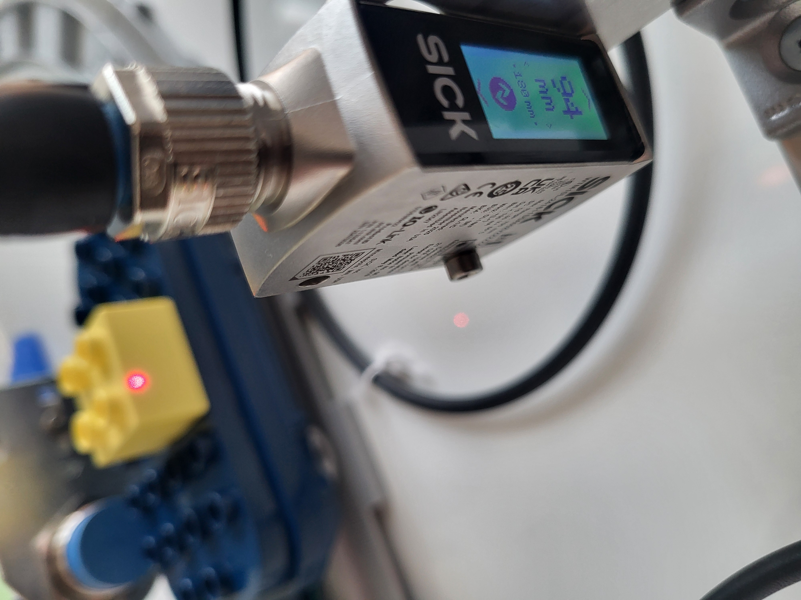
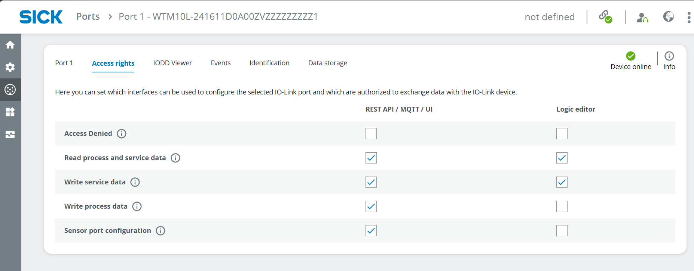
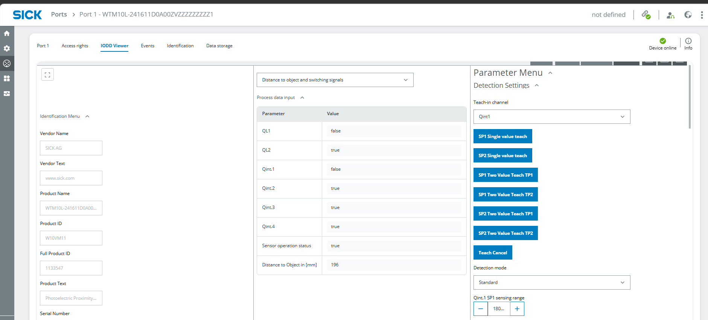
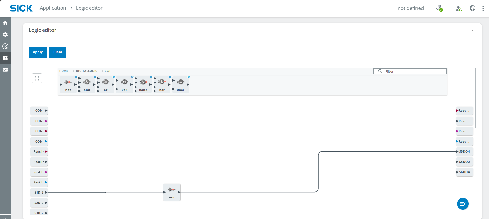
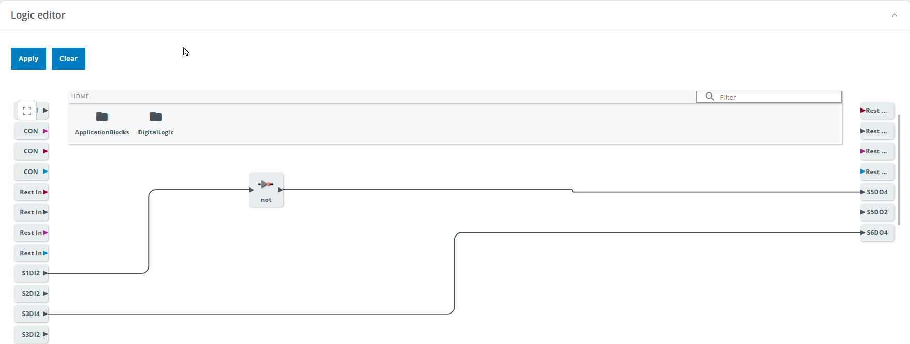

# Smart Train Loop

## Short Description

This advanced project demonstrates how multiple sensor technologies can be combined to analyze a train moving around a track loop.

The W10, UC12 and IMC30 are used for presence detection, distance measurement and the detection of metallic objects. The sensor results can be visualized using LEDs or an optional signal light tower. The required logic is created in the Logic Editor of the SIG300.

## Project Information

<table style="border-collapse: collapse; width: 100%;">
  <thead>
    <tr style="background-color: #005aff; color: white;">
      <th style="padding: 8px; text-align: left;">Project type</th>
      <th style="padding: 8px; text-align: left;">Required knowledge level</th>
      <th style="padding: 8px; text-align: left;">Estimated duration</th>
      <th style="padding: 8px; text-align: left;">Additional hardware and software requirements</th>
    </tr>
  </thead>
  <tbody>
    <tr>
      <td><span class="project-badge advanced">Advanced Project</span></td>
      <td>Advanced</td>
      <td>1 to 2 hours</td>
      <td>
        Mounting Kit<br>
        Battery-powered train with tracks<br>
        Metallic objects for the train wagons<br>
        Optional: SLT
      </td>
    </tr>
  </tbody>
</table>


## Goal

The goal of this project is to build a smart gate that analyzes a train moving through the detection area.

The project combines different sensors to:

- detect the train
- determine whether a train wagon is loaded
- detect metallic objects on a train wagon
- visualize the sensor results with LEDs or an optional SLT
- combine the sensor signals in the Logic Editor of the SIG300

---

## Project Concept

The project uses the three sensors included in the IO-Link Connectivity Starter Kit:

- the W10 photoelectric sensor
- the UC12 ultrasonic distance sensor
- the IMC30 inductive proximity sensor

Each sensor performs a different task. The results are combined in the Logic Editor of the SIG300 and can be displayed using the connected LEDs or an optional signal light tower.

---

## Before You Start

Connect to the SIG300 user interface as described in the Getting Started guide.

[Getting Started](./iolink_getting_started.md){ .md-button .button-small }

If the optional Mounting Kit is used, assemble the [mounting frame](../mounting_frame.md) before positioning the sensors.


---

# Project Setup

## 1. Connect the Devices

Connect the three sensors and the LEDs or optional SLT to the SIG300.

??? info "Example connection setup"

    An example connection setup is:

    - SIG300 connected to the computer via USB-C
    - S1: W10
    - S2: UC12
    - S3: IMC30
    - S4: SLT or yellow LED
    - S5: green LED
    - S6: red LED

    The green and red LEDs may initially blink because the corresponding ports are configured for IO-Link.

---

## 2. Define the Sensor Tasks

Think of a suitable task for each sensor.

Mount the sensors on the mounting frame using the supplied mounting brackets and tools.

??? info "Sensor information"

    **W10**

    Photoelectric sensor that measures distance using an optical functional principle.

    Measuring range:

    ```text
    25 to 700 mm, depending on the selected mode
    ```

    https://www.sick.com/ag/en/catalog/products/detection-sensors/photoelectric-sensors/w10/wtm10l-241611d0a00zvzzzzzzzzz1/p/p678567

    **UC12**

    Ultrasonic distance sensor.

    Measuring range:

    ```text
    55 to 250 mm
    ```

    https://www.sick.com/ag/en/catalog/products/distance-sensors/ultrasonic-distance-sensors/uc12/uc12-1223e/p/p665120

    **IMC30**

    Inductive proximity sensor that detects metallic objects.

    Sensing range:

    ```text
    0 to 20 mm
    ```

    https://www.sick.com/ag/en/catalog/products/detection-sensors/inductive-proximity-sensors/imc/imc30-20nppvc0sa00/p/p483964?tab=detail

??? info "Example setup and tasks"

    **UC12**

    Mount the UC12 at the top of the frame to detect the train. Keep the maximum measuring range in mind.

    **W10**

    Mount the W10 at the bottom of the other vertical bar to check whether a train wagon is loaded. Keep the minimum height of the objects on the wagon in mind.

    **IMC30**

    Mount the IMC30 at the bottom of one vertical bar to detect metallic objects on the train wagon. Keep the maximum sensing distance in mind.

    

    

    

---

## 3. Open the SIG300 User Interface

1. Connect to the SIG300 user interface as described in the Getting Started guide.
2. Log in as **Service**.
3. Use the following password:

```text
servicelevel
```

4. Select **Keep Default Password**.

---

# IODD Configuration

## 1. Check the IODD Files

1. Select **Application** > **IODD File Management**.
2. Check whether the IODDs for all connected sensors are available.


If an IODD is missing, download it from:

- the **Downloads** > **Software** section of the corresponding SICK product page
- https://ioddfinder.io-link.com/

Use the following device information when searching:

- W10: `WTM10x-xx1611xxA00xVxxxxxxxxxx`
- UC12: `6077702`
- IMC30: `1079301`
- SLT060: `6075938`

3. Assign the IODDs to the corresponding ports if this has not happened automatically.


---

# Port Configuration

## 1. Configure the Sensors

The following example describes the configuration of the W10 at port S1.

The sensors can be used as digital inputs, for example to trigger a digital output such as an LED. They can also be used as IO-Link devices to communicate with other IO-Link devices such as the SLT.

1. Open **Ports** > **Port 1**.
2. Open the **Access rights** tab.
3. Enable the required access rights.

The following access rights are relevant:

- **Read process and service data**
- **Sensor port configuration**



4. Open the **Port 1** configuration tab.
5. Check the following settings:

- correct IODD assigned
- IO-Link selected
- Device Identification Check set to **Yes**
- Version set to **V1.1**

!!! note "Relevant pins"

    Pin 4 is relevant for the SLT when it is used as an IO-Link device.

    Pin 2 can be used for digital signals, for example when connecting the sensor result to an LED.


6. Open the **IODD Viewer** tab.
7. Select the measurement type at the top center.
8. Read the current measurement value at the bottom center.

To define a trigger at a specific measurement value, adjust the corresponding sensor parameters.

For example, to trigger the W10 when the measured value is greater than 180 mm:

1. Open **Detection settings**.
2. Set **Qint.1 SP1 sensing range** to `180 mm`.
3. Select **High active**.



Repeat the configuration for all sensors.

!!! note "Different IODD Viewer layouts"

    The IODD Viewer can look different for each sensor because the sensors use different functional principles, parameters and integrated functions.

---

## 2. Configure the LEDs

The SLT is configured in a similar way to a sensor because it is used as an IO-Link device.

For simple digital outputs such as the included LEDs, use the following procedure:

1. Open **Ports** and select the port used by the LED.
2. Open the **Access rights** tab.
3. Enable **Write process data**.


4. Open the configuration tab for the corresponding port.
5. Configure the pin used by the LED.
6. Depending on the port configuration and access rights, toggle **HI/LO** to check whether the LED works.


Repeat the configuration for all LEDs.

!!! warning "Verify the port mode"

    The previous version of this guide specified **Digital In** for Pin 4, although the LED is controlled as a digital output.

    Verify the required port mode in the SIG300 user interface and the applicable device instructions before finalizing the configuration.

---

# Logic Editor

## 1. Create the Application Logic

The Logic Editor combines the digital sensor signals with the connected LEDs.

!!! warning "Apply changes"

    Always select **Apply** after changing the logic. Otherwise, the changes do not take effect.

1. Open **Application** > **Logic Editor**.
2. Create the logic for the connected sensors and LEDs.
3. Use the tasks defined during the project setup.

The following examples show possible implementations.

---

## 2. Indicate Whether a Wagon Is Loaded

??? info "Light up the green LED if a wagon is loaded"

    Create a direct connection between the digital input of the W10 and the digital output of the green LED.

    Example:

    ```text
    S1DI2 → S5DO4
    ```

    Drag the arrow from the input block on the left to the output block on the right.

    Depending on the measurement result of the W10, the green LED should light up.

    To invert the result, add the following logic block between the input and output:

    ```text
    Digital Logic > Gate > NOT
    ```

    

---

## 3. Indicate Whether the Train Is Detected

??? info "Light up the red LED if the train is detected"

    The UC12 can detect objects within a defined area.

    1. Mount the UC12 according to its measuring range and the height of the train.
    2. Open the **IODD Viewer**.
    3. Check the measurement result and adjust the position of the UC12.
    4. Open **SSC1: switch signal channel 1**.
    5. Adjust the **SP1** value.
    6. Select **Low active**.

    !!! note "UC12 SP1 value"

        The SP1 value described here is not a value in millimeters.

    

    Open the Logic Editor and connect:

    ```text
    S2I2 → S6DO4
    ```

    A NOT gate is not required because the logic is configured as **Low active**.

    

    Select **Apply** and test the result.

---

## 4. Indicate Whether a Metallic Object Is Detected

??? info "Light up the yellow LED if a metallic object is detected"

    The IMC30 detects metallic objects within its sensing range.

    1. Mount the IMC30 according to its sensing range and the distance to the metallic objects on the wagon.
    2. Open the **IODD Viewer**.
    3. Check the measurement result.
    4. Adjust the position of the IMC30 if necessary.

    No additional parameter needs to be configured for this example.

    Open the Logic Editor and connect:

    ```text
    S3I2 → S4DO4
    ```

    

    Select **Apply** and test the result.

---

## 5. Keep an LED Active for Three Seconds

??? info "Keep an LED active for three seconds after a trigger"

    Add a **Delay** block in the Logic Editor.

    Set **OffDelay** to:

    ```text
    3000 ms
    ```

    This delays the LED switching off for three seconds after the trigger signal ends.

    

---

## Expected Result

After completing the project, the SIG300 should combine the configured sensor signals and control the connected LEDs or optional SLT.

Depending on the implemented logic:

- the green LED indicates whether a train wagon is loaded
- the red LED indicates whether the train is detected
- the yellow LED indicates whether a metallic object is detected
- a delay can keep an LED active for three seconds after a trigger

---

## Reset

When the project is complete, select **Clear** in the Logic Editor to remove all blocks and connections.

!!! warning "Factory reset"

    A factory reset also deletes the uploaded IODD files.

---

## Summary

In this advanced project, you combined the three sensors of the IO-Link Connectivity Starter Kit in a smart train application.

You worked with:

- the W10 photoelectric sensor
- the UC12 ultrasonic distance sensor
- the IMC30 inductive proximity sensor
- LEDs or an optional SLT
- IODD File Management
- port configuration
- the IODD Viewer
- the Logic Editor of the SIG300

The individual sensor results were connected to visual outputs representing different states of the train and its load.

## Next Steps

Return to the IO-Link project overview or review the SensorFusion project.

<div class="next-step-buttons" markdown>

[Example Projects](./iolink_example_projects.md){ .md-button }

[SensorFusion](./sensor_fusion.md){ .md-button }

</div>