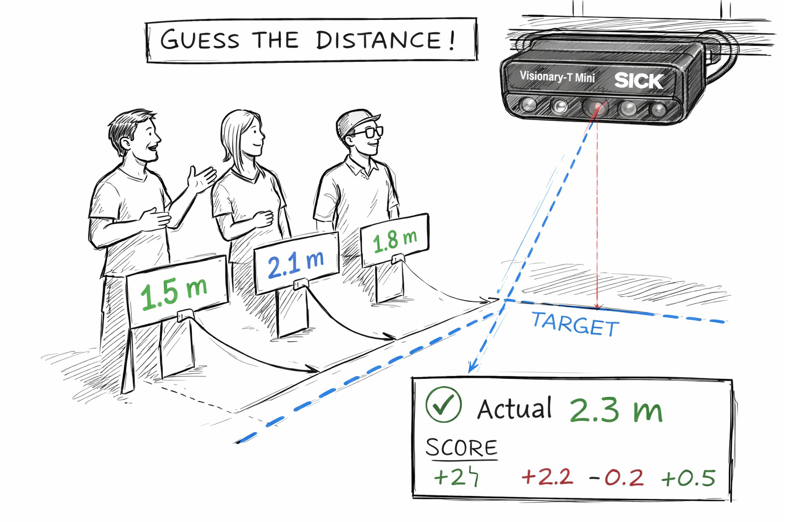

# Distance Estimation

## Short Description

This challenge project focuses on estimating and measuring distances with the LiDAR Starter Kit.

The goal is to create a playful setup where users estimate the distance to an object and compare their estimation with the measured LiDAR distance.

## Project Information

<table style="border-collapse: collapse; width: 100%;">
  <thead>
    <tr style="background-color: #005aff; color: white;">
      <th style="padding: 8px; text-align: left;">Project type</th>
      <th style="padding: 8px; text-align: left;">Required knowledge level</th>
      <th style="padding: 8px; text-align: left;">Estimated duration</th>
      <th style="padding: 8px; text-align: left;">Additional hardware and software requirements</th>
    </tr>
  </thead>
  <tbody>
    <tr>
      <td>Challenge Project</td>
      <td>Basic</td>
      <td>1 to 2 Hours</td>
      <td>Any objects</td>
    </tr>
  </tbody>
</table>

 

## Challenge Goal

The goal of this project is to evaluate human distance estimation using LiDAR measurement data.

Users should estimate the distance to an object, while the LiDAR sensor provides the measured distance. The difference between estimation and measurement can then be displayed or analyzed.

Unlike a guided project, this challenge does not provide a complete step-by-step solution. Use your knowledge from previous LiDAR Starter Kit projects to develop your own approach.

---

## Problem Statement

Human distance estimation can be inaccurate, especially without reference points.

The LiDAR Starter Kit can be used to measure distances and compare them with a user's estimated value.

Possible goals:

- measure the distance to an object
- compare estimated and measured distance
- calculate the deviation
- visualize the result in a dashboard
- create a small game based on distance estimation

---

## Task

Create an application that measures the distance to an object and compares it with a user estimation.

Your solution should include:

1. A defined measurement setup
2. One or more test objects
3. A method to read or display the measured distance
4. A way for users to enter or select their estimated distance
5. Calculation of the deviation between estimation and measurement
6. Optional visualization of the result

---

## Requirements

<h3>Core Requirements</h3>

<ul>
  <li>Use the LiDAR Starter Kit to measure the distance to an object.</li>
  <li>Place a test object in front of the sensor.</li>
  <li>Read or display the measured distance value.</li>
  <li>Allow the user to estimate the distance.</li>
  <li>Compare the estimated distance with the measured distance.</li>
  <li>Calculate the deviation between estimation and measurement.</li>
</ul>

<h3>Optional Extensions</h3>

<ul>
  <li>Create a dashboard for displaying the measured and estimated values.</li>
  <li>Generate random target distances for a game mode.</li>
  <li>Add a score based on estimation accuracy.</li>
  <li>Track multiple rounds or multiple players.</li>
  <li>Visualize the deviation as a bar, percentage or color indicator.</li>
  <li>Use different objects and compare measurement behavior.</li>
</ul>

---

## Suggested Approach

Use the following approach as orientation:

1. Set up the LiDAR Starter Kit.
2. Place an object at a visible distance in front of the sensor.
3. Open the sensor user interface or use a script to read measurement data.
4. Let the user estimate the distance to the object.
5. Read the measured distance from the sensor.
6. Calculate the difference between estimated and measured distance.
7. Display the result.
8. Repeat the process with different distances or objects.

---

## Project Ideas

You can implement the challenge in different ways depending on the available setup and programming experience.

  

    <h3>Simple Measurement</h3>
    
Place an object in front of the LiDAR sensor and read the measured distance.

    
This is the easiest version and can be used to understand the basic measurement behavior.

  

  

    <h3>Estimation Game</h3>
    
Let a user estimate the distance to an object before revealing the measured value.

    
The result can be scored based on how close the estimation was to the real measurement.

  

  

    <h3>Random Target Distance</h3>
    
Generate a random target distance and ask the user to place an object as close as possible to that distance.

    
The LiDAR sensor can then measure the actual distance and calculate the deviation.

  

  

    <h3>Dashboard Visualization</h3>
    
Create a simple dashboard that shows estimated distance, measured distance and deviation.

    
This can make the project more interactive and easier to understand during demonstrations.

  

---

## Hints

??? tip "Hint 1: Start with one object"
    Start with a single object and a fixed sensor position.  
    After the measurement works reliably, test different objects and distances.

??? tip "Hint 2: Use clear measurement conditions"
    Make sure the object is visible to the LiDAR sensor and not too close to the sensor.

??? tip "Hint 3: Separate measurement and game logic"
    First make sure that the distance measurement works.  
    Then add estimation, scoring or dashboard logic.

??? tip "Hint 4: Compare multiple rounds"
    Let users repeat the estimation several times and calculate an average deviation.

??? tip "Hint 5: Use code examples if needed"
    If you want to read measurement data with Python, check the LiDAR code examples.

    [LiDAR code examples](./lidar_code_snippets.md){ .md-button .button-small }

---

## Example Project File

A prepared example project file is available here:

[Distance Estimation](../files/distance_estimation.zip){ .md-button .button-small }

---

## Expected Result

After completing this challenge, the LiDAR Starter Kit should be able to measure the distance to an object and compare it with a user's estimated distance.

A successful result means that:

- the object is detected by the LiDAR sensor
- the measured distance can be read or displayed
- the user estimation can be compared with the measured value
- the deviation can be calculated
- the project can be extended into a small interactive game or dashboard

---

## Summary

In this challenge project, you used the LiDAR Starter Kit to measure distances and compare them with human estimates.

You practiced how to:

- measure object distance with LiDAR
- evaluate measurement results
- calculate deviations
- build a playful distance estimation setup
- extend sensor data into a simple interactive application

This project is a good exercise for understanding LiDAR measurement behavior and turning sensor data into an interactive demo.

---

## Next Steps

Continue with another LiDAR project or open the complete project files on GitHub.com.

[Example Projects](./lidar_example_projects.md){ .md-button }

[GitHub](https://github.com/SICKAG/SICK-Sensor-Starter-Kits/tree/main/projects/lidar/distance_estimation){:target="_blank" .md-button}

