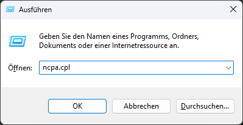
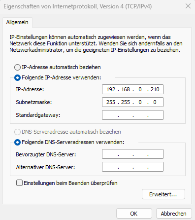

# Getting Started with the LiDAR Starter Kit

Follow these steps to set up and start using your LiDAR Starter Kit:

## Step 1: Hardware Setup
1. Connect the LiDAR sensor to your computer using the provided cable and the network adapter.
2. Ensure the power supply is connected and turned on.
3. Configure the IP address of the adapter.

??? sickinfo "Detailed instructions"   

      - Shortcut in Windows: "Win + R": "ncpa.cpl"

      

      - Alternative: Open your operating system's network settings (e.g., **Control Panel > Network & Internet** in Windows 10/11, or the equivalent in your OS).  
      Choose **Advanced network settings**  

      - Identify the USB Ethernet adapter (might be listed as **ASIX USB to Gigabit Ethernet Family Adapter**).

       

      - Click on the adapter and select **Properties / Edit**.  

      - Enter administrator credentials if necessary.  

      - Locate **Internet Protocol Version 4 (TCP/IPv4)** and select **Properties** or right-click.

        

      - Change from DHCP to manual IP settings:  
      Use the following IP address: `192.168.0.xxx`  
      Subnet mask: `255.255.0.0`

        

      - Save changes by clicking **Ok** in both windows.

- Open a browser and enter the default IP address 192.168.0.1. You should now see the Sensor UI

  
*Figure 1: Connection setup for the LiDAR Starter Kit.*

## Step 2: Software Installation

For the first setup, no additional software installation is required if you only want to open the sensor user interface in your browser.

For more advanced use cases, such as reading measurement data with Python scripts, you can use the example scripts provided in the project repository.

Typical tools you may need later:

- Python
- Visual Studio Code or another IDE
- Example scripts for LiDAR communication
- Optional: GitHub.com project files

!!! note "Software setup"
    The basic setup can be completed through the sensor user interface.  
    Python scripts are mainly required for advanced examples and custom applications.

---

## Step 3: First Measurement

After the LiDAR sensor is connected and reachable, you can start with your first measurement or first demo.

You can either:

- use the sensor user interface to check whether the sensor is reachable
- continue with the first LiDAR example project
- use Python scripts to read device or measurement data

---

## Next Steps

**Get started with your first LiDAR project:**

[Field Evaluation](./lidar_field_evaluation.md){ .md-button .button-small }

**Or choose another option:**

[Example Projects](./lidar_example_projects.md){ .md-button }

[LiDAR Code Examples](./lidar_code_snippets.md){ .md-button }

[Advanced](./lidar_advanced.md){ .md-button }

