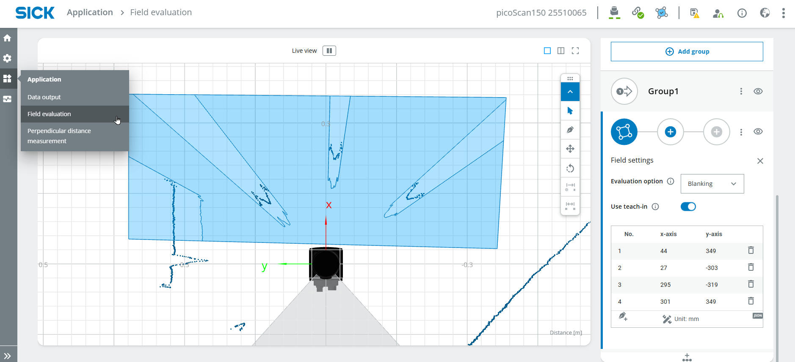
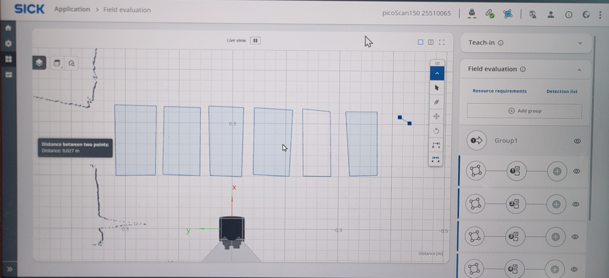
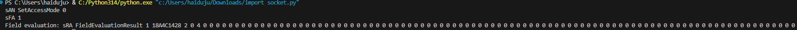

# Human Piano / Air Piano

## Short Description

This showcase project demonstrates how the LiDAR Starter Kit can be used to create an interactive **Air Piano**.

You will create multiple detection fields with the LiDAR sensor and use a Python application to play different notes when a field is infringed by a person or object.

The project can be extended with different play modes, semitones, more realistic piano notes or multiple simultaneous sounds.

## Project Information

<table style="border-collapse: collapse; width: 100%;">
  <thead>
    <tr style="background-color: #005aff; color: white;">
      <th style="padding: 8px; text-align: left;">Project type</th>
      <th style="padding: 8px; text-align: left;">Required knowledge level</th>
      <th style="padding: 8px; text-align: left;">Estimated duration</th>
      <th style="padding: 8px; text-align: left;">Additional hardware and software requirements</th>
    </tr>
  </thead>
  <tbody>
    <tr>
      <td><span class="project-badge showcase">Showcase Project</span></td>
      <td>Advanced</td>
      <td>30 to 60 Minutes</td>
      <td>Several people or objects, audio output, Python with pygame</td>
    </tr>
  </tbody>
</table>

<br>


## Goal

The goal of this project is to simulate piano keys with LiDAR detection fields.

After completing this project, you should understand how to:

- create multiple LiDAR detection fields
- read field evaluation results with Python
- map field infringements to musical notes
- trigger sounds based on sensor data
- use different play modes such as trigger or hold
- improve socket handling for more stable operation

---

## Project Concept

The LiDAR sensor monitors several fields placed next to each other.

Each field represents one piano key.  
When a person or object infringes a field, the Python script reads the field state and plays the corresponding note.

Possible extensions:

- play tones continuously while a field is infringed
- play tones only once when entering a field
- add semitones
- use realistic piano sounds
- trigger multiple notes at the same time
- combine the setup with a dashboard or visual feedback

---

## Before You Start

Connect your LiDAR Starter Kit as described in the [Getting Started](./lidar_getting_started.md). guide.

!!! note "Code examples"
    The code snippets on this page are examples.  
    You can adapt the code or use your own implementation for the project.

!!! warning "Required Python package"
    The improved piano example uses `pygame.midi`.  
    Install pygame before running the script:

    ```bash
    pip install pygame
    ```

---

# Field Evaluation Setup

## 1. Open the Sensor User Interface

1. Open the LiDAR sensor user interface in your browser.
2. Make sure the sensor is connected and reachable.
3. The user interface should look similar to the example below.


---

## 2. Log in as Service User

1. Log in as **Service**.
2. Use the password:

```text
servicelevel
```

3. Press **Keep Default Password**.

---

## 3. Create Field Evaluation Areas

1. Select **Application** > **Field evaluation**.
2. Draw a field in a suitable size.
3. Repeat this step until you have multiple fields next to each other.



If useful, perform a **Teach-in** to ignore static objects.

1. Start the teach-in process.
2. Wait for approximately 10 seconds.
3. Stop the teach-in process.


---

## 4. Configure Field Parameters

Define the field parameters for field infringement.

For example, configure the maximum blanking size.  
This value corresponds to the minimum object size that infringes the field.


Draw multiple fields right next to each other.



You can ignore the **Output** configuration for this basic example.

!!! tip "Field setup"
    Start with a small number of fields first, for example three or four.  
    After the Python logic works reliably, add more fields and notes.

---

# Python Integration

## 1. Read Field Evaluation Result

Open a Python coding environment, for example Visual Studio Code.

The following code opens a connection to the LiDAR sensor and reads the field evaluation result once.

```python
import socket

HOST = "192.168.0.1"
PORT = 2111

def sopas(cmd):
    with socket.socket(socket.AF_INET, socket.SOCK_STREAM) as s:
        s.settimeout(2)
        s.connect((HOST, PORT))
        telegram = b"\x02" + cmd.encode("ascii") + b"\x03"
        s.sendall(telegram)
        return s.recv(1024).decode("ascii").strip("\x02\x03")

# Enable measurement
print(sopas("sMN SetAccessMode 03 F4724744"))
print(sopas("sMN LMCstartmeas"))

# Read field evaluation
response = sopas("sRN FieldEvaluationResult")
print("Field evaluation:", response)
```

The result should look similar to this:



In the field evaluation result:

- **2** means the field is not infringed
- **4** means the field is infringed

---

## 2. Extract Field States

For multiple fields, the response contains multiple field states.

The exact positions depend on the sensor configuration and the number of fields.  
In the improved example below, the response is split into a list and the field values are read by index.

!!! warning "Field index configuration"
    The values `FIELD_START_INDEX` and `FIELD_STEP` may need to be adapted to your setup.  
    Print the full response first and check where the field states are located.

---

## 3. Air Piano Code

The following code uses a persistent socket connection and MIDI output:

- one persistent socket connection instead of reconnecting in every loop
- automatic reconnect if the connection fails once
- MIDI notes instead of simple beep frequencies
- trigger mode and hold mode
- semitones
- multiple notes can be active at the same time
- more realistic piano-like behavior

```python
import socket  
import time  
import pygame.midi

# ============ KONFIGURATION ============  
HOST = "192.168.0.1"  
PORT = 2111

# Spielmodus:  
#   "hold"    = Ton klingt dauerhaft (Orgel)  
#   "trigger" = Ton wird einmal angeschlagen (Klavier)  
PLAY_MODE = "hold"

NOTE_DURATION_MS = 400   # Tondauer im Trigger-Modus (ms)  
VELOCITY = 110           # Anschlagstärke (0-127)

# --- Instrument passt automatisch zum Modus ---  
if PLAY_MODE == "hold":  
    INSTRUMENT = 19      # Church Organ (hält den Ton)  
else:  
    INSTRUMENT = 0       # Acoustic Grand Piano (klingt aus)

# Chromatische Tonleiter (12 Töne): C, C#, D, D#, E, F, F#, G, G#, A, A#, H  
NOTES = [60, 61, 62, 63, 64, 65, 66, 67, 68, 69, 70, 71]

# Physische Reihenfolge (links -> rechts) -> Feld-Nummer in der Antwort  
FIELD_ORDER = [3, 7, 5, 8, 4, 9, 6, 2, 10, 1, 11, 0]

FIELD_START_INDEX = 4    # Position des ersten Feldwerts in der Antwort  
FIELD_STEP = 2           # Abstand zwischen den Feldwerten  
NUM_FIELDS = len(NOTES)


# ============ LIDAR-VERBINDUNG (persistent) ============  
class LidarConnection:  
    def __init__(self, host, port):  
        self.host = host  
        self.port = port  
        self.sock = None  
        self.connect()

    def connect(self):  
        if self.sock:  
            try:  
                self.sock.close()  
            except OSError:  
                pass  
        self.sock = socket.socket(socket.AF_INET, socket.SOCK_STREAM)  
        self.sock.settimeout(2)  
        self.sock.connect((self.host, self.port))

    def sopas(self, cmd):  
        telegram = b"\x02" + cmd.encode("ascii") + b"\x03"  
        try:  
            self.sock.sendall(telegram)  
            return self.sock.recv(1024).decode("ascii").strip("\x02\x03")  
        except (OSError, socket.timeout):  
            self.connect()  
            self.sock.sendall(telegram)  
            return self.sock.recv(1024).decode("ascii").strip("\x02\x03")

    def close(self):  
        if self.sock:  
            self.sock.close()


# ============ HAUPTPROGRAMM ============  
def main():  
    pygame.midi.init()  
    player = pygame.midi.Output(pygame.midi.get_default_output_id())  
    player.set_instrument(INSTRUMENT)

    lidar = LidarConnection(HOST, PORT)  
    print(lidar.sopas("sMN SetAccessMode 03 F4724744"))  
    print(lidar.sopas("sMN LMCstartmeas"))

    note_on = [False] * NUM_FIELDS  
    note_off_time = [0.0] * NUM_FIELDS  
    prev_infringed = [False] * NUM_FIELDS

    try:  
        while True:  
            now = time.time()  
            response = lidar.sopas("sRN FieldEvaluationResult").split(' ')

            for pos in range(NUM_FIELDS):  
                field_number = FIELD_ORDER[pos]  
                idx = FIELD_START_INDEX + field_number * FIELD_STEP  
                infringed = (idx < len(response)) and (response[idx] == '4')  
                note = NOTES[pos]

                if PLAY_MODE == "hold":  
                    if infringed and not note_on[pos]:  
                        player.note_on(note, VELOCITY)  
                        note_on[pos] = True  
                    elif not infringed and note_on[pos]:  
                        player.note_off(note, VELOCITY)  
                        note_on[pos] = False

                elif PLAY_MODE == "trigger":  
                    if infringed and not prev_infringed[pos]:  
                        player.note_on(note, VELOCITY)  
                        note_on[pos] = True  
                        note_off_time[pos] = now + NOTE_DURATION_MS / 1000  
                    if note_on[pos] and now >= note_off_time[pos]:  
                        player.note_off(note, VELOCITY)  
                        note_on[pos] = False

                prev_infringed[pos] = infringed

            time.sleep(0.01)

    except KeyboardInterrupt:  
        print("Durch Nutzer gestoppt.")  
    finally:  
        for pos in range(NUM_FIELDS):  
            if note_on[pos]:  
                player.note_off(NOTES[pos], VELOCITY)  
        del player  
        pygame.midi.quit()  
        lidar.close()


if __name__ == "__main__":  
    main()  
```

---

## 4. Code Explanation

The most important configuration options are:

- `PLAY_MODE`: defines whether notes are played continuously or only once when entering a field
- `NOTE_DURATION_MS`: defines how long a note is played in trigger mode
- `INSTRUMENT`: defines the MIDI instrument
- `VELOCITY`: defines the key velocity
- `NOTES`: maps LiDAR fields to MIDI notes
- `FIELD_START_INDEX`: defines where the first field status is located in the response
- `FIELD_STEP`: defines the distance between field values in the response
- `NUM_FIELDS`: defines how many LiDAR fields are evaluated

The script keeps one socket connection open and reuses it for repeated SOPAS commands.  
This can improve stability compared to opening a new socket connection in every loop cycle.

---

## 5. Play Modes and Extensions

<div class="strategy-grid">

  <div class="strategy-card">
    <h3>Trigger Mode</h3>
    <p>A note is played once when a field changes from not infringed to infringed.</p>
    <p>This mode behaves more like a real piano key press.</p>
  </div>

  <div class="strategy-card">
    <h3>Hold Mode</h3>
    <p>A note plays as long as the field remains infringed.</p>
    <p>This mode behaves more like an organ or continuous sound trigger.</p>
  </div>

  <div class="strategy-card">
    <h3>Semitones</h3>
    <p>The example uses MIDI notes from 60 to 70 and includes semitones.</p>
    <p>This makes the setup closer to a chromatic piano scale.</p>
  </div>

  <div class="strategy-card">
    <h3>Multiple Notes</h3>
    <p>Several fields can be active at the same time.</p>
    <p>Using MIDI output makes it easier to handle overlapping notes compared to simple beep sounds.</p>
  </div>

</div>

---

## 6. More Realistic Piano Sounds

The improved example uses MIDI notes and the General MIDI instrument **Acoustic Grand Piano**.

For even more realistic piano sound, possible extensions are:

- use a different MIDI instrument
- use external MIDI software
- use recorded `.wav` piano samples
- use an audio library that supports overlapping sound playback
- map each LiDAR field to a different piano sample

!!! info "Sound quality"
    Simple beep frequencies are useful for first tests.  
    MIDI output is a better option if the project should sound more like a real piano.

---

## Troubleshooting

??? question "The script stops after a few minutes with a socket error. What can I do?"

    This can happen if a new socket connection is opened too often.

    A typical error message is:

    ```text
    Only one usage of each socket address, protocol, network address or port is normally permitted.
    ```

    To reduce this problem, use a persistent socket connection instead of opening a new connection in every loop iteration.

    The improved MIDI example on this page uses the `LidarConnection` class for this purpose.

??? question "No MIDI output device was found. What can I do?"

    Make sure that your system has an available MIDI output device.

    On some systems, additional MIDI software or virtual MIDI devices may be required.

??? question "The wrong field triggers a note. What should I check?"

    Check the values of:

    ```python
    FIELD_START_INDEX
    FIELD_STEP
    NUM_FIELDS
    ```

    These values depend on the structure of the field evaluation response and the number of configured fields.

??? question "The notes do not match the fields. What can I change?"

    Adjust the `NOTES` list.

    Example:

    ```python
    NOTES = [60, 62, 64, 65, 67, 69]
    ```

    This would map the fields to a simple C major scale.

??? question "The notes play repeatedly too fast. What can I do?"

    Use `PLAY_MODE = "trigger"` to play a note only once when a field is entered.

    You can also increase `NOTE_DURATION_MS` or add a longer delay in the loop.

---

## Expected Result

After completing this project, the LiDAR Starter Kit should trigger different notes depending on which field is infringed.

A successful result means that:

- multiple detection fields are configured
- field states can be read with Python
- each field is mapped to a MIDI note
- a note is played when a field is infringed
- trigger and hold behavior can be tested
- the setup can be extended with semitones and more realistic piano sounds

---

## Summary

In this showcase project, you created a LiDAR-based Air Piano.

You learned how to:

- create multiple LiDAR detection fields
- read field evaluation results
- map fields to MIDI notes
- trigger audio output with Python
- use different play modes
- improve socket handling for stable long-term operation
- extend the project with semitones or more realistic piano sounds

This project demonstrates how LiDAR field evaluation can be used for interactive audio applications.

---

## Next Steps

Continue with another LiDAR project or open the complete project files on GitHub.com.

<div class="next-step-buttons" markdown>

[Example Projects](./lidar_example_projects.md){ .md-button }

[GitHub](https://github.com/SICKAG/SICK-Sensor-Starter-Kits){:target="_blank" .md-button}

</div>