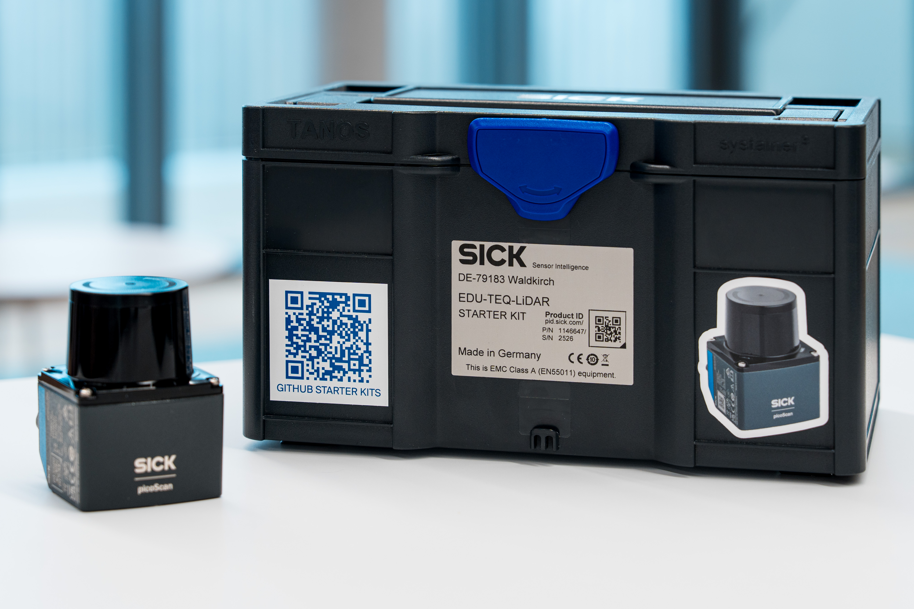
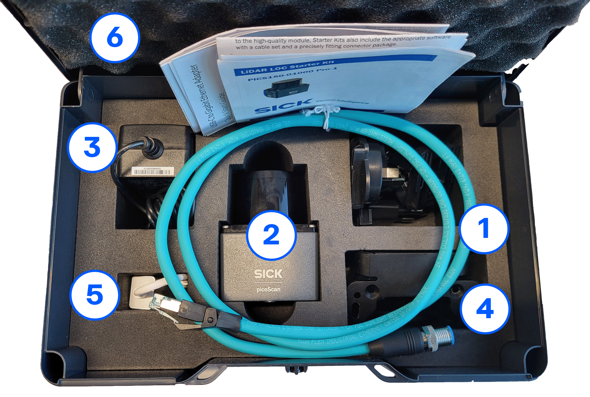

# LiDAR Starter Kit Overview

Welcome to the **LiDAR Starter Kit** documentation.

The LiDAR Starter Kit helps you get started with distance measurement, field evaluation and interactive LiDAR-based applications. It includes a picoScan150 LiDAR sensor, accessories, documentation and example projects for educational and demonstration purposes.

{ width="650" }

## Key Features

- High-precision distance measurement
- Field evaluation for object and area detection
- Simple configuration with SOPASair
- Easy integration into interactive applications
- Example projects for quick hands-on learning

## What can you do with it?

With the LiDAR Starter Kit, you can explore typical LiDAR applications such as:

- distance measurement
- field evaluation
- object detection in defined areas
- interactive games and demonstrations
- sensor-based trigger and feedback scenarios

## What is included?

The LiDAR Starter Kit contains the following components:

<table style="border-collapse: collapse; width: 100%;">
  <thead>
    <tr style="background-color: #005aff; color: white;">
      <th style="padding: 8px; text-align: left;">#</th>
      <th style="padding: 8px; text-align: left;">Article Description</th>
      <th style="padding: 8px; text-align: left;">Quantity</th>
      <th style="padding: 8px; text-align: left;">Part No.</th>
    </tr>
  </thead>
  <tbody>
    <tr>
      <td>1</td>
      <td>Ethernet cable</td>
      <td>1</td>
      <td>2112844</td>
    </tr>
    <tr>
      <td>2</td>
      <td>picoScan150 LiDAR sensor</td>
      <td>1</td>
      <td>1134610</td>
    </tr>
    <tr>
      <td>3</td>
      <td>Power supply</td>
      <td>1</td>
      <td>6089529</td>
    </tr>
    <tr>
      <td>4</td>
      <td>Mounting bracket</td>
      <td>1</td>
      <td>2134874</td>
    </tr>
    <tr>
      <td>5</td>
      <td>Network adapter</td>
      <td>1</td>
      <td>6083426</td>
    </tr>
    <tr>
      <td>6</td>
      <td>Transport box</td>
      <td>1</td>
      <td>5352371</td>
    </tr>
    <tr>
      <td>7</td>
      <td>Quickstart Guide</td>
      <td>1</td>
      <td>8030246</td>
    </tr>
  </tbody>
</table>

??? info "Show component overview image"
    

## Recommended next step

Start with the setup guide to connect the LiDAR sensor, open SOPASair and run your first demo.

[Getting Started Guide](./lidar_getting_started.md){.md-button .button-small}

!!! note "Educational use"
    The Starter Kits are intended for educational and demonstration purposes only and must not be used in production environments.