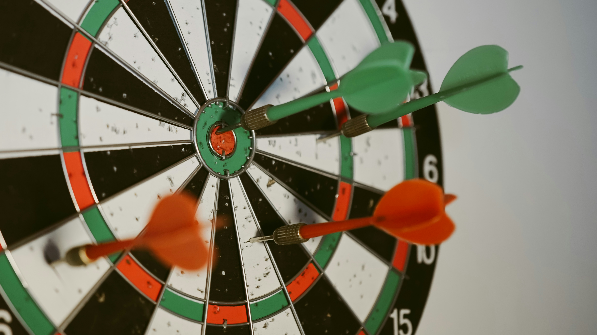

# Darts

## Short Description

This challenge project focuses on detecting the hit position of Velcro balls on a dartboard with the Vision Starter Kit.

The goal is to analyze the dartboard image, determine where the ball landed and use this information to calculate scores for different dart game modes.

## Project Information

<table style="border-collapse: collapse; width: 100%;">
  <thead>
    <tr style="background-color: #005aff; color: white;">
      <th style="padding: 8px; text-align: left;">Project type</th>
      <th style="padding: 8px; text-align: left;">Required knowledge level</th>
      <th style="padding: 8px; text-align: left;">Estimated duration</th>
      <th style="padding: 8px; text-align: left;">Additional hardware and software requirements</th>
    </tr>
  </thead>
  <tbody>
    <tr>
      <td>Challenge Project</td>
      <td>Advanced</td>
      <td>4 Hours</td>
      <td>Velcro dart board with Velcro balls</td>
    </tr>
  </tbody>
</table>

 

## Challenge Goal

The goal of this project is to create a Vision Starter Kit application that automatically detects the hit position of Velcro balls on a dartboard.

The detected position should then be used to calculate scores and display the progress of a darts game.

Unlike a guided project, this challenge does not provide a complete step-by-step solution. Use your knowledge from previous Vision Starter Kit projects to develop your own approach.

---

## Problem Statement

!!! tip 
    the hit position of a Velcro ball on a dartboard should be detected automatically.

Based on the detected position, the system should calculate the corresponding score and provide information about the current game state.

Possible goals:

- detect whether a dart hit the board
- determine the hit position
- assign the hit position to a score field
- calculate the current score
- track rounds or legs
- support different game modes
- support multiple players

---

## Task

Create an application that analyzes a dartboard and calculates scores based on the detected hit position.

Your solution should include:

1. Image acquisition setup for the dartboard
2. Stable positioning of the dartboard in the camera image
3. Detection of the Velcro ball
4. Mapping of the detected hit position to a score value
5. Score calculation logic
6. Optional visualization of the game progress

---

## Requirements

<h3>Core Requirements</h3>

<ul>
  <li>Use the Vision Starter Kit to observe the dartboard.</li>
  <li>Detect the Velcro ball reliably.</li>
  <li>Identify the approximate hit position.</li>
  <li>Map the hit position to a score area.</li>
  <li>Calculate the score based on the dartboard logic.</li>
  <li>Provide feedback about the current score or game state.</li>
</ul>

<h3>Optional Extensions</h3>

<ul>
  <li>Different game modes</li>
  <li>Round and leg calculation</li>
  <li>Multiplayer mode</li>
  <li>Score history</li>
  <li>Dashboard for visualization</li>
  <li>Automatic reset after each throw</li>
  <li>Difficulty levels or training mode</li>
</ul>

---

## Suggested Approach

Use the following high-level approach as orientation:

1. Set up the Vision Starter Kit.
2. Place the dartboard in the sensor's field of view.
3. Configure image acquisition.
4. Make sure the dartboard is visible and stable in the image.
5. Detect the Velcro ball after a throw.
6. Determine the hit position relative to the dartboard.
7. Define score zones for the board.
8. Map the detected position to a score value.
9. Add score calculation logic.
10. Extend the application with visualization or game modes.

---

## Possible Detection Strategies

There are different ways to solve this challenge.

  

    <h3>Object Detection</h3>
    
Detect the Velcro ball as an object in the camera image.

    
Best suited if the ball has a clearly visible color or texture compared to the dartboard.

  

  

    <h3>Color-Based Detection</h3>
    
Use color differences between the Velcro ball and the dartboard.

    
Useful if the ball has strong contrast and stable lighting.

  

  

    <h3>Position Mapping</h3>
    
Define fixed regions on the dartboard image and map the detected hit position to these regions.

    
Works best if the dartboard remains in a fixed position.

  

---

## Game Logic Ideas

After detecting the hit position, the application can calculate the score and track the game state.

Possible logic elements:

- calculate score for one throw
- sum up scores over multiple throws
- track player turns
- calculate rounds or legs
- detect invalid throws
- support different game modes

Possible feedback:

- current throw score
- current total score
- active player
- remaining score
- round result
- winner indication

---

## Hints

??? tip "Hint 1: Keep the dartboard fixed"
    Try to keep the dartboard in a fixed position.  
    A stable board position makes score mapping much easier.

??? tip "Hint 2: Start with simple zones"
    Start by dividing the board into only a few larger zones.  
    After this works reliably, increase the level of detail.

??? tip "Hint 3: Use high contrast"
    Use a Velcro ball that is clearly visible against the dartboard background.  
    This can simplify detection.

??? tip "Hint 4: Separate detection and scoring"
    First make sure the hit position is detected reliably.  
    Then add the score calculation logic.

??? tip "Hint 5: Use previous classification projects as reference"
    If you are unsure how to use the AI Classification tool, revisit the [guided example project](./classify_hex_nuts_screws.md).

---

## Expected Result

!!! success  
    After completing this challenge, the Vision Starter Kit should be able to detect the hit position of a Velcro ball on the dartboard.

A successful result means that:

- the dartboard is visible and stable in the camera image
- the Velcro ball is detected reliably
- the hit position can be assigned to a score area
- the score can be calculated automatically
- the game progress can be displayed or extended with additional logic

---

## Summary

In this challenge project, you applied vision-based detection to a dartboard use case.

You practiced how to:

- detect object positions in an image
- map positions to predefined regions
- calculate scores based on detected positions
- combine image analysis with game logic
- extend a vision-based project into an interactive game application

This project is a good exercise for connecting visual detection with rule-based scoring logic.

---

## Next Steps

Return to the project overview or open the complete project files on GitHub.com.

[Example Projects](./vision_example_projects.md){ .md-button .button-small }

[GitHub](https://github.com/SICKAG/SICK-Sensor-Starter-Kits){:target="_blank" .md-button .button-small}

