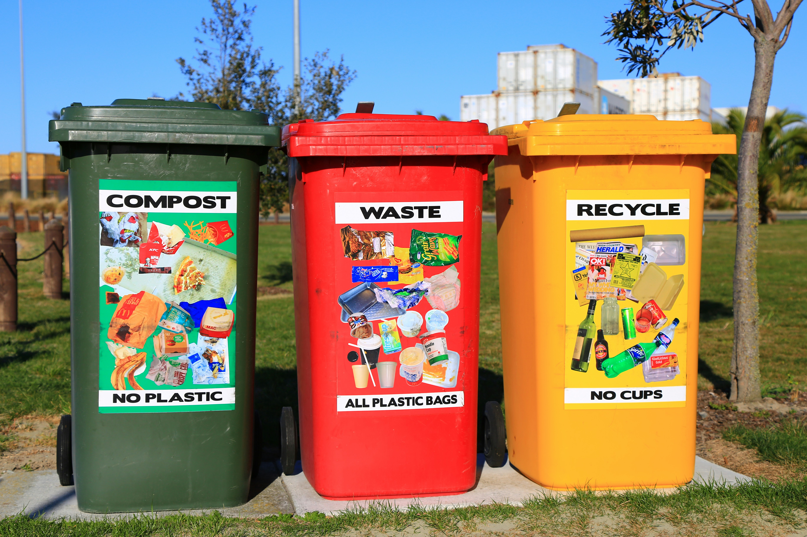

# Recycling

## Short Description

This challenge project focuses on using the **AI Classification** tool to classify different types of waste for recycling tasks.

You will create a Vision Starter Kit application that can distinguish between different waste classes or detect foreign objects in a predefined waste category.

## Project Information

<table style="border-collapse: collapse; width: 100%;">
  <thead>
    <tr style="background-color: #005aff; color: white;">
      <th style="padding: 8px; text-align: left;">Project type</th>
      <th style="padding: 8px; text-align: left;">Required knowledge level</th>
      <th style="padding: 8px; text-align: left;">Estimated duration</th>
      <th style="padding: 8px; text-align: left;">Additional hardware and software requirements</th>
    </tr>
  </thead>
  <tbody>
    <tr>
      <td>Challenge Project</td>
      <td>Basic to Advanced</td>
      <td>1 to 4 Hours</td>
      <td>
        Waste objects, for example paper, plastics or packaging 
        Optional: conveyor belt 
        Optional: pusher or rejector to sort objects 
        Alternative: LED or sound feedback
      </td>
    </tr>
  </tbody>
</table>

 

## Challenge Goal

The goal of this project is to create an AI-based recycling application with the Vision Starter Kit.

The system should classify different waste objects or detect foreign objects in a waste bin. For example, the application could detect plastic objects in a box of paper or classify objects into categories such as paper, plastic and packaging.

Unlike a guided project, this challenge does not provide a complete step-by-step solution. Use your knowledge from previous Vision Starter Kit projects to develop your own approach.

---

## Problem Statement

Incorrectly sorted waste objects should be detected automatically to support recycling and waste separation processes.

Possible scenarios:

- detect foreign objects in a bin
- classify waste into different material categories
- identify incorrectly sorted objects
- provide visual or acoustic feedback based on the classification result

---

## Task

Create a Vision Starter Kit application that classifies or evaluates waste objects.

Your solution should include:

1. Definition of object or material classes
2. Image acquisition setup
3. AI Classification training
4. Testing with different waste objects
5. Feedback or result visualization

Possible classes could be:

- paper
- plastic
- cardboard
- packaging
- metal
- foreign object
- empty background

You can also define your own classes depending on the objects available.

---

## Requirements

<h3>Core Requirements</h3>

<ul>
  <li>Use the <strong>AI Classification</strong> tool in SICK Nova.</li>
  <li>Define at least two object or material classes.</li>
  <li>Capture multiple training images for each class.</li>
  <li>Train the classification model.</li>
  <li>Test the model with new waste objects.</li>
  <li>Evaluate whether the classification result is reliable.</li>
</ul>

<h3>Optional Extensions</h3>

<ul>
  <li>Add LED or sound feedback.</li>
  <li>Use a conveyor belt.</li>
  <li>Trigger image acquisition automatically.</li>
  <li>Add a pusher or rejector mechanism.</li>
  <li>Compare easy and difficult object shapes.</li>
  <li>Test different lighting conditions.</li>
</ul>

---

## Suggested Approach

Use the following approach as orientation:

1. Set up the Vision Starter Kit.
2. Choose the waste categories you want to classify.
3. Prepare several example objects for each category.
4. Create an empty job in SICK Nova.
5. Configure image acquisition.
6. Add the **AI Classification** tool.
7. Create one class for each waste category.
8. Capture several images for each class.
9. Train the model.
10. Test the classification with new objects.
11. Improve the dataset if the result is not reliable.

---

## Project Ideas

You can implement the challenge in different ways depending on the available hardware.

  

    <h3>Simple Classification</h3>
    
Classify individual waste objects placed under the sensor.

    
Possible classes could be paper, plastic or packaging.

    
This is the easiest version of the project and can be implemented with the Starter Kit only.

  

  

    <h3>Foreign Object Detection</h3>
    
Detect whether a waste bin contains an object that does not belong to the expected category.

    
Example: Detect a plastic object inside a paper bin.

  

  

    <h3>Visual Feedback</h3>
    
Display the inspection result using simple feedback.

    
Examples include a green light for correct objects, a red light for incorrect objects, sound feedback or a message on a connected device.

  

  

    <h3>Automated Sorting</h3>
    
Extend the project with additional hardware.

    
Possible extensions include a conveyor belt, trigger sensor, pusher, rejector or signal light.

  

---

## Hints

??? tip "Hint 1: Start simple"
    Start with only two classes, for example **paper** and **plastic**.  
    After the classification works reliably, add more classes.

??? tip "Hint 2: Use different variations"
    Capture training images with different object positions, rotations and distances.  
    This can improve the robustness of the classification result.

??? tip "Hint 3: Pay attention to lighting"
    Recycling objects can have reflective or transparent surfaces.  
    Make sure the image is well-lit and the object is clearly visible.

??? tip "Hint 4: Use the guided classification project"
    If you are unsure how to use the AI Classification tool, revisit the [guided example project](./classify_hex_nuts_screws.md) below.

---

## Expected Result

After completing this challenge, the Vision Starter Kit should classify the selected waste objects or detect foreign objects in a defined recycling scenario.

A successful result means that:

- the trained classes are recognized correctly
- new test objects are classified reliably
- misclassified objects can be identified and improved through additional training images
- the project idea can be extended with feedback or sorting hardware

---

## Example Project File

A prepared example project file is available here:

[RecyclingBinProject](../files/RecyclingBinProject.zip){ .md-button .button-small}

---

## Summary

In this challenge project, you applied AI Classification to a recycling use case.

You practiced how to:

- define object or material classes
- collect training images
- train an AI Classification model
- evaluate classification results
- improve the dataset
- think about possible extensions such as feedback or sorting mechanisms

This project is a good exercise for transferring the Vision Starter Kit workflow to a real-world inspired application.

---

## Next Steps

Continue with another Vision project or open the complete project files on GitHub.com.

[Example Projects](./vision_example_projects.md){ .md-button .button-small }

[GitHub](https://github.com/SICKAG/SICK-Sensor-Starter-Kits/tree/main/projects/vision/recycling){:target="_blank" .md-button .button-small}

