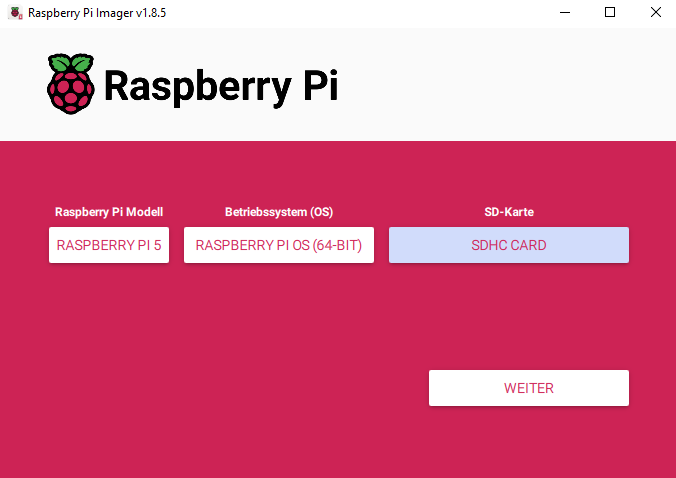
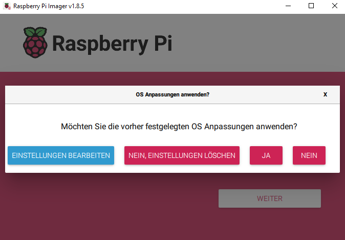
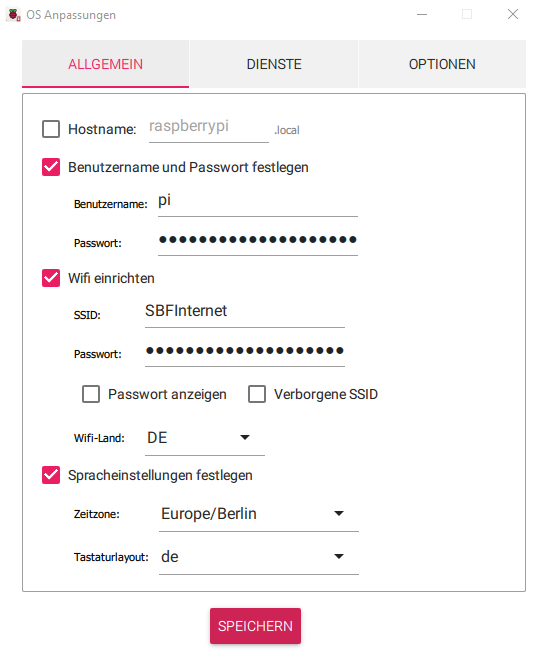
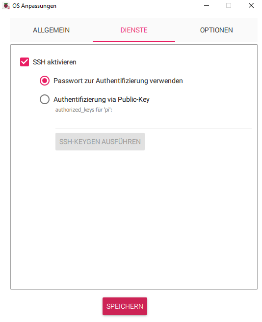
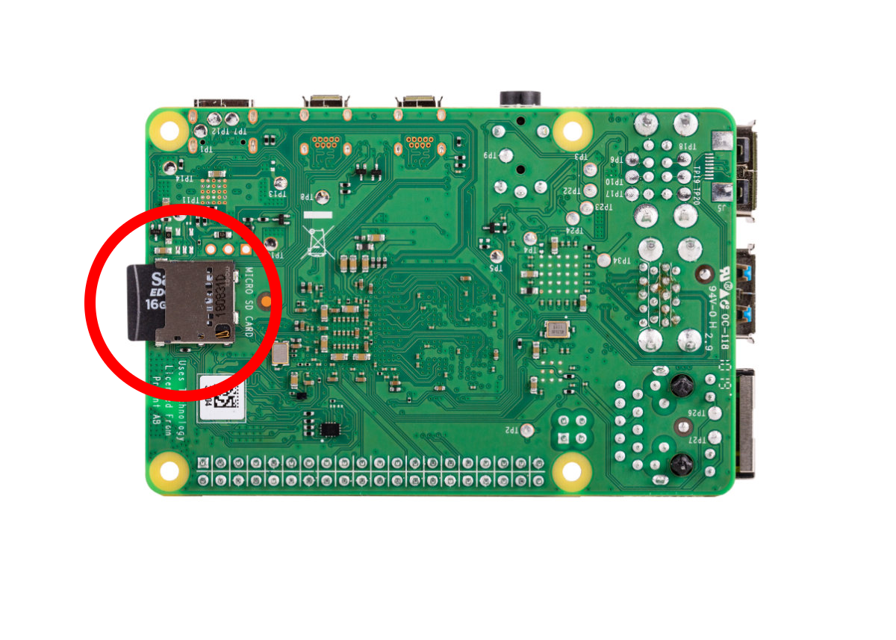
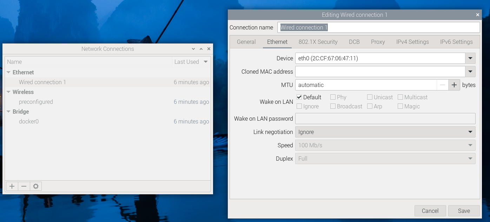
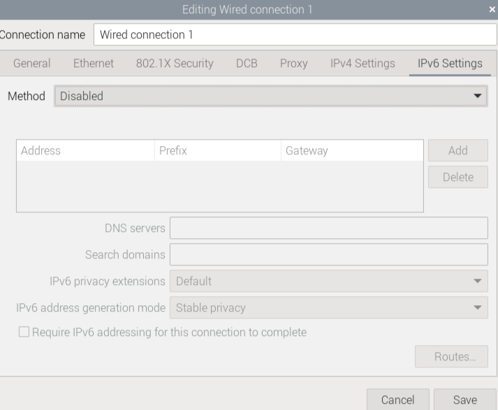
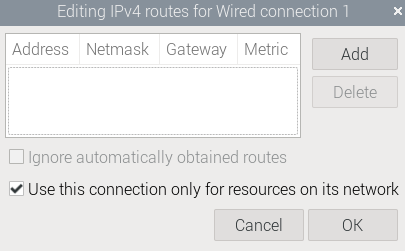
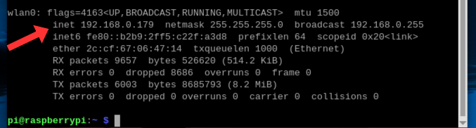
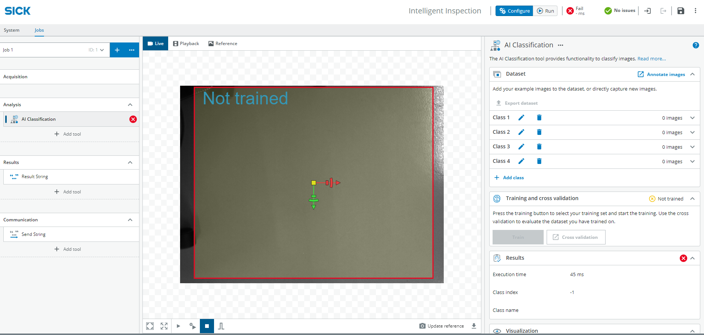

<!-- # Rock, Paper, Scissors

<table style="border-collapse: collapse; width: 100%;">
  <thead>
    <tr style="background-color: #005aff; color: white;">
      <th style="padding: 8px; text-align: left;">Short description</th>
      <th style="padding: 8px; text-align: left;">Required knowledge level</th>
      <th style="padding: 8px; text-align: left;">Estimated duration</th>
      <th style="padding: 8px; text-align: left;">Additional hardware and software requirements</th>
    </tr>
  </thead>
  <tbody>
    <tr>
      <td>Use the sensor and AI tools to recognize hand signs for the game “Rock, Paper, Scissors”. A Python Flask web app running on a Raspberry Pi selects a random sign for the computer and compares it with the sensor-detected hand sign.</td>
      <td>Expert</td>
      <td>4 hours</td>
      <td>
<strong>Hardware</strong>
  <ul>
    <li>Raspberry Pi 5</li>
    <li>Micro HDMI (cable/adapter), Display, keyboard, mouse</li>
  </ul>
  <strong>Software</strong>
  <ul>
    <li>Visual Studio Code</li>
    <li>Raspberry Pi Imager</li>
    <li>Python</li>
  </ul>
</td>
    </tr>
  </tbody>
</table>

## Introduction

In this project, we want to use the InspectorP61x sensor to play the game "rock, paper, scissors" against the computer. The sensor with SICK Nova is to be set up so that it recognizes the different hand signals using AI and transmits the data via an Ethernet connection. 
Using Python and Flask, a web application with the game is programmed so that a random sign is selected by the computer and the hand sign is recognized by the sensor. This game logic then runs on the Raspberry Pi. 

## Prerequisites

Setup the sensor as mentioned in the [Getting started](./vision_getting_started.md) section.

This guide explains how to get the web-based game up and running and what needs to be installed and prepared. Overall, a little experience with programming can't hurt, but it is not a prerequisite for this project. Providing data via the Ethernet connection is explained in the Vision Starter Kit. 

## Project preparation

### Concept

|  |  |
|------------------------|------------------------|
| **SICK Vision Starter Kit** InspectorP61x for industrial machine vision   Data is provided via Ethernet. | **Raspberry PI 5** Is a fully-fledged computer to which a monitor, keyboard, and mouse can be connected. Receives data from the sensor and processes it in a Python program. Control via [SSH](https://www.cloudflare.com/de-de/learning/access-management/what-is-ssh/)

### Hardware setup

For the Raspberry Pi Imager, we need a computer with an internet connection. We also need a computer for the SSH connection to the Raspberry Pi. If you are accessing the Raspberry Pi directly with a mouse, keyboard, and monitor, you really only need the computer for installing the Raspberry Pi OS. 

The Raspberry Pi requires power via a USB-C port and Wi-Fi, as the Ethernet port is needed for the InspectorP61x. 

The InspectorP61x is connected to the power supply and connected to the Raspberry Pi with an Ethernet cable. 

**Setup of the sensor**

The sensor can be mounted in different ways using the mounting bracket. For example, it can be mounted on a table and the hand held under the sensor. Alternatively, it would also be possible to place the sensor in front of a wall and hold the hand in front of the wall.

The following factors are important:

A uniform background
Enough space for the entire hand to fit in the picture. 

### Software setup

**Raspberry Pi Imager**

We use Raspberry Pi OS as the operating system for the Raspberry Pi. We need to transfer this to an SD card so that we can then install it on the Raspberry Pi.

1. First, we need to install the imager for the operating system: [Download Raspberry Pi Imager](https://www.raspberrypi.com/software/). Then open it and select the following: The appropriate Raspberry Pi model, the correct operating system (in this case 64-bit), and the SD card onto which the imager is to be flashed. 

2. Now we'll adjust the settings by going to "Edit settings." 

3. We will now set "pi" as the user name and "raspberry" as the password. In the WiFi settings, enter the WiFi network and the corresponding password. Also specify the WiFi country and set the language settings. Next, we need to activate SSH in the services and click to indicate that we want to use the Raspberry password for authentication via SSH. 

We save the settings, return to the previous menu, and apply the settings. If a message appears stating that all data on the SD card will be deleted, we confirm this. The installation process on the SD card should now continue automatically. 

> **Note:**
> If for any reason you need to repeat the previous steps, the settings will still be saved. However, the Wi-Fi password will be the hash and no longer the password itself. Therefore, you should check this again!

4. In the final step, we remove the SD card and connect it to the Raspberry. 

**Additional settings in Raspbian**

In order to connect to the Raspberry Pi via SSH and to the sensor via LAN at the same time, we need to adjust a few more settings. For this step, we first need to connect the Raspberry Pi to a monitor, mouse, and keyboard. Help with this can be found here: [Getting Started with Raspberry Pi](https://www.raspberrypi.com/documentation/computers/getting-started.html#keyboard)

We also need to connect the sensor to the LAN port on the Raspberry Pi.

5. First, click on the Wi-Fi icon in the top taskbar. In the menu that opens, click on "Edit Connections" under "Advanced Options." 

6. Next, click on "Wired Connection 1" in the menu that just opened.  It should look like this.

7. Under the Device tab, we now select "eth0" with the specified MAC address included. Next, we need to go to the "IPv6 Settings" tab. There, we select "Disable" under "Method." Everything should now look like this.

8. Next, we go to the "IPv4 Settings" tab, as we also need to adjust a few things there. First, we select "Manual" as the "Method" so that we can specify our own IP and "Netmask." There, we now enter 192.168.2.100 as the "Address" and 24 as the "Netmask." We can leave the field for Gateway blank.

However, before we can save everything, we need to check the box "Use this connection only for resources on its network" under "Routes...". See below:

Now we can save everything under "Save". 

**Check Connection**

Before we continue, we should test whether we can now connect to the Raspberry Pi via SSH from our computer and to the sensor. 

9. To do this, we need the IP address of our Raspberry Pi. We can easily find this via the command line. We open this by clicking on this icon.

10. In the command line that now opens, we type the command "ifconfig." This gives us all the information about the network adapters currently in use and their IP addresses, etc.

However, we are only interested in the IP address specified under "wlan0." In the example, this would be "192.168.0.179," but it may also be different. It is important that we make a note of this IP address.

11. Now we open the command line on our computer. In Windows, you have to press the Windows key and then type "cmd." When you press Enter, the command line should open. Now we enter the following.

"ssh pi@[IP]" The IP is the one we noted in the previous step. 

Press Enter to send the command. If we have entered everything correctly, we will now be prompted to enter the Raspberry Pi password. In this case, the password is the one we chose when configuring the operating system. In our example, this would be "raspberry." 

We can see that we are connected because the command line now shows pi@raspberrypi instead of "C:\Users\xxxx."

If this is the case, we have now successfully established an SSH connection to our Raspberry Pi. This means we can now dispense with the micro HDMI cable and monitor and carry out the next steps on our computer via SSH as well. 

12. To test whether the sensor is connected, we first switch it on and enter the following command.

> "ping 192.168.2.20"

If we have done everything correctly up to this point, the following output should be visible.

Now the Raspberry Pi constantly pings the sensor. To interrupt this, we can press CTRL + C.

>**Note:**
>If your output differs from the one shown here, you should check the IP and the physical connection of your sensor again. 

**Python**

Since we need non-standard Python modules to implement the project, we must first install them. To do this, we can use the package manager integrated into Raspbian. 

1. First, let's make sure our system packages are up to date. To do this, open the command line and enter the command

>"sudo apt update" 

This will list all available packages and their versions. If we can update packages, we can do so with the command

>"sudo apt upgrade"

2. Next, we need to check whether Python and pip are already installed. We do this using

>"python3 --version" 

or

>"pip3 --version"

If no versions are displayed, we need to install them:

>"sudo apt install python3"  
>"sudo apt install python3-pip"

 

**Note for developers:**

If you want to develop yourself, you can install Visual Studio Code on your computer or the Raspberry Pi. The command for this would be "sudo apt install code." For the SSH connection, you will need an extension for VS Code: [Visual Studio Code Tutorial for SSH](https://code.visualstudio.com/docs/remote/ssh).

## Start

### 1. SICK Web user interface

Now that we have set up Nova2D in the Starter Kit, we can configure additional settings for our game. 

**Data entry**

To ensure that our hand signals are recognized, we now need to find an AI-supported analysis tool. To do this, go to: Analysis → AI Classification

2. A red rectangle will now appear on the image with the words "not trained" inside it. Adjust this rectangle (in this case, the entire image capture can be used). 

3. Now we can create 4 classes (scissors, rock, paper, no sign) and record images of the signs ("Add active image"). Record at least 20 to 30 images for each class, then go to Train and wait. Once training is complete, you can test how accurate the recognition is. See also: Hardware setup to find out how the sensor should be attached and how the hand should be positioned. 

4. If recognition is still inaccurate after training, more images can be captured to expand the dataset.

The settings and the dataset can now be saved and exported if necessary. 

### Web UI

Under Demo, you will find a zip folder containing all the files you need to start the rock, paper, scissors game. Before you can do this, you will need to install all the necessary packages. These are stored in a text file. Copy the folder to your Raspberry Pi and navigate to the correct directory in the terminal (path/to stands for the directory where you saved the folder):

>cd path/to/SchereStein/Python

You can install all packages from this file with the following command:

> pip install -r requirements.txt

6. If you have specified a different IP address for the sensor than the one in the documentation, you must change it in the client.py file. The same applies to the port. 

Now everything should be ready for you to run the game.

## Demo

Here you will find all the important files you need to start the game:

In the Python folder, you will find the start.sh file, which you can use to start the game 
after you have installed all the necessary packages. 
Use the requirements.txt file for the installation.
Have fun!

[Zip-file](../files/Python.zip)

To open the game with the website, you can run the start-sh file in the terminal with the following command:

>bash start.sh        ./start.ps1

Enter the IP address of your Raspberry Pi followed by port 5001, which runs the web application, into your browser as follows:

Example: 192.168.0.179:5001/

The website should now appear, allowing you to play rock, paper, scissors with the sensor. 

### Other resources:
[Rock, Paper, Scissor with Time of Flight Sensor and Arduino](https://projecthub.arduino.cc/mad_mcu/how-to-play-rock-paper-scissor-with-a-time-of-flight-sensor-3d27ec)

**For developpers:** 

[Flask](https://flask.palletsprojects.com/en/stable/quickstart/#http-methods)

[Visual Studio Code](https://code.visualstudio.com/) 

-->

# Rock, Paper, Scissors

## Short Description

This advanced project combines the **Vision Starter Kit**, **AI Classification**, a **Raspberry Pi** and a **Python Flask web application** to play Rock, Paper, Scissors against the computer.

The InspectorP61x detects the hand sign using AI Classification. The Raspberry Pi receives the result via Ethernet, runs the game logic and displays the web-based game interface.

## Project Information

<table style="border-collapse: collapse; width: 100%;">
  <thead>
    <tr style="background-color: #005aff; color: white;">
      <th style="padding: 8px; text-align: left;">Project type</th>
      <th style="padding: 8px; text-align: left;">Required knowledge level</th>
      <th style="padding: 8px; text-align: left;">Estimated duration</th>
      <th style="padding: 8px; text-align: left;">Additional hardware and software requirements</th>
    </tr>
  </thead>
  <tbody>
    <tr>
      <td>Advanced Project</td>
      <td>Expert</td>
      <td>4 Hours</td>
      <td>
        <strong>Hardware</strong>
        <ul>
          <li>Raspberry Pi 5</li>
          <li>Micro HDMI cable or adapter</li>
          <li>Display, keyboard and mouse</li>
        </ul>
        <strong>Software</strong>
        <ul>
          <li>Visual Studio Code</li>
          <li>Raspberry Pi Imager</li>
          <li>Python</li>
          <li>Flask</li>
        </ul>
      </td>
    </tr>
  </tbody>
</table>

 

{.image-medium}

## Goal

The goal of this project is to create a web-based Rock, Paper, Scissors game that uses the Vision Starter Kit to detect hand signs.

After completing this project, you should understand how to:

- train an AI Classification model for hand signs
- connect the InspectorP61x to a Raspberry Pi
- configure the Raspberry Pi network settings
- receive sensor data via Ethernet
- run a Python Flask web application
- combine sensor results with simple game logic

---

## Project Concept

The project consists of two main components:

| Component | Role |
|---|---|
| Vision Starter Kit | Detects the hand sign with AI Classification |
| Raspberry Pi 5 | Receives sensor data, runs the Python game logic and hosts the web application |

The sensor detects one of the following classes:

- rock
- paper
- scissors
- no sign

The Raspberry Pi randomly selects a sign for the computer and compares it with the result detected by the sensor.

{.image-small}

---

## Before You Start

Set up the Vision Starter Kit as described in the [Getting Started](./vision_getting_started.md) guide.

!!! info "Advanced project"
    This project requires additional hardware and software setup.  
    Basic knowledge of Python, networking and Raspberry Pi configuration is helpful.

---

## Project Preparation

### Hardware setup

For the Raspberry Pi Imager, we need a computer with an internet connection. We also need a computer for the SSH connection to the Raspberry Pi. If you are accessing the Raspberry Pi directly with a mouse, keyboard, and monitor, you really only need the computer for installing the Raspberry Pi OS. 

The Raspberry Pi requires power via a USB-C port and Wi-Fi, as the Ethernet port is needed for the InspectorP61x. 

The InspectorP61x is connected to the power supply and connected to the Raspberry Pi with an Ethernet cable. 

**Setup of the sensor**

The sensor can be mounted in different ways using the mounting bracket. For example, it can be mounted on a table and the hand held under the sensor. Alternatively, it would also be possible to place the sensor in front of a wall and hold the hand in front of the wall.

The following factors are important:

A uniform background
Enough space for the entire hand to fit in the picture. 

### Software setup

**Raspberry Pi Imager**

We use Raspberry Pi OS as the operating system for the Raspberry Pi. We need to transfer this to an SD card so that we can then install it on the Raspberry Pi.

1. First, we need to install the imager for the operating system: [Download Raspberry Pi Imager](https://www.raspberrypi.com/software/). Then open it and select the following: The appropriate Raspberry Pi model, the correct operating system (in this case 64-bit), and the SD card onto which the imager is to be flashed. 

2. Now we'll adjust the settings by going to "Edit settings." 

3. We will now set "pi" as the user name and "raspberry" as the password. In the WiFi settings, enter the WiFi network and the corresponding password. Also specify the WiFi country and set the language settings. Next, we need to activate SSH in the services and click to indicate that we want to use the Raspberry password for authentication via SSH. 

We save the settings, return to the previous menu, and apply the settings. If a message appears stating that all data on the SD card will be deleted, we confirm this. The installation process on the SD card should now continue automatically. 

> **Note:**
> If for any reason you need to repeat the previous steps, the settings will still be saved. However, the Wi-Fi password will be the hash and no longer the password itself. Therefore, you should check this again!

4. In the final step, we remove the SD card and connect it to the Raspberry. 

**Additional settings in Raspbian**

In order to connect to the Raspberry Pi via SSH and to the sensor via LAN at the same time, we need to adjust a few more settings. For this step, we first need to connect the Raspberry Pi to a monitor, mouse, and keyboard. Help with this can be found here: [Getting Started with Raspberry Pi](https://www.raspberrypi.com/documentation/computers/getting-started.html#keyboard)

We also need to connect the sensor to the LAN port on the Raspberry Pi.

5. First, click on the Wi-Fi icon in the top taskbar. In the menu that opens, click on "Edit Connections" under "Advanced Options." 

6. Next, click on "Wired Connection 1" in the menu that just opened.  It should look like this.

7. Under the Device tab, we now select "eth0" with the specified MAC address included. Next, we need to go to the "IPv6 Settings" tab. There, we select "Disable" under "Method." Everything should now look like this.

8. Next, we go to the "IPv4 Settings" tab, as we also need to adjust a few things there. First, we select "Manual" as the "Method" so that we can specify our own IP and "Netmask." There, we now enter 192.168.2.100 as the "Address" and 24 as the "Netmask." We can leave the field for Gateway blank.

However, before we can save everything, we need to check the box "Use this connection only for resources on its network" under "Routes...". See below:

Now we can save everything under "Save". 

**Check Connection**

Before we continue, we should test whether we can now connect to the Raspberry Pi via SSH from our computer and to the sensor. 

9. To do this, we need the IP address of our Raspberry Pi. We can easily find this via the command line. We open this by clicking on this icon.

10. In the command line that now opens, we type the command "ifconfig." This gives us all the information about the network adapters currently in use and their IP addresses, etc.

However, we are only interested in the IP address specified under "wlan0." In the example, this would be "192.168.0.179," but it may also be different. It is important that we make a note of this IP address.

11. Now we open the command line on our computer. In Windows, you have to press the Windows key and then type "cmd." When you press Enter, the command line should open. Now we enter the following.

"ssh pi@[IP]" The IP is the one we noted in the previous step. 

Press Enter to send the command. If we have entered everything correctly, we will now be prompted to enter the Raspberry Pi password. In this case, the password is the one we chose when configuring the operating system. In our example, this would be "raspberry." 

We can see that we are connected because the command line now shows pi@raspberrypi instead of "C:\Users\xxxx."

If this is the case, we have now successfully established an SSH connection to our Raspberry Pi. This means we can now dispense with the micro HDMI cable and monitor and carry out the next steps on our computer via SSH as well. 

12. To test whether the sensor is connected, we first switch it on and enter the following command.

> "ping 192.168.2.20"

If we have done everything correctly up to this point, the following output should be visible.

Now the Raspberry Pi constantly pings the sensor. To interrupt this, we can press CTRL + C.

>**Note:**
>If your output differs from the one shown here, you should check the IP and the physical connection of your sensor again. 

**Python**

Since we need non-standard Python modules to implement the project, we must first install them. To do this, we can use the package manager integrated into Raspbian. 

1. First, let's make sure our system packages are up to date. To do this, open the command line and enter the command

>"sudo apt update" 

This will list all available packages and their versions. If we can update packages, we can do so with the command

>"sudo apt upgrade"

2. Next, we need to check whether Python and pip are already installed. We do this using

>"python3 --version" 

or

>"pip3 --version"

If no versions are displayed, we need to install them:

>"sudo apt install python3"  
>"sudo apt install python3-pip"

 

**Note for developers:**

If you want to develop yourself, you can install Visual Studio Code on your computer or the Raspberry Pi. The command for this would be "sudo apt install code." For the SSH connection, you will need an extension for VS Code: [Visual Studio Code Tutorial for SSH](https://code.visualstudio.com/docs/remote/ssh).

## Start

### SICK Web user interface

Now that we have set up Nova2D in the Starter Kit, we can configure additional settings for our game. 

**Data entry**

To ensure that our hand signals are recognized, we now need to find an AI-supported analysis tool. To do this, go to: Analysis → AI Classification

2. A red rectangle will now appear on the image with the words "not trained" inside it. Adjust this rectangle (in this case, the entire image capture can be used). 

3. Now we can create 4 classes (scissors, rock, paper, no sign) and record images of the signs ("Add active image"). Record at least 20 to 30 images for each class, then go to Train and wait. Once training is complete, you can test how accurate the recognition is. See also: Hardware setup to find out how the sensor should be attached and how the hand should be positioned. 

4. If recognition is still inaccurate after training, more images can be captured to expand the dataset.

The settings and the dataset can now be saved and exported if necessary. 

### Web UI

Under Demo, you will find a zip folder containing all the files you need to start the rock, paper, scissors game. Before you can do this, you will need to install all the necessary packages. These are stored in a text file. Copy the folder to your Raspberry Pi and navigate to the correct directory in the terminal (path/to stands for the directory where you saved the folder):

>cd path/to/SchereStein/Python

You can install all packages from this file with the following command:

> pip install -r requirements.txt

6. If you have specified a different IP address for the sensor than the one in the documentation, you must change it in the client.py file. The same applies to the port. 

Now everything should be ready for you to run the game.

## Demo

Here you will find all the important files you need to start the game:

In the Python folder, you will find the start.sh file, which you can use to start the game 
after you have installed all the necessary packages. 
Use the requirements.txt file for the installation.
Have fun!

[Zip-file](../files/Python.zip)

To open the game with the website, you can run the start-sh file in the terminal with the following command:

>bash start.sh        ./start.ps1

Enter the IP address of your Raspberry Pi followed by port 5001, which runs the web application, into your browser as follows:

Example: 192.168.0.179:5001/

The website should now appear, allowing you to play rock, paper, scissors with the sensor. 

---

## Expected Result

After completing this project, the system should:

- detect rock, paper, scissors or no sign with the Vision Starter Kit
- send the detected class to the Raspberry Pi
- run the game logic in a Python Flask web application
- show the game interface in a browser
- compare the sensor-detected sign with the computer-selected sign

---

## Summary

In this advanced project, you combined machine vision, AI Classification, Raspberry Pi networking and a Python Flask web application.

You learned how to:

- configure hand sign recognition in SICK Nova
- set up a Raspberry Pi for sensor communication
- configure network settings for Wi-Fi and Ethernet
- install required Python packages
- start a Flask-based web game
- combine sensor output with application logic

This project demonstrates how the Vision Starter Kit can be used as part of a larger interactive application.

---

## Additional Resources

[Rock, Paper, Scissor with Time of Flight Sensor and Arduino](https://projecthub.arduino.cc/mad_mcu/how-to-play-rock-paper-scissor-with-a-time-of-flight-sensor-3d27ec)

**For developers:** 

[Flask](https://flask.palletsprojects.com/en/stable/quickstart/#http-methods)

[Visual Studio Code](https://code.visualstudio.com/) 

---

## Next Steps

Continue with another Vision project or open the complete project files on GitHub.com.

[Example Projects](./vision_example_projects.md){ .md-button .button-small }

[GitHub](https://github.com/SICKAG/SICK-Sensor-Starter-Kits){:target="_blank" .md-button .button-small}

