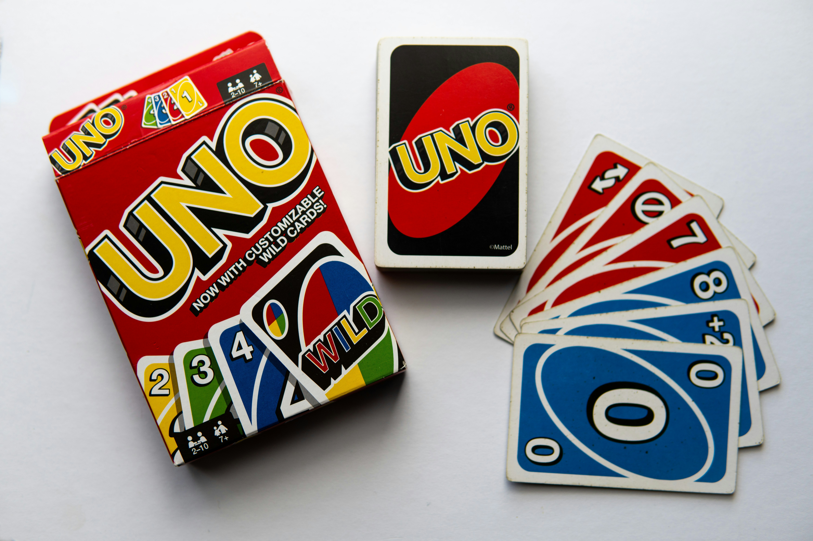

<!-- # UNO Card Game

<table style="border-collapse: collapse; width: 100%;">
  <thead>
    <tr style="background-color: #005aff; color: white;">
      <th style="padding: 8px; text-align: left;">Short description</th>
      <th style="padding: 8px; text-align: left;">Required knowledge level</th>
      <th style="padding: 8px; text-align: left;">Estimated duration</th>
      <th style="padding: 8px; text-align: left;">Additional hardware and software requirements</th>
    </tr>
  </thead>
  <tbody>
    <tr>
      <td>Detect and classify UNO playing cards and develop a logic to play against the computer.</td>
      <td>Advanced/Expert</td>
      <td>4-8 Hours</td>
      <td>UNO playing cards</td>
    </tr>
  </tbody>
</table>

## What problem needs to be solved?
Playing cards shall be automatically recognized so that a classic card game such as UNO or Mau-Mau can be played against a computer. Card color, number and special cards must be reliably detected.
 
 
Project ideas:

* Robust card recognition even if cards are slightly rotated
* Rule-based game logic for UNO or Mau-Mau
* Play against the computer
* Multiplayer

## Example configuration file

[UNO configuration.zip](../files/configuration_nova_inspector_uno.ncfg)

-->

# UNO Card Game

## Short Description

This advanced project focuses on detecting and classifying UNO playing cards with the Vision Starter Kit.

The goal is to recognize card colors, numbers and special cards and use the classification result to build a simple game logic for playing UNO or a similar card game against the computer.

## Project Information

<table style="border-collapse: collapse; width: 100%;">
  <thead>
    <tr style="background-color: #005aff; color: white;">
      <th style="padding: 8px; text-align: left;">Project type</th>
      <th style="padding: 8px; text-align: left;">Required knowledge level</th>
      <th style="padding: 8px; text-align: left;">Estimated duration</th>
      <th style="padding: 8px; text-align: left;">Additional hardware and software requirements</th>
    </tr>
  </thead>
  <tbody>
    <tr>
      <td>Advanced Project</td>
      <td>Advanced to Expert</td>
      <td>4 to 8 Hours</td>
      <td>UNO playing cards</td>
    </tr>
  </tbody>
</table>

 

## Goal

The goal of this project is to create a card recognition application that can classify UNO playing cards and use the detected cards in a rule-based game logic.

After completing this project, you should understand how to:

- classify UNO cards with the Vision Starter Kit
- distinguish card colors and values
- recognize special cards
- map classification results to game logic
- create the foundation for a computer-based UNO game

---

## Project Concept

In this project, the Vision Starter Kit is used to identify UNO playing cards.

The classification result can then be used by an external application or game logic to decide whether a card can be played, what effect a special card has or how the computer should react.

The system should recognize relevant card properties such as:

- card color
- card number
- special card type
- invalid or unknown card

Possible game variants:

- simplified UNO logic
- Mau-Mau style game logic
- single-player against computer
- multiplayer extension

---

## Before You Start

Set up the Vision Starter Kit as described in the [Getting Started](./vision_getting_started.md) guide.

!!! info "Advanced project"
    This project requires reliable image classification and additional game logic.  
    Basic experience with SICK Nova, AI Classification and programming logic is helpful.

---

## Task

Create an application that detects UNO playing cards and uses the detected card information in a game logic.

Your solution should include:

1. Image acquisition setup for UNO cards
2. AI Classification setup for card recognition
3. Definition of relevant card classes
4. Training images for each card class
5. Logic for interpreting card color, number and special cards
6. Feedback or visualization of the detected card
7. Optional game logic for playing against the computer

---

## Requirements

<h3>Core Requirements</h3>

<ul>
  <li>Use the <strong>AI Classification</strong> tool in SICK Nova.</li>
  <li>Detect UNO cards reliably.</li>
  <li>Classify at least a selected subset of cards.</li>
  <li>Distinguish relevant card properties such as color, number or special card type.</li>
  <li>Provide a useful output for the detected card.</li>
  <li>Use the classification result in a simple game logic.</li>
</ul>

<h3>Optional Extensions</h3>

<ul>
  <li>Implement the full UNO rule logic.</li>
  <li>Add a computer opponent.</li>
  <li>Add a multiplayer mode.</li>
  <li>Create a web-based interface.</li>
  <li>Add score tracking.</li>
  <li>Visualize playable cards.</li>
  <li>Add probability or strategy suggestions.</li>
</ul>

---

## Suggested Approach

Use the following high-level approach as orientation:

1. Set up the Vision Starter Kit.
2. Prepare a selected set of UNO cards.
3. Create an empty job in SICK Nova.
4. Configure image acquisition.
5. Add the **AI Classification** tool.
6. Define card classes.
7. Capture training images for each class.
8. Train the classification model.
9. Test whether the cards are recognized reliably.
10. Map the classification results to card values and colors.
11. Add basic game logic.
12. Extend the game logic if the classification works reliably.

---

## Possible Classes

For a first version, do not start with the complete UNO deck.  
Start with a reduced card set and extend the project step by step.

Possible first classes:

- red 1
- red 2
- blue 1
- blue 2
- green 1
- yellow 1
- skip card
- reverse card
- draw two card

For a more advanced version, you can classify:

- all colors
- all numbers
- special cards
- wild cards

!!! tip "Start simple"
    Start with only a few cards first.  
    After the classification works reliably, add more colors, numbers and special cards.

---

## Game Logic Ideas

After detecting a card, the application can use the result in a simplified UNO game logic.

Possible logic elements:

- check whether the detected card matches the current color
- check whether the detected card matches the current number
- apply effects of special cards
- let the computer choose a random or valid card
- show whether the played card is valid
- update the current card on the game board

Possible feedback:

- valid card
- invalid card
- color match
- number match
- special card effect
- next player turn

---

## Hints

??? tip "Hint 1: Reduce the number of classes"
    Start with a small subset of cards.  
    Too many classes can make the first training attempt more difficult.

??? tip "Hint 2: Separate color and value"
    Consider whether you want to classify complete cards directly or split the logic into color and value recognition.

??? tip "Hint 3: Use consistent lighting"
    UNO cards have strong colors and reflective surfaces.  
    Make sure the lighting is stable and avoid reflections.

??? tip "Hint 4: Capture variations"
    Capture cards with small position and rotation variations.  
    This helps the model recognize cards more reliably.

??? tip "Hint 5: First solve recognition, then game logic"
    Make sure card recognition works reliably before adding complex game rules.

---

## Example Configuration File

A prepared SICK Nova configuration file is available here:

[configuration_nova_inspector_uno.ncfg](../files/configuration_nova_inspector_uno.ncfg){ .md-button .button-small}

---

## Expected Result

After completing this project, the Vision Starter Kit should be able to detect selected UNO playing cards and provide their classification result for a game application.

A successful result means that:

- selected UNO cards are recognized reliably
- card colors and values can be interpreted
- the classification result can be used in game logic
- valid and invalid card moves can be evaluated
- the concept can be extended to more cards or more complex rules

---

## Summary

In this advanced project, you applied AI Classification to a card game use case.

You practiced how to:

- classify UNO playing cards
- define useful card classes
- train and test an AI Classification model
- interpret classification results
- connect card recognition with rule-based game logic
- extend a vision-based project into an interactive application

This project demonstrates how the Vision Starter Kit can be used to combine object classification with application-specific decision logic.

---

## Next Steps

Continue with another Vision project or open the complete project files on GitHub.com.

[Example Projects](./vision_example_projects.md){ .md-button .button-small }

[GitHub](https://github.com/SICKAG/SICK-Sensor-Starter-Kits){:target="_blank" .md-button .button-small}

