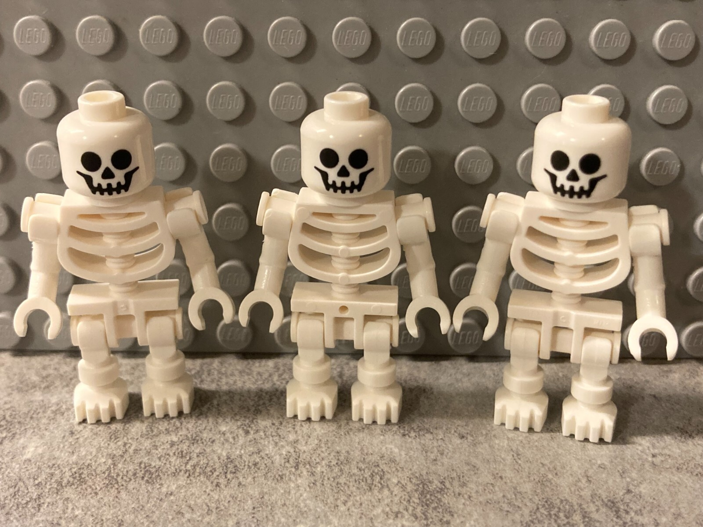

<!-- # Example projects Vision Starter Kit

Here you can find some example projects which you can follow along easily and replicate yourself.

You will find additional information about the prerequisites, estimated duration, etc. for every project.

Feel free to create your own projects and share them with us!

<table style="border-collapse: collapse; width: 100%;">
  <thead>
    <tr style="background-color: #005aff; color: white;">
      <th style="padding: 8px; text-align: left;">#</th>
      <th style="padding: 8px; text-align: left;">Project name</th>
      <th style="padding: 8px; text-align: left;">Short description</th>
      <th style="padding: 8px; text-align: left;">Required knowledge level</th>
      <th style="padding: 8px; text-align: left;">Estimated duration</th>
      <th style="padding: 8px; text-align: left;">Additional hardware and software requirements</th>
    </tr>
  </thead>
  <tbody>
    <tr>
      <td>1</td>
      <td><a href="vision_starter_project.html">Vision Starter Project</a></td>
      <td>Get started with first image acquisition settings and an easy AI Classification and Anomaly Detection task.</td>
      <td>Basic</td>
      <td>90 Minutes</td>
      <td>none – everything included in the Starter Kit</td>
    </tr>
    <tr>
      <td>2</td>
      <td><a href="classify_hex_nuts_screws.html">Classify Hex Nuts/Screws</a></td>
      <td>Try out the AI Classification tool by taking images of different hex nuts and/or screws to generate your first AI algorithm.</td>
      <td>Basic</td>
      <td>30 Minutes</td>
      <td>none – everything included in the Starter Kit</td>
    </tr>
    <tr>
      <td>3</td>
      <td><a href="chocolate_inspection.html">Chocolate Inspection</a></td>
      <td>Follow along the SICK Nova Tutorials on YouTube and get to learn various AI and non-AI tools by inspecting a Chocolate Bar.</td>
      <td>Advanced</td>
      <td>2 Hours</td>
      <td>Chocolate Bar 3D print files <a href="https://sick.com/de/en/downloads/media/swp682086">sick.com/de/en/downloads/media/swp682086</a> OR any other chocolate bar / packed grocery</td>
    </tr>
    <tr>
      <td>4</td>
      <td><a href="sketch_demonstrator.html">Sketch Demonstrator</a></td>
      <td>Classify different hand-drawn sketches with the AI Classification tool.</td>
      <td>Advanced</td>
      <td>2 Hours</td>
      <td>Paper, Edding</td>
    </tr>
    <tr>
      <td>5</td>
      <td>Empty box detection</td>
      <td>Analyze boxes if they contain contamination or foreign objects with the AI Anomaly Detection tool.</td>
      <td>Advanced</td>
      <td>1 Hour</td>
      <td>Empty boxes Contaminations (e.g. pieces of paper, small rocks, hair, etc.)</td>
    </tr>
    <tr>
      <td>56</td>
      <td><a href="rock_paper_scissors.html">Rock, paper, scissors</a></td>
      <td>Use the sensor and AI tools to recognize hand signs for the game “Rock, Paper, Scissors”. A Python Flask web app running on a Raspberry Pi selects a random sign for the computer and compares it with the sensor-detected hand sign.</td>
      <td>Expert</td>
      <td>4 Hours</td>
      <td><strong>Hardware:</strong> Raspberry Pi 5, Micro HDMI (cable/adapter), Display, keyboard, mouse <strong>Software:</strong> Visual Studio Code, Raspberry Pi Imager, Python</td>
    </tr>
    <tr>
      <td>7</td>
      <td>Sort LEGO skeletons</td>
      <td>Analyze LEGO pieces (skeletons are best suitable for this) and sort out pieces with missing parts. This project can be extended by using a conveyor belt and trigger sensor to automate the analyzing process.</td>
      <td>Expert</td>
      <td>4 Hours</td>
      <td>LEGO skeletons Optional: Conveyor belt, Trigger sensor, Cables, Signal light</td>
    </tr>
    <tr>
      <td>8</td>
      <td><a href="recycling.html">Recycling</td>
      <td>Use the AI Classification tool to sort different kinds of waste for recycling tasks.</td>
      <td>Basic/Advanced</td>
      <td>1-4 Hours</td>
      <td>Waste (e.g. paper, plastics, packaging, ...) if possible conveyor belt if possible pusher/rejector to sort/reject objects - alternative: LED our sound feedback</td>
    </tr>
    <tr>
      <td>9</td>
      <td><a href="blackjack.html">Black Jack</td>
      <td>Detect and classify playing cards and develop a logic to play Black Jack against the computer</td>
      <td>Advanced/Expert</td>
      <td>4-8 Hours</td>
      <td>Playing cards
    </tr>
    <tr>
      <td>10</td>
      <td><a href="uno.html">UNO Card Game</td>
      <td>Detect and classify UNO playing cards and develop a logic to play against the computer</td>
      <td>Advanced/Expert</td>
      <td>4-8 Hours</td>
      <td>UNO Playing cards
    </tr>
    <tr>
      <td>11</td>
      <td><a href="tic_tac_toe.html">Tic Tac Toe</td>
      <td>Analyze a Tic Tac Toe board and play against the computer.</td>
      <td>Advanced</td>
      <td>4 Hours</td>
      <td>Paper, Pen, Scissors
    </tr>
    <tr>
      <td>12</td>
      <td><a href="tic_tac_toe.html">Tic Tac Toe</td>
      <td>Analyze thrown darts on a board and create a logic for different games.</td>
      <td>Advanced</td>
      <td>4 Hours</td>
      <td>Velcro Dart Board with velcro balls
    </tr>
  </tbody>
</table>

-->

# Example Projects Vision Starter Kit

Explore example projects for the **Vision Starter Kit**.  
The projects are grouped by **type**, **difficulty** and **estimated duration** to help you choose the right starting point.

You can follow the guided projects step by step, use showcase projects as inspiration or try challenge projects to build your own solution.

---

## Project Types

| Project type | Description |
|---|---|
| Guided Project | Step-by-step project with detailed instructions |
| Challenge Project | Task-based project with fewer instructions |
| Showcase Project | Demonstrator project that shows what is possible |
| Advanced Project | More complex project with higher hardware or software requirements |
| Community Project | A Project created by our Community |

---

## Project Overview

-   

    **Vision Starter Project**

    **Type:** Guided Project  
    **Difficulty:** Basic  
    **Estimated duration:** 90 minutes  
    **Requirements:** Everything included in the Starter Kit  

    Get started with first image acquisition settings and an easy AI Classification and Anomaly Detection task.

    [Vision Starter Project](vision_starter_project.md){ .md-button}

-    

    **Classify Hex Nuts/Screws**

    **Type:** Guided Project   
    **Difficulty:** Basic  
    **Estimated duration:** 30 minutes  
    **Requirements:** Everything included in the Starter Kit  

    Try out the AI Classification tool by taking images of different hex nuts and screws to generate your first AI algorithm.

    [Classify hex,nuts,screws](classify_hex_nuts_screws.md){ .md-button}

-   

    **Chocolate Inspection**

    **Type:** Showcase Project  
    **Difficulty:** Advanced  
    **Estimated duration:** 2 hours  
    **Requirements:** Chocolate bar, optional 3D print files or another packed grocery item  

    Follow along with SICK Nova tutorials and explore different AI and non-AI tools by inspecting a chocolate bar.

    [Chocolate Inspection](chocolate_inspection.md){ .md-button}

-   

    **Sketch Demonstrator**

    **Type:** Challenge Project   
    **Difficulty:** Advanced  
    **Estimated duration:** 2 hours  
    **Requirements:** Paper, Edding  

    Classify different hand-drawn sketches with the AI Classification tool.
    
    [Sketch Demonstrator](sketch_demonstrator.md){ .md-button}

-   

    **Empty Box Detection**

    **Type:** Challenge Project   
    **Difficulty:** Advanced  
    **Estimated duration:** 1 hour  
    **Requirements:** Empty boxes, contaminations such as paper pieces, small stones or similar objects  

    Analyze boxes and check whether they contain contamination or foreign objects using AI Anomaly Detection.

    [Coming soon]

-   

    **Rock, Paper, Scissors**

    **Type:** Advanced Project  
    **Difficulty:** Expert  
    **Estimated duration:** 4 hours  
    **Requirements:** Raspberry Pi 5, display, keyboard, mouse, Python, Visual Studio Code  

    Use the sensor and AI tools to recognize hand signs for Rock, Paper, Scissors. A Python Flask web app compares the sensor-detected hand sign with a randomly selected computer sign.

    [Rock Paper Scissors](rock_paper_scissors.md){ .md-button}

-     

     **Sort LEGO Skeletons**

    **Type:**  Advanced Project   
    **Difficulty:** Expert  
    **Estimated duration:** 4 hours  
    **Requirements:** LEGO skeletons, optional conveyor belt, trigger sensor, cables and signal light  

    Analyze LEGO pieces and identify missing parts. The project can be extended with a conveyor belt and trigger sensor for automation.

    [Coming soon]

-   

    **Recycling**

    **Type:** Challenge Project  
    **Difficulty:** Basic to Advanced  
    **Estimated duration:** 1 to 4 hours  
    **Requirements:** Waste objects, optional conveyor belt, optional pusher or feedback signal  

    Use AI Classification to sort different types of waste for recycling tasks.

    [Recycling](recycling.md){ .md-button }

-   

    **Black Jack**

    **Type:** Advanced Project    
    **Difficulty:** Advanced to Expert  
    **Estimated duration:** 4 to 8 hours  
    **Requirements:** Playing cards  

    Detect and classify playing cards and develop logic to play Black Jack against the computer.

    [Blackjack](blackjack.md){ .md-button}

-   

    **UNO Card Game**

    **Type:** Advanced Project  
    **Difficulty:** Advanced to Expert  
    **Estimated duration:** 4 to 8 hours  
    **Requirements:** UNO playing cards  

    Detect and classify UNO playing cards and develop logic to play against the computer.

    [Uno](uno.md){ .md-button }

-   

    **Tic Tac Toe**

    **Type:** Challenge Project   
    **Difficulty:** Advanced  
    **Estimated duration:** 4 hours  
    **Requirements:** Paper, pen, scissors  

    Analyze a Tic Tac Toe board and create a logic to play against the computer.

    [Tic Tac Toe](tic_tac_toe.md){ .md-button }

-   

    **Darts**

    **Type:** Challenge Project     
    **Difficulty:** Advanced  
    **Estimated duration:** 4 hours  
    **Requirements:** Velcro dart board with velcro balls  

    Analyze thrown darts on a board and create logic for different games.

    [Darts](darts.md){ .md-button }

---

## Contribute Your Own Project

You created your own project with the Vision Starter Kit?  
Future community or university projects can be submitted through the [GitHub.com](https://github.com/SICKAG/SICK-Sensor-Starter-Kits){:target="_blank"} project repository.

