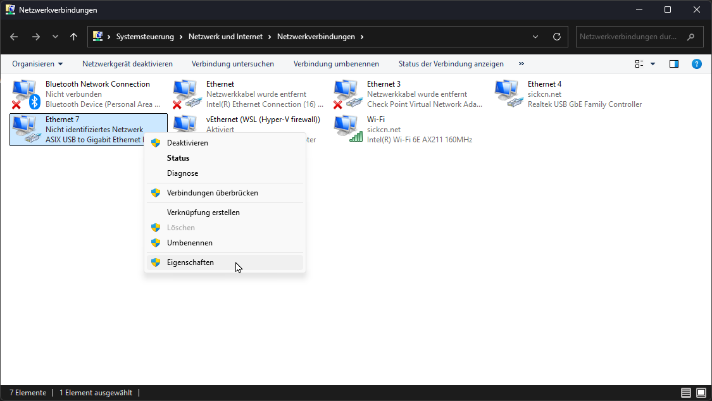
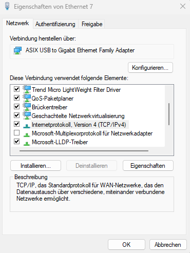

# Getting Started with the LiDAR Starter Kit

Follow these steps to set up and start using your LiDAR Starter Kit:

## Step 1: Hardware Setup
1. Connect the LiDAR sensor to your computer using the provided cable and the network adapter.
2. Ensure the power supply is connected and turned on.
3. Configure the IP address of the adapter.

??? sickinfo "Detailed instructions"   

      - Shortcut in Windows: "Win + R": "ncpa.cpl"

      

      - Alternative: Open your operating system's network settings (e.g., **Control Panel > Network & Internet** in Windows 10/11, or the equivalent in your OS).  
      Choose **Advanced network settings**  

      - Identify the USB Ethernet adapter (might be listed as **ASIX USB to Gigabit Ethernet Family Adapter**).

       

      - Click on the adapter and select **Properties / Edit**.  

      - Enter administrator credentials if necessary.  

      - Locate **Internet Protocol Version 4 (TCP/IPv4)** and select **Properties** or right-click.

        

      - Change from DHCP to manual IP settings:  
      Use the following IP address: `192.168.0.xxx`  
      Subnet mask: `255.255.0.0`

        

      - Save changes by clicking **Ok** in both windows.

4. Open a browser and enter the default IP address 192.168.0.1. You should now see the Sensor UI

  
*Figure 1: Connection setup for the LiDAR Starter Kit.*

## Step 2: Software Installation
1. Install the required drivers and software from the SICK website.
2. Download the example Python scripts provided in the kit.

## Step 3: First Measurement
1. Run the `01_read_devicetype.py` script to verify the connection.
2. Use the `02_read_measurement.py` script to take a single measurement.

Refer to the advanced section for more complex use cases.
