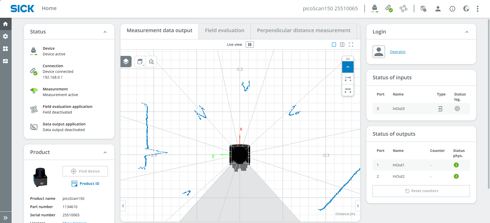
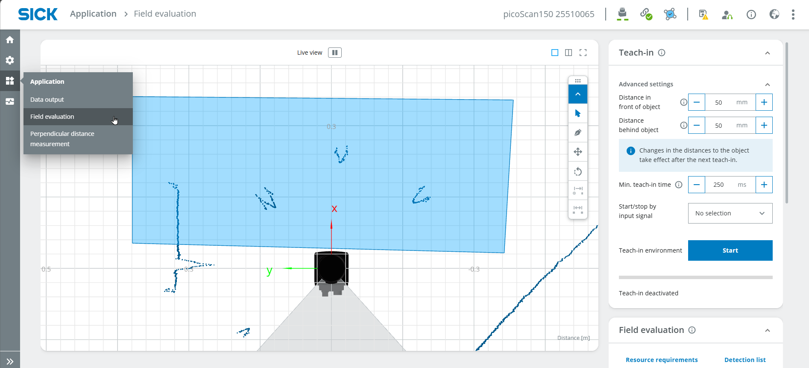
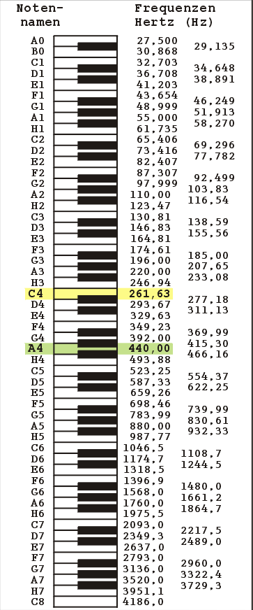

# Human Piano / Air Piano
<table style="border-collapse: collapse; width: 100%;">
  <thead>
    <tr style="background-color: #005aff; color: white;">
      <th style="padding: 8px; text-align: left;">Short description</th>
      <th style="padding: 8px; text-align: left;">Required knowledge level</th>
      <th style="padding: 8px; text-align: left;">Estimated duration</th>
      <th style="padding: 8px; text-align: left;">Additional hardware and software requirements</th>
    </tr>
  </thead>
  <tbody>
    <tr>
      <td>Create multiple fields and a basic Python application to play sounds based on field infringements.</td>
      <td>Advanced</td>
      <td>30-60 Minutes</td>
      <td>Several people or objects</td>
    </tr>
  </tbody>
</table>


In this project, the aim is to simulate keys of a piano by drawing fields that play different sounds when being infringed by objects. A basic python script runs the logic of the different notes.

## Instruction

**Note:** The mentioned code snippets are just examples. Feel free to use your own code to run the project.

### Field evaluation

- Connect your device as mentioned in [Getting Started](./lidar_getting_started.md). The UI should now look something like this:



- Log in as **Service**, password: **servicelevel** and press **Keep Default Password**
- Select **Application** > **Field evaluation** and draw a field in a suitable size.


- If useful, perform a **Teach-in** to ignore all static objects. Stop the teach-in after around 10 seconds.



- Define the field parameters, e.g. the max. blanking size which corresponds to the minimal oject size the infringes the field.


- Draw multiple fields right next to each other.


- You can ignore **Output**

### Coding

- Open a coding environment with Python such as Visual Studio Code.
- Enter the following code:

```python
import socket

HOST = "192.168.0.1"
PORT = 2111

def sopas(cmd):
    with socket.socket(socket.AF_INET, socket.SOCK_STREAM) as s:
        s.settimeout(2)
        s.connect((HOST, PORT))
        telegram = b"\x02" + cmd.encode("ascii") + b"\x03"
        s.sendall(telegram)
        return s.recv(1024).decode("ascii").strip("\x02\x03")

# Enable measurement
print(sopas("sMN SetAccessMode 03 F4724744"))
print(sopas("sMN LMCstartmeas"))

# Read field evaluation
response = sopas("sRN FieldEvaluationResult")
print("Field evaluation:", response)
```

- The result should look something like this: 


- **2** = Field not infringed, **4** = Field infringed
- Now, read out a specific value (field infringed or not infringed, e.g. to play a sound or turn on a light).

??? sickinfo "Code"
    ```python
    field1 = response[38:39]
    print(output)
    ```

- **38:39** refers to the position in the result (first digit 2 or 4)
- Check if the result is giving out the right position (either 2 for "not infringed" or 4 for "infringed").
- Play a sound if the field is infringed; otherwise, display the text "error". Important: Type "import winsound" on the second line of the code (below the previous "import socket")

??? sickinfo "Code"
    ```python
    import winsound


    if output == '4':
        winsound.Beep(200, 1000)
    else:  print('error')
    ```

- To read out sensor data continuously, include the code in 'while True'

??? sickinfo "Code"
    ```python
    import socket
    import winsound
    HOST = "192.168.0.1"
    PORT = 2111
    def sopas(cmd):
    with socket.socket(socket.AF_INET, socket.SOCK_STREAM) as s:
        s.settimeout(2)
        s.connect((HOST, PORT))
        telegram = b"\x02" + cmd.encode("ascii") + b"\x03"
        s.sendall(telegram)
        return s.recv(1024).decode("ascii").strip("\x02\x03")
    # Enable measurement
    print(sopas("sMN SetAccessMode 03 F4724744"))
    print(sopas("sMN LMCstartmeas"))

    while True:
    # Read field evaluation
    response = sopas("sRN FieldEvaluationResult")
    print("Field evaluation:", response)

    output= response[38:39]
    #print(output)

    if output == '4':
        winsound.Beep(200, 1000)
    else:  print('error')
    ```

- Add all fields to your code
- Choose the suitable frequencies for your notes.

??? sickinfo "Frequencies"
    

- **Complete code:**

??? sickinfo "Code"
    ```python
    import winsound

    if output == '4':
        x
        import socket
    import winsound

    HOST = "192.168.0.1"
    PORT = 2111

    def sopas(cmd):
    with socket.socket(socket.AF_INET, socket.SOCK_STREAM) as s:
        s.settimeout(2)
        s.connect((HOST, PORT))
        telegram = b"\x02" + cmd.encode("ascii") + b"\x03"
        s.sendall(telegram)
        return s.recv(1024).decode("ascii").strip("\x02\x03")

    # Enable measurement
    print(sopas("sMN SetAccessMode 03 F4724744"))
    print(sopas("sMN LMCstartmeas"))

    #music notes
    noteC=262
    noteD=298
    noteE=330
    noteF=350
    noteG=392
    noteA=440

    fieldposition=37
    duration=300

    while True:
    # Read field evaluation
    response = sopas("sRN FieldEvaluationResult")
    print("Field evaluation:", response)

    field1= response[fieldposition:fieldposition+1]
    field2= response[fieldposition+4:fieldposition+5]
    field3= response[fieldposition+8:fieldposition+9]
    field4= response[fieldposition+12:fieldposition+13]
    field5= response[fieldposition+16:fieldposition+17]
    field6= response[fieldposition+20:fieldposition+21]
    #print(field1 +' '+ field2)


    if field1 == '4':
        winsound.Beep(noteC, duration)
    if field2 == '4':
        winsound.Beep(noteD, duration)
    if field3 == '4':
        winsound.Beep(noteE, duration)
    if field4 == '4':
        winsound.Beep(noteF, duration)
    if field5 == '4':
        winsound.Beep(noteG, duration)
    if field6 == '4':
        winsound.Beep(noteA, duration)
    else:  print('error')
    ```
- Try playing a song by infringing the correct fields.

Want more difficulty levels?

- Play note only when switching notes
- Include semitones, i.e., adjacent keys