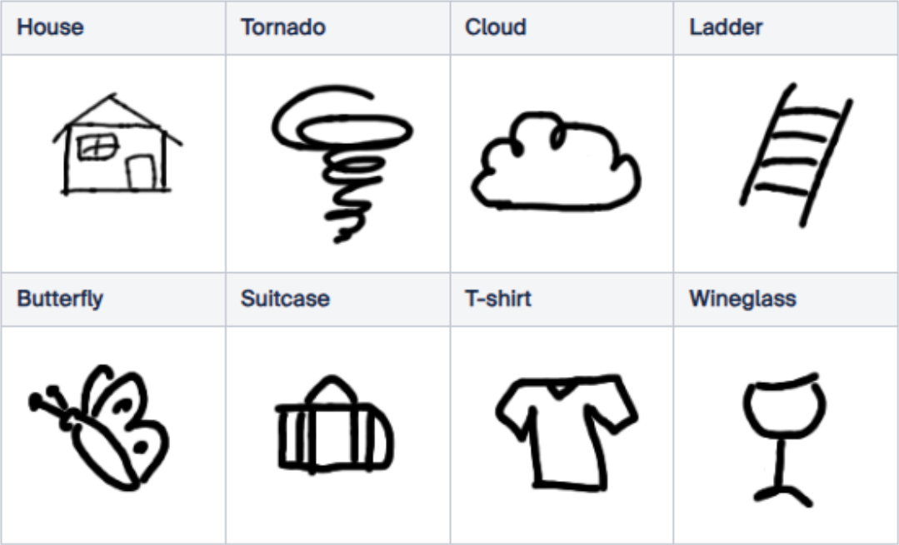

# Sketch Demonstrator

<table style="border-collapse: collapse; width: 100%;">
  <thead>
    <tr style="background-color: #005aff; color: white;">
      <th style="padding: 8px; text-align: left;">Short description</th>
      <th style="padding: 8px; text-align: left;">Required knowledge level</th>
      <th style="padding: 8px; text-align: left;">Estimated duration</th>
      <th style="padding: 8px; text-align: left;">Additional hardware and software requirements</th>
    </tr>
  </thead>
  <tbody>
    <tr>
      <td>Classify different hand-drawn sketches with the AI Classification tool</td>
      <td>Advanced</td>
      <td>2 hours</td>
      <td>Paper, Edding</td>
    </tr>
  </tbody>
</table>

Define up to 8 different objects/classes. These classes could be the following:

Now create multiple drawings of each class. Please note that only a maximum of 100 images can be used for training on-device.

Use the AI Classification tool to classify the different hand-drawn objects.

If you don't know how to use the AI Classification tool, check out the detailed description of the [Classify Hex Nuts / Screws](./classify_hex_nuts_screws.md) example project.
 

