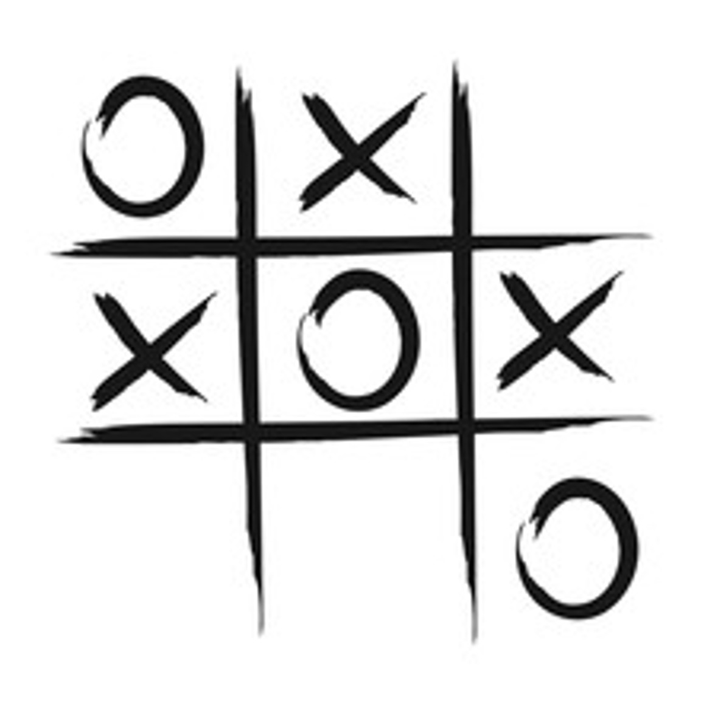

# Tic Tac Toe

<table style="border-collapse: collapse; width: 100%;">
  <thead>
    <tr style="background-color: #005aff; color: white;">
      <th style="padding: 8px; text-align: left;">Short description</th>
      <th style="padding: 8px; text-align: left;">Required knowledge level</th>
      <th style="padding: 8px; text-align: left;">Estimated duration</th>
      <th style="padding: 8px; text-align: left;">Additional hardware and software requirements</th>
    </tr>
  </thead>
  <tbody>
    <tr>
      <td>Analyze a Tic Tac Toe board and play against the computer.</td>
      <td>Advanced</td>
      <td>4 Hours</td>
      <td>Paper, Pen, Scissors</td>
    </tr>
  </tbody>
</table>

## What problem needs to be solved?
A physical game board or a Tic Tac Toe playing field on a piece of paper shall be observed to detect player moves and allow playing against a computer opponent.

Project ideas:

* Detection of symbols, colors and empty fields
* Turn-based game logic
* Different levels of difficulty
* "Coach" which suggests the best position of the next symbol
* Dashboard for visualization
* Robot arm to draw symbols

## Example project file Python and Nova

[TicTacToe.zip](../files/tictactoe.zip)

