# Vision Starter Project

<table style="border-collapse: collapse; width: 100%;">
  <thead>
    <tr style="background-color: #005aff; color: white;">
      <th style="padding: 8px; text-align: left;">Short description</th>
      <th style="padding: 8px; text-align: left;">Required knowledge level</th>
      <th style="padding: 8px; text-align: left;">Estimated duration</th>
      <th style="padding: 8px; text-align: left;">Additional hardware and software requirements</th>
    </tr>
  </thead>
  <tbody>
    <tr>
      <td>Get started with first image acquisition settings and an easy AI Classification and Anomaly Detection task.</td>
      <td>Basic</td>
      <td>90 Minutes</td>
      <td>none – everything included in the Starter Kit</td>
    </tr>
  </tbody>
</table>

## Instructions

### 1. Image acquisition

- Set up the Inspector as described in [Getting started](./vision_getting_started.md).
- Select **Live** on top and press the **Play** button at the bottom to take images continuously.
-  Place the GitHub info card in the camera's field of view
- Select **Jobs** > **Acquisition** and play around with the **Settings** to get a well-lit image. Alternatively, press **Run auto setup** directly.

- If necessary, adjust the focus of the camera manually using the focus adjustment tool (included in the Kit)

### 2. AI Classification

- Choose **Analysis** > **Add tool** > **Classify** > **AI Classification** (without dStudio)

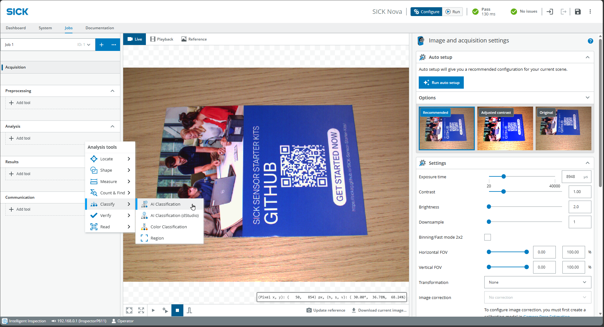

- Adjust the size of the box, so that it encompasses the entire object plus a buffer to account for variations or different positions.

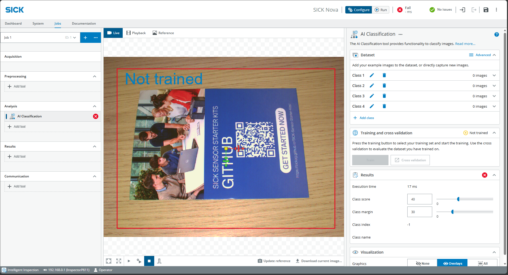

- Create classes under **Dataset** on the right
- Click the play icon at the bottom center to take continuous photos
- Expand the first class and capture images using **Add active image**
- Try out different variations (position / rotation)

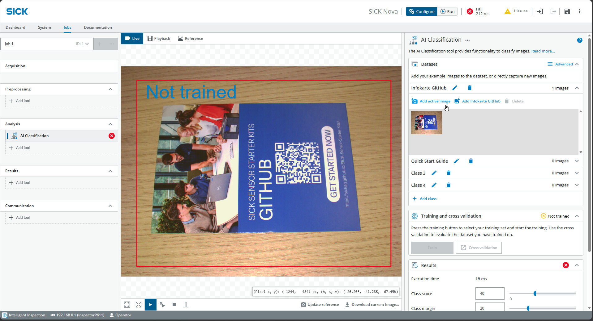

- Repeat for the second class, take at least 5 images each and click on **Train**.

- After a few seconds, the training is finished an you can test the results.

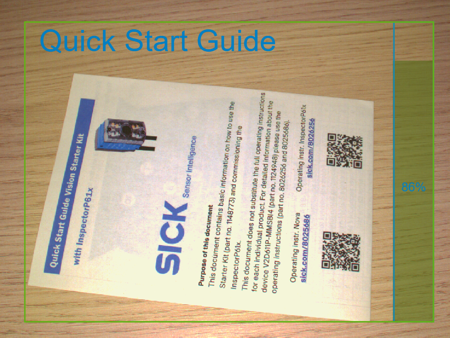

- If useful, add more images or include additional classes (e.g., "Empty") to optimize the results.

### 3. Object Locator

The Object Locator is designed to detect the position of an object and perform analyses relative to that position (e.g., detect anomalies).

- On the left, choose **Jobs** > **Analysis** > **Add tool** > **Locate** > **Object Locator**
- Place an object in the image
- At the bottom center, click **Update reference** and jump to the **Reference** tab
- Drag the box over a distinctive part of the object

- If necessary, adjust the parameters on the right:
  - Edge strength for contrast edges
  - Rotation for possible rotation of the object
  - Scaling, Match score and Angle for sensitivity
- Click **Live** and **Play** at the center to test whether the part of the object is being tracked when the object is moved

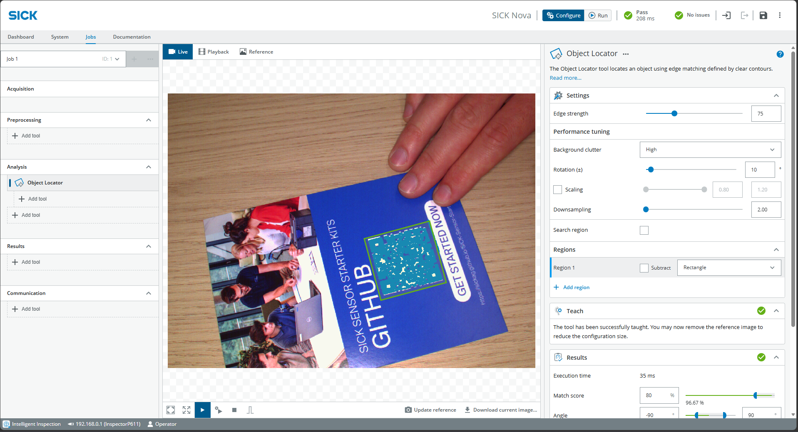

**Important**: The Object Locator must work reliably before any other tools are used.
Add any additional tools directly below the Object Locator.

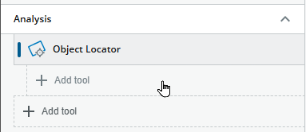

### 4. Anomaly Detection

- On the left, choose **Jobs** > **Analysis** > **Add tool** > **Verify** > **AI Anomaly Detection** (if necessary, below Object Locator)

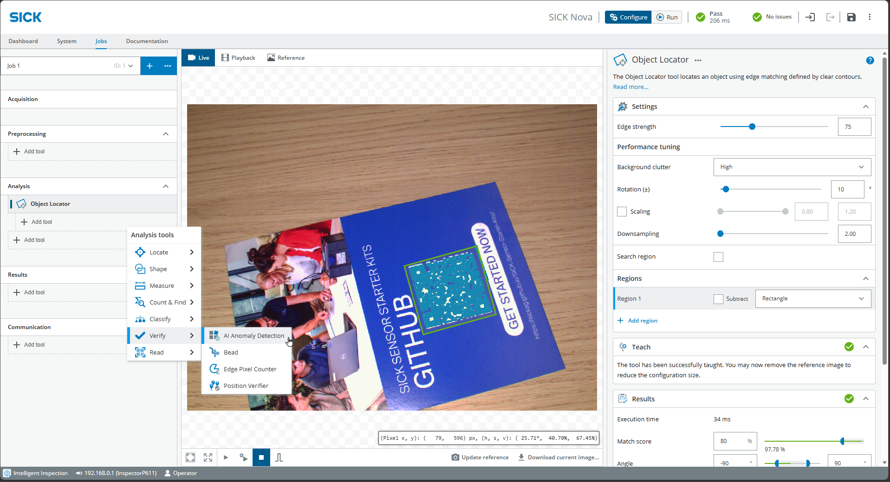

- At the top center, select the **Reference** tab and drag a box over the object (make it only slightly larger, since the Object Locator is tracked along with it)

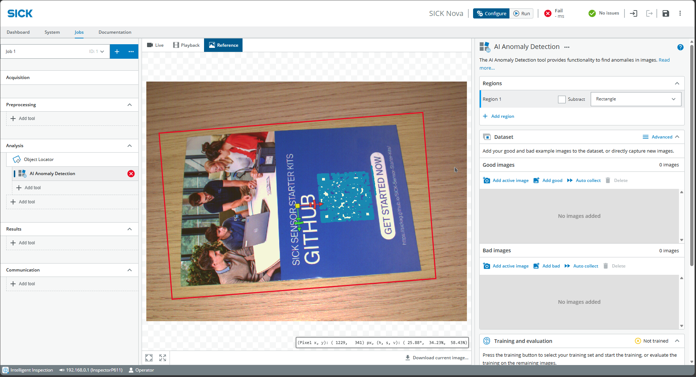

- Go back to **Live** and **Play** and find **Dataset** at the bottom right. Add Good images with various variations. Start with just a few Good images for now.
- Click **Train**.

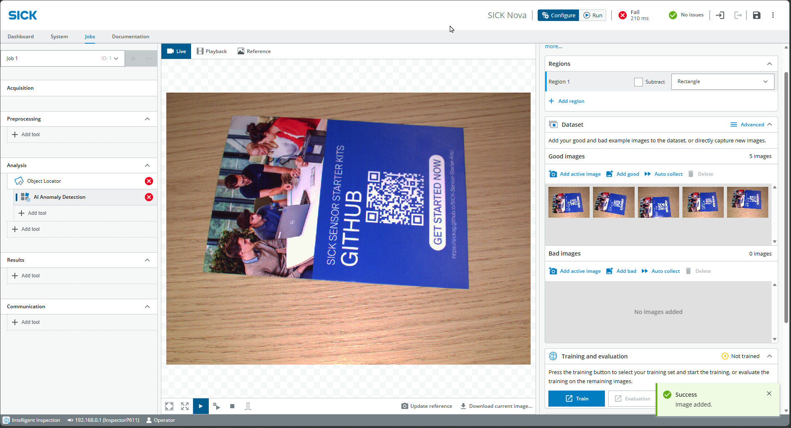

Adjust training parameters if necessary:

- **Number of training images** (the rest is for evaluation)
- **Fast vs. precise** depending on the number of images and time
- Keep **Strict matching** active if object variation is very low / only one object

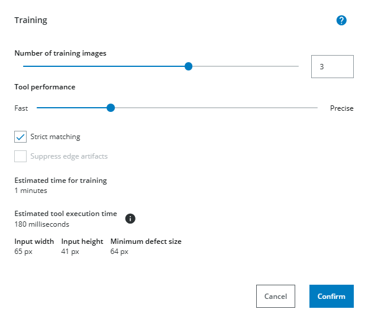

- Set to **Live** and **Play** and test out different positions and foreign objects.
- **Note**: Anomaly Detection always depends on the Object Locator. If it fails, Anomaly Detection will also fail
- At the bottom right under **Results**, adjust **Anomaly Score** and **Visualization range** if necessary. This affects the sensitivity of detecting anomalies and visualizing them with a heatmap.

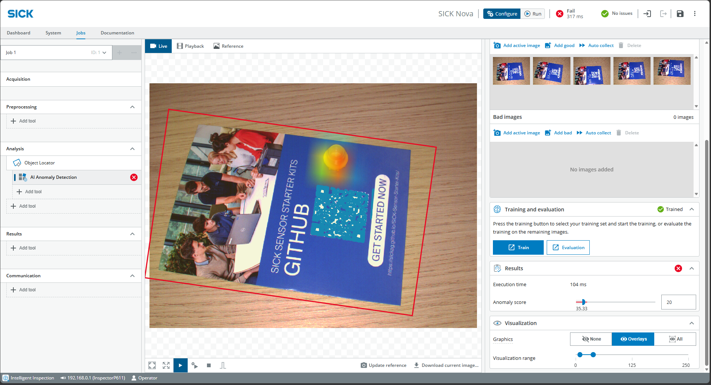

If necessary, capture additional images and also add Bad images to optimize results

### 5. Reset

At the op right, click on the **3 dots** > **Application defaults**

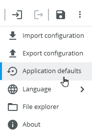

